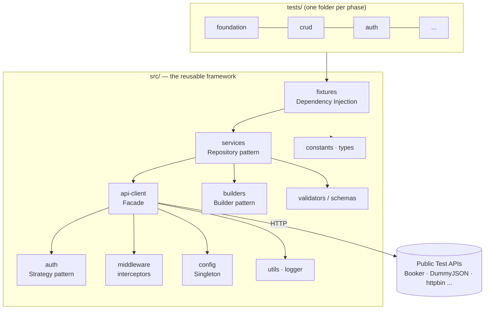

# OmniAPI

> **Enterprise API Automation Framework using Playwright + TypeScript**

A production-grade, reference-quality API test automation framework — built
incrementally as an "API Testing Academy" covering beginner → advanced concepts,
with enterprise architecture, SOLID/Clean Code principles, and full tooling.

---

## 🚀 Quick Start

```bash
# 1. Use the pinned Node version (or Node >= 20)
nvm use            # reads .nvmrc (Node 22)

# 2. Install dependencies
npm install

# 3. Create your local environment file
cp .env.example .env

# 4. Run the Phase 1 health check
npm run test:foundation
```

### Common scripts

| Script                            | What it does                                       |
| --------------------------------- | -------------------------------------------------- |
| `npm test`                        | Run the entire Playwright suite                    |
| `npm run test:foundation`         | Run only the `tests/foundation` phase              |
| `npm run typecheck`               | Type-check with `tsc --noEmit` (no output emitted) |
| `npm run lint` / `lint:fix`       | ESLint check / auto-fix                            |
| `npm run format` / `format:check` | Prettier write / verify                            |
| `npm run test:report`             | Open the last HTML report                          |
| `npm run clean`                   | Delete reports & build artifacts                   |

---

## 🏛️ Architecture

`src/` is the **framework** (reusable, ships like a library). `tests/` **consume**
it. Tests orchestrate services — they never contain raw HTTP plumbing. This
separation is what lets the suite scale to thousands of tests.



### Layer responsibilities

| Layer                     | Folder                                       | Responsibility                                 |
| ------------------------- | -------------------------------------------- | ---------------------------------------------- |
| Tests                     | `tests/<phase>/`                             | Assert behavior; orchestrate services          |
| Fixtures                  | `src/fixtures/`                              | Inject ready-to-use services into tests (DI)   |
| Services                  | `src/services/`                              | One object per API resource (Repository)       |
| API Client                | `src/api-client/`                            | Thin reusable HTTP wrapper (Facade)            |
| Auth                      | `src/auth/`                                  | Pluggable auth strategies (Strategy)           |
| Builders                  | `src/builders/`                              | Construct request payloads fluently (Builder)  |
| Middleware                | `src/middleware/`                            | Cross-cutting: logging, retry, correlation IDs |
| Validators / Schemas      | `src/validators/`, `src/schemas/`            | Response & JSON-schema assertions              |
| Config                    | `src/config/`                                | Validated, immutable env config (Singleton)    |
| Utils / Constants / Types | `src/utils/`, `src/constants/`, `src/types/` | Shared primitives                              |

---

## 📁 Folder Structure

```
omniapi-playwright-framework/
├── src/                      # Reusable framework code
│   ├── api-client/   auth/   builders/   config/   constants/
│   ├── contracts/    fixtures/   middleware/   models/   reporters/
│   ├── schemas/      services/   types/   utils/   validators/
├── tests/                    # One folder per phase
│   ├── foundation/  crud/  authentication/  validation/  schema/
│   ├── pagination/  security/  graphql/  performance/  websocket/
│   ├── contract/    mocking/  file/  chaining/  e2e/  regression/
├── docs/                     # Architecture, concept notes, interview Q&A
├── data/                     # Data-driven test inputs (JSON/CSV/Excel)
├── playwright.config.ts      # Test runner control center
├── tsconfig.json             # Strict TypeScript contract
├── eslint.config.mjs         # ESLint 9 flat config
└── .env.example              # Environment template
```

---

## 🧠 Concept Notes (Phase 1)

- **12-Factor config**: configuration lives in the environment (`.env`), never in
  code. The same build runs against any environment by swapping env vars.
- **Fail fast**: `ConfigManager` validates env on load and throws a clear error
  for bad config — no silent fallbacks to the wrong URL.
- **Quality is automatic, not manual**: Husky + lint-staged make a badly
  formatted or lint-failing commit physically impossible.
- **Path aliases** (`@config/*`, `@utils/*`…) remove `../../../` import noise.

---

## 🎯 Design Patterns (introduced as needed)

| Pattern              | Where                      | Why                                          |
| -------------------- | -------------------------- | -------------------------------------------- |
| **Singleton**        | `ConfigManager`            | One validated, shared, immutable config      |
| Factory              | `src/builders` (Phase 5)   | Create varied payloads/clients cleanly       |
| Builder              | `src/builders` (Phase 5)   | Fluent, readable request construction        |
| Strategy             | `src/auth` (Phase 4)       | Swap auth schemes without touching callers   |
| Repository           | `src/services` (Phase 3)   | Encapsulate per-resource API access          |
| Facade               | `src/api-client` (Phase 2) | Simple surface over Playwright's request API |
| Dependency Injection | `src/fixtures` (Phase 2+)  | Provide services to tests, testable seams    |

---

## 💬 Interview Questions (Phase 1)

1. **Why a Singleton for config instead of a plain exported object?**
   A Singleton guarantees one validated parse, exposes a controlled access point
   (`getInstance`), and a private constructor prevents accidental re-instantiation.
   A plain object works too — the win is _controlled, lazy, validated_ init plus a
   `reset()` seam for tests.

2. **Why strict TypeScript with `noUncheckedIndexedAccess`?**
   It types `arr[i]` as `T | undefined`, forcing null-safety on every lookup —
   exactly where API payload bugs hide.

3. **ESLint vs Prettier — what's the difference?**
   ESLint enforces _code quality_ (no floating promises, no `any`); Prettier
   enforces _formatting_. `eslint-config-prettier` disables overlapping rules so
   they never fight.

4. **Why separate `src/` from `tests/`?**
   `src/` is a reusable library; `tests/` consume it. Tests never hold raw HTTP
   logic, so changes to an endpoint touch one service, not hundreds of tests.

5. **How does the same config run in dev, staging, and CI?**
   `dotenv` loads `.env` locally; CI injects env vars directly. `ConfigManager`
   reads `process.env` either way and validates — zero code changes.

---

## ⚠️ Common Mistakes (avoided here)

- Hard-coding base URLs and credentials in tests.
- Using `console.log` instead of a leveled logger.
- Committing `.env` (secrets leak) — it is git-ignored; `.env.example` is the template.
- Leaving `test.only` in code (CI `forbidOnly` blocks it).
- `any` everywhere (ESLint warns; strict TS discourages).

---

## ✅ Best Practices Baked In

- Strict TypeScript + type-aware ESLint.
- Immutable, validated, fail-fast configuration.
- Structured logging via Winston.
- Automated pre-commit quality gate (Husky + lint-staged).
- Parallel-by-default, CI-aware Playwright config.

---

## 🗺️ Roadmap

Built in 20 phases (Foundation → CRUD → Auth → Builders → Validation → Chaining →
Data-Driven → Negative → Pagination → Files → Security → Performance → GraphQL →
Mocking → WebSockets → Contract → Reporting → CI/CD → Enterprise features).

**Status: Phase 1 ✅ — Project Initialization & Enterprise Architecture complete.**
