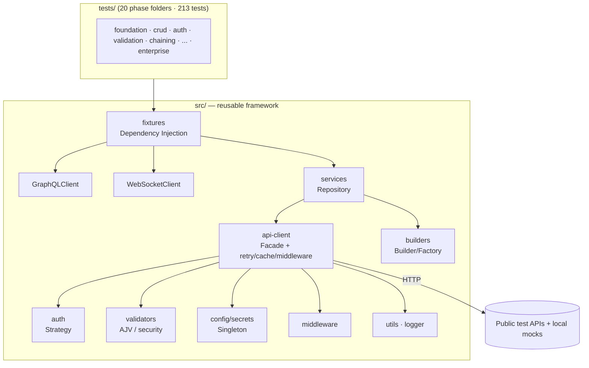
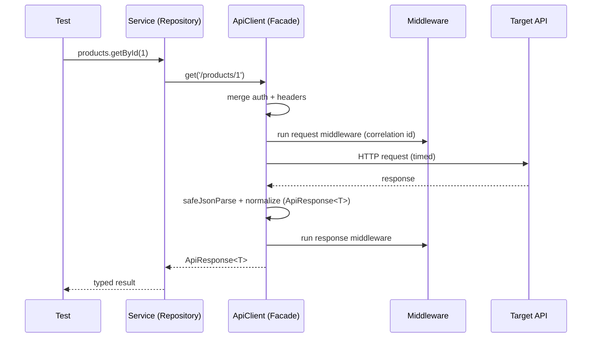
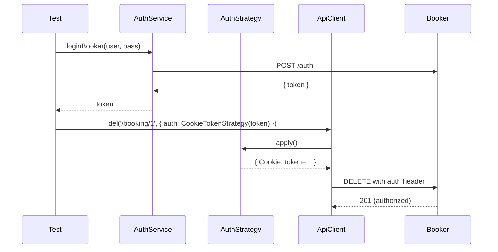
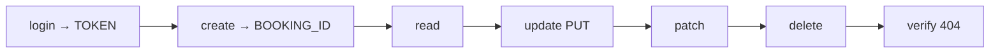
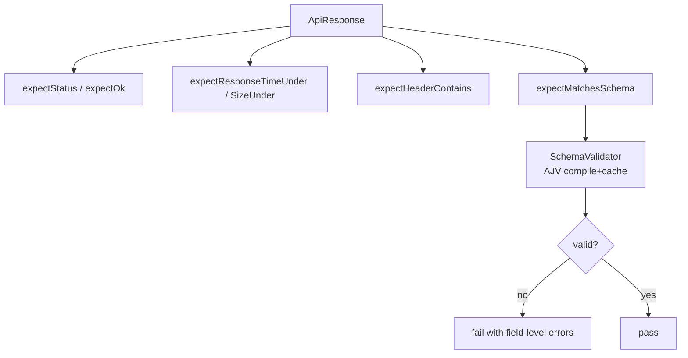
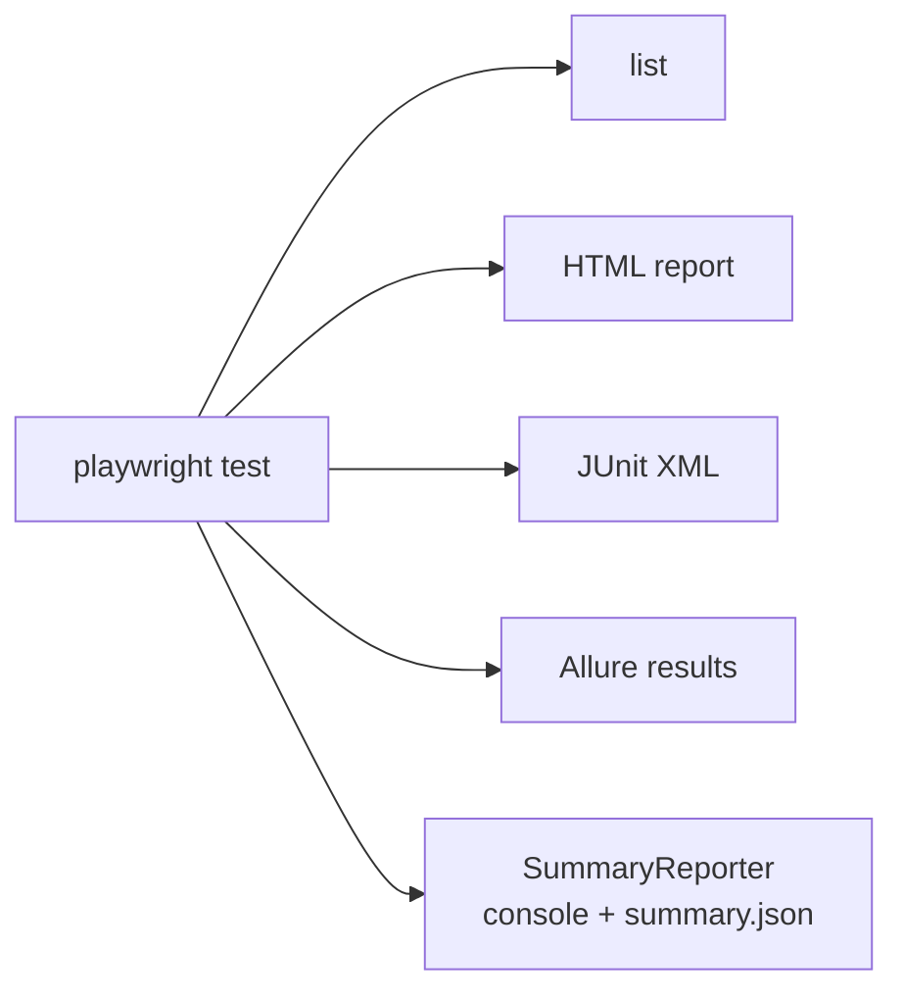
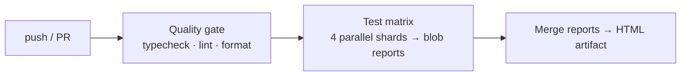

<div align="center">

# OminAPI

### Enterprise API Automation Framework — Playwright + TypeScript

[](https://github.com/omiinayak25/ominapi-playwright-framework/actions/workflows/ci.yml)


A production-grade, reference-quality API test automation framework — built as an
**"API Testing Academy"** spanning beginner → advanced concepts, with layered
enterprise architecture, SOLID/Clean-Code principles, and full tooling.

</div>

---

## 📖 Table of Contents

- [Project Overview](#-project-overview)
- [Technology Stack](#-technology-stack)
- [Supported APIs](#-supported-apis)
- [Installation](#-installation)
- [Folder Structure](#-folder-structure)
- [Framework Architecture](#-framework-architecture)
- [Design Patterns](#-design-patterns)
- [Features](#-features)
- [Test Execution](#-test-execution)
- [Reporting](#-reporting)
- [Project Statistics](#-project-statistics)
- [Roadmap](#-roadmap)
- [Documentation](#-documentation)
- [Contribution Guide](#-contribution-guide)
- [License](#-license)
- [Credits](#-credits)

---

## 🎯 Project Overview

### Vision

Provide a single, reference implementation that demonstrates **how a senior QA
automation engineer architects an API testing framework** — not just tests, but
the _system that keeps tests good_ as a team and suite scale.

### Goals

- Teach **beginner → advanced** API testing concepts through working code.
- Demonstrate **enterprise architecture** and **design patterns** applied only
  where they solve a real problem.
- Stay **production-ready**: strict typing, linting, formatting, git hooks, CI/CD.
- Serve as a **portfolio / interview** reference project.

### Key Features

- ✅ Reusable HTTP **API Client** (Facade) over Playwright's `APIRequestContext`
- ✅ **Auth** strategies: Basic, Bearer/JWT, API-Key, Cookie/Session, OAuth2 (sim)
- ✅ **CRUD** via a Service/Repository layer with typed domain models
- ✅ **Dynamic data** with Builder + Factory patterns (Faker, UUID, dates)
- ✅ **Validation**: multi-dimension assertions + AJV **JSON-Schema** validation
- ✅ **Request chaining** (full login → CRUD → verify lifecycle)
- ✅ **Data-driven** testing (JSON, CSV, Excel, environment datasets)
- ✅ **Negative & security** testing (OWASP payloads, JWT tampering, data exposure)
- ✅ **Pagination** (offset, page-based, cursor-style), filtering, sorting, search
- ✅ **File APIs** (multipart upload, binary download, magic-byte detection)
- ✅ **Performance** smoke testing with latency percentiles (p50/p90/p95/p99)
- ✅ **GraphQL** (queries, mutations, variables, fragments, error handling)
- ✅ **Mocking** via an in-process fake HTTP server
- ✅ **WebSockets** (connection, messaging, reconnect, validation)
- ✅ **Contract testing** (OpenAPI conformance + backward-compatibility diffing)
- ✅ **Reporting**: Allure, HTML, JUnit, and a custom summary reporter
- ✅ **CI/CD**: GitHub Actions (sharded), Jenkins, Azure DevOps, Docker
- ✅ **Enterprise resilience**: retry, circuit breaker, TTL cache, middleware,
  correlation IDs, secrets management, typed errors

### Framework Highlights

- **Strict TypeScript** (`exactOptionalPropertyTypes`, `noUncheckedIndexedAccess`, …)
- **Zero raw HTTP in tests** — everything flows through the layered framework
- **Config-centralized** — a vendor outage or endpoint change is a one-line edit
- **Opt-in enterprise features** — adding retry/cache/middleware never broke the
  existing 199 tests (Open/Closed Principle)
- **Every file is teaching-commented**: why it exists, what it solves, how it works

### Learning Objectives

By studying this repository you will learn to: design a layered test framework,
apply Singleton/Facade/Repository/Strategy/Builder/Factory/DI patterns, validate
contracts with JSON Schema, build resilience (retry/circuit breaker/cache), test
GraphQL/WebSockets, mock dependencies, and wire enterprise-grade CI/CD.

---

## 🧰 Technology Stack

| Layer              | Technology                                           |
| ------------------ | ---------------------------------------------------- |
| Language           | TypeScript (strict)                                  |
| Test runner / HTTP | Playwright `@playwright/test` (`APIRequestContext`)  |
| Schema validation  | AJV + ajv-formats                                    |
| Test data          | @faker-js/faker, Node `crypto` (UUID)                |
| Data files         | csv-parse (CSV), exceljs (Excel)                     |
| WebSockets         | ws                                                   |
| Logging            | winston                                              |
| Config             | dotenv                                               |
| Lint / Format      | ESLint 9 (flat config) + typescript-eslint, Prettier |
| Git hooks          | Husky + lint-staged                                  |
| Reporting          | Allure, Playwright HTML, JUnit, custom reporter      |
| CI/CD              | GitHub Actions, Jenkins, Azure DevOps, Docker        |

---

## 🌐 Supported APIs

| API                            | Purpose                              | Auth                   | Status | Used In                                             |
| ------------------------------ | ------------------------------------ | ---------------------- | ------ | --------------------------------------------------- |
| **Restful Booker**             | Stateful CRUD + token auth           | Token (Cookie) / Basic | ✅     | auth, chaining, data-driven, negative, security     |
| **DummyJSON**                  | Products CRUD, search, paging, users | None                   | ✅     | crud, pagination, validation, performance, security |
| **JSONPlaceholder**            | Posts CRUD (fake)                    | None                   | ✅     | crud, schema, validation, negative                  |
| **postman-echo**               | Request/response reflection          | Basic                  | ✅     | foundation, auth, data-driven, perf                 |
| **httpbingo.org**              | httpbin-compatible utilities         | Basic / Bearer         | ✅     | foundation, auth, file                              |
| **Open Brewery DB**            | Page-based pagination                | None                   | ✅     | pagination                                          |
| **Countries GraphQL**          | GraphQL queries/fragments            | None                   | ✅     | graphql                                             |
| **GraphQLZero**                | GraphQL mutations                    | None                   | ✅     | graphql                                             |
| **Swagger Petstore (OpenAPI)** | Contract model (committed spec)      | None                   | ✅     | contract                                            |
| ReqRes                         | (dropped — now requires a paid key)  | —                      | ❌     | n/a                                                 |

> Mocked/local servers (`MockServer`, `MockWebSocketServer`) back the mocking and
> WebSocket suites for fully offline, deterministic runs.

---

## 🚀 Installation

### Prerequisites

- **Node.js ≥ 20** (project pins **22** via `.nvmrc`)
- **npm** (ships with Node)
- Java (only if you want to _render_ the Allure HTML report)

### 1. Clone

```bash
# Clone the repository, then enter the project directory
git clone https://github.com/omiinayak25/ominapi-playwright-framework.git
cd ominapi-playwright-framework
```

### 2. Use the pinned Node version

```bash
nvm use        # reads .nvmrc (Node 22)
```

### 3. Install dependencies

```bash
# Install all dependencies (Playwright, AJV, faker, etc.) from package-lock
npm install
```

### 4. Environment setup

```bash
cp .env.example .env   # then edit values as needed (.env is git-ignored)
```

### 5. Run the tests

```bash
npm test                 # full suite
npm run test:foundation  # a single phase
```

### 6. Generate reports

```bash
npm run test:report      # open Playwright HTML report
npm run allure:report    # generate Allure report (needs Java)
npm run allure:open      # open the Allure report
```

### 7. Docker usage

```bash
# Build the test image from the Dockerfile, tagging it "ominapi"
docker build -t ominapi .
docker run --rm ominapi          # runs `npm run test:ci` (--rm cleans up the container after)
```

### 8. CI/CD usage

Push to `main`/`develop` (or open a PR) → GitHub Actions runs the quality gate,
sharded tests, and publishes a merged HTML report artifact. See
[.github/workflows/ci.yml](.github/workflows/ci.yml), [Jenkinsfile](Jenkinsfile),
and [azure-pipelines.yml](azure-pipelines.yml).

---

## 📁 Folder Structure

```
ominapi-playwright-framework/
├── .github/workflows/ci.yml      # GitHub Actions: quality gate → sharded tests → report
├── .husky/pre-commit             # lint-staged quality gate
├── data/                         # Data-driven inputs (JSON, CSV, Excel, env/)
├── docs/                         # Documentation (this set)
├── src/                          # Reusable framework code (the "product")
│   ├── api-client/               # ApiClient (Facade), GraphQLClient, WebSocketClient, types
│   ├── auth/                     # AuthService + strategies/ (Strategy pattern)
│   ├── builders/                 # BookingBuilder, BookingFactory, NegativeBookingFactory
│   ├── config/                   # ConfigManager (Singleton), SecretsManager, index
│   ├── constants/                # HTTP status codes, security payloads
│   ├── contracts/                # OpenAPI contract documents
│   ├── fixtures/                 # Playwright fixtures (Dependency Injection)
│   ├── middleware/               # Request/response middleware (correlation IDs)
│   ├── models/                   # Domain models (Booking, Product, Post, Brewery)
│   ├── reporters/                # Custom Playwright SummaryReporter
│   ├── schemas/                  # JSON Schemas (post, product, booking)
│   ├── services/                 # Repositories (Booking, Product, Post, Brewery, Base)
│   ├── types/                    # Shared TypeScript types
│   ├── utils/                    # logger, retry, cache, circuit-breaker, file, jwt, perf, …
│   ├── validators/               # response, schema (AJV), security validators
│   └── global-setup.ts           # Playwright global setup (config readiness banner)
├── tests/                        # One folder per phase/topic (20 folders)
│   ├── foundation/  crud/  authentication/  builders/  validation/  schema/
│   ├── chaining/  data-driven/  negative/  pagination/  file/  security/
│   ├── performance/  graphql/  mocking/  websocket/  contract/  enterprise/
│   └── e2e/  regression/         # reserved placeholders
├── Dockerfile · .dockerignore
├── Jenkinsfile · azure-pipelines.yml
├── playwright.config.ts          # test runner control center (+ globalSetup, reporters)
├── tsconfig.json                 # strict TypeScript + path aliases
├── eslint.config.mjs             # ESLint 9 flat config
├── .prettierrc.json · .editorconfig · .nvmrc · .env.example
└── project-metadata.json · framework-info.json · repository-info.json
```

### Layer responsibilities

| Layer                              | Folder                            | Responsibility                        |
| ---------------------------------- | --------------------------------- | ------------------------------------- |
| Tests                              | `tests/<phase>/`                  | Assert behavior; orchestrate services |
| Fixtures                           | `src/fixtures/`                   | Inject ready services/clients (DI)    |
| Services                           | `src/services/`                   | One repository per resource           |
| API clients                        | `src/api-client/`                 | HTTP/GraphQL/WS Facades               |
| Auth                               | `src/auth/`                       | Pluggable auth strategies             |
| Builders                           | `src/builders/`                   | Fluent/named test data                |
| Validators / Schemas               | `src/validators/`, `src/schemas/` | Assertions + JSON-Schema              |
| Middleware                         | `src/middleware/`                 | Cross-cutting hooks                   |
| Config / Constants / Types / Utils | `src/config/` …                   | Shared primitives & resilience utils  |

---

## 🏛️ Framework Architecture

### Project Architecture



### Request Flow



### Authentication Flow



### Request Chaining



### Validation Flow



### Reporting Flow



### CI/CD Flow



---

## 🧩 Design Patterns

| Pattern                                 | Where                                                | Why / Benefit                                                           |
| --------------------------------------- | ---------------------------------------------------- | ----------------------------------------------------------------------- |
| **Singleton**                           | `ConfigManager`, `SchemaValidator`, `SecretsManager` | One validated, shared, cached instance                                  |
| **Facade**                              | `ApiClient`, `GraphQLClient`, `WebSocketClient`      | Simple surface over complex transport; tests never touch raw Playwright |
| **Repository**                          | `src/services/*` (`BaseApiService` + concretes)      | Encapsulate per-resource access; endpoint changes touch one file        |
| **Strategy**                            | `src/auth/strategies/*`                              | Interchangeable auth schemes via one `apply()` method                   |
| **Builder**                             | `BookingBuilder`                                     | Fluent, defaulted, deep-copy test data                                  |
| **Factory**                             | `BookingFactory`, `NegativeBookingFactory`           | Named scenarios; composes the Builder                                   |
| **Dependency Injection**                | `src/fixtures/*`                                     | Tests declare needs; fixtures provide & dispose                         |
| **Null Object**                         | `NoAuthStrategy`                                     | Explicit "no auth"; removes null checks                                 |
| **Middleware**                          | `src/middleware/*`                                   | Cross-cutting hooks (correlation IDs)                                   |
| **Circuit Breaker / Retry / TTL Cache** | `src/utils/*`                                        | Resilience: fail fast, recover from blips, avoid redundant calls        |

---

## ✨ Features

| Module              | Implementation                                                                                                                             |
| ------------------- | ------------------------------------------------------------------------------------------------------------------------------------------ |
| API Client          | [`src/api-client/api-client.ts`](src/api-client/api-client.ts) — verbs, normalized `ApiResponse<T>`, timing, opt-in retry/cache/middleware |
| GraphQL client      | [`src/api-client/graphql-client.ts`](src/api-client/graphql-client.ts)                                                                     |
| WebSocket client    | [`src/api-client/ws-client.ts`](src/api-client/ws-client.ts)                                                                               |
| Authentication      | [`src/auth/`](src/auth/) — Basic, Bearer/JWT, API-Key, Cookie, NoAuth + `AuthService`                                                      |
| CRUD services       | [`src/services/`](src/services/) — Booking, Product, Post, Brewery                                                                         |
| Builders/Factories  | [`src/builders/`](src/builders/)                                                                                                           |
| Validation          | [`src/validators/`](src/validators/) — response, AJV schema, security                                                                      |
| Schemas / Contracts | [`src/schemas/`](src/schemas/), [`src/contracts/`](src/contracts/)                                                                         |
| Data loading        | [`src/utils/data-loader.ts`](src/utils/data-loader.ts) — JSON/CSV/Excel                                                                    |
| Pagination          | [`src/utils/pagination.ts`](src/utils/pagination.ts) + services                                                                            |
| Files               | [`src/utils/file.ts`](src/utils/file.ts) — magic-byte detection                                                                            |
| Performance         | [`src/utils/perf.ts`](src/utils/perf.ts) — percentiles                                                                                     |
| Mocking             | [`src/utils/mock-server.ts`](src/utils/mock-server.ts)                                                                                     |
| Resilience          | [`retry`](src/utils/retry.ts), [`circuit-breaker`](src/utils/circuit-breaker.ts), [`cache`](src/utils/cache.ts)                            |
| Secrets / Errors    | [`src/config/secrets.ts`](src/config/secrets.ts), [`src/utils/errors.ts`](src/utils/errors.ts)                                             |
| Logging             | [`src/utils/logger.ts`](src/utils/logger.ts) (winston)                                                                                     |
| Reporting           | [`src/reporters/summary.reporter.ts`](src/reporters/summary.reporter.ts)                                                                   |

---

## ▶️ Test Execution

| Goal               | Command                                             |
| ------------------ | --------------------------------------------------- |
| Full suite         | `npm test`                                          |
| Single phase       | `npm run test:foundation` · `npm run test:crud`     |
| A folder           | `npx playwright test tests/graphql`                 |
| A single file      | `npx playwright test tests/crud/posts.crud.spec.ts` |
| By name (tag/grep) | `npx playwright test -g "JWT"`                      |
| Parallel shards    | `npx playwright test --shard=1/4`                   |
| Debug              | `npx playwright test --debug`                       |
| UI mode            | `npx playwright test --ui`                          |
| With body logs     | `LOG_LEVEL=debug npm test`                          |
| Different env      | `TEST_ENV=staging npm test`                         |
| CI run             | `npm run test:ci`                                   |
| Docker             | `docker run --rm ominapi`                           |
| Quality gate       | `npm run verify` (typecheck → lint → format → test) |

> **Headed mode** does not apply to API tests (no browser UI). Use `--debug`/`--ui`
> and `LOG_LEVEL=debug` for inspection instead.

---

## 📊 Reporting

| Reporter              | Output                                      | View                                           |
| --------------------- | ------------------------------------------- | ---------------------------------------------- |
| list                  | live console                                | (default)                                      |
| HTML                  | `playwright-report/`                        | `npm run test:report`                          |
| JUnit                 | `test-results/junit-results.xml`            | CI ingestion                                   |
| Allure                | `allure-results/`                           | `npm run allure:report && npm run allure:open` |
| Custom summary        | console block + `test-results/summary.json` | counts, duration, slowest tests                |
| Request/response logs | console (winston)                           | `LOG_LEVEL=debug`                              |
| Trace                 | on first retry                              | `npx playwright show-trace`                    |

---

## 📈 Project Statistics

| Metric                    | Value           |
| ------------------------- | --------------- |
| Phases complete           | **20 / 20**     |
| Tests                     | **213 passing** |
| Source files (`src/*.ts`) | 66 (~3,988 LOC) |
| Test spec files           | 62 (~3,587 LOC) |
| API clients               | 3               |
| Services (repositories)   | 5               |
| Utilities                 | 17              |
| Builders / Factories      | 3               |
| Validators                | 3               |
| Domain models             | 4               |
| JSON schemas              | 3               |
| Auth strategies           | 5               |
| OpenAPI contracts         | 1               |
| Test folders              | 20              |
| Completion                | **100%**        |

---

## 🗺️ Roadmap

**✅ Completed (all 20 phases):** Project setup · HTTP foundation · CRUD · Auth ·
Dynamic data · Validation · Chaining · Data-driven · Negative · Pagination · Files ·
Security · Performance · GraphQL · Mocking · WebSockets · Contract testing ·
Reporting · CI/CD · Enterprise features.

**🔭 Planned / possible enhancements:** true cursor pagination against an auth API ·
live OpenAPI sweep · per-test request/response report attachments · k6/Gatling load
profiles · latency regression baselines · `e2e/` & `regression/` suites · record-and-replay mocking.

---

## 📚 Documentation

Full guides live in [`docs/`](docs/):

| Getting started                            | Modules                                                                                                                   | Quality                                          | Learning                                                        |
| ------------------------------------------ | ------------------------------------------------------------------------------------------------------------------------- | ------------------------------------------------ | --------------------------------------------------------------- |
| [Installation](docs/Installation.md)       | [APIClient](docs/APIClient.md)                                                                                            | [SecurityTesting](docs/SecurityTesting.md)       | [DesignPatterns](docs/DesignPatterns.md)                        |
| [GettingStarted](docs/GettingStarted.md)   | [Authentication](docs/Authentication.md)                                                                                  | [PerformanceTesting](docs/PerformanceTesting.md) | [BestPractices](docs/BestPractices.md)                          |
| [Configuration](docs/Configuration.md)     | [CRUD](docs/CRUD.md)                                                                                                      | [ContractTesting](docs/ContractTesting.md)       | [InterviewQuestions](docs/InterviewQuestions.md)                |
| [FolderStructure](docs/FolderStructure.md) | [Validation](docs/Validation.md) · [SchemaValidation](docs/SchemaValidation.md)                                           | [Reporting](docs/Reporting.md)                   | [LearningRoadmap](docs/LearningRoadmap.md)                      |
| [Architecture](docs/Architecture.md)       | [DataDrivenTesting](docs/DataDrivenTesting.md) · [Pagination](docs/Pagination.md)                                         | [CI-CD](docs/CI-CD.md)                           | [FAQ](docs/FAQ.md) · [Troubleshooting](docs/Troubleshooting.md) |
|                                            | [GraphQL](docs/GraphQL.md) · [WebSocket](docs/WebSocket.md) · [Mocking](docs/Mocking.md) · [Utilities](docs/Utilities.md) |                                                  | [Roadmap](docs/Roadmap.md) · [Changelog](docs/Changelog.md)     |

---

## 🤝 Contribution Guide

- **Coding standards:** strict TypeScript, no `any`, async/await, interfaces over
  type-aliases where appropriate, every file documented.
- **Quality gate:** `npm run verify` must pass; the pre-commit hook runs lint-staged.
- **Git workflow:** GitFlow — feature branches off `main`/`develop`.
- **Branch naming:** `feat/<topic>`, `fix/<topic>`, `chore/<topic>`, `docs/<topic>`.
- **Commit messages:** [Conventional Commits](https://www.conventionalcommits.org/)
  (`feat:`, `fix:`, `chore:`, `docs:`, `refactor:`, `test:`).
- **Pull requests:** describe the change, link issues, ensure CI is green.

---

## 📄 License

[MIT](LICENSE) © omiinayak25

---

## 🙏 Credits

- **Author:** [omiinayak25](https://github.com/omiinayak25)
- Built on the open-source [Playwright](https://playwright.dev/) test runner and a
  set of free public test APIs (Restful Booker, DummyJSON, JSONPlaceholder,
  postman-echo, httpbingo, Open Brewery DB, Countries GraphQL, GraphQLZero).
