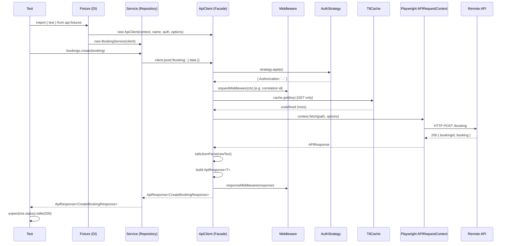
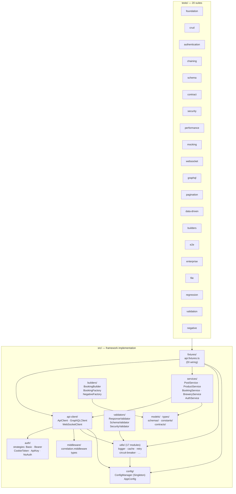

# OmniAPI Framework — Architecture

## Overview

OmniAPI is a strict-TypeScript, Playwright-based API test framework organized in
distinct layers. Each layer has a single responsibility and depends only on the
layers below it. This separation keeps tests readable, infrastructure swappable,
and cross-cutting concerns (auth, retry, middleware) isolated.

Repository: <https://github.com/omiinayak25/omniapi-playwright-framework>

---

## Purpose

Playwright's `APIRequestContext` is a capable but low-level primitive. Without a
structured framework every test would repeat header merging, JSON parsing, timing,
logging, auth, and response normalization. OmniAPI removes all of that boilerplate
so a test expresses intent only:

```typescript
const res = await bookings.create(BookingFactory.valid());
expect(res.status).toBe(201);
```

---

## Layered Architecture

```
┌─────────────────────────────────────────────────────┐
│   Tests  (tests/**/*)                               │
│   Declare intent; depend on injected fixtures only  │
└───────────────────────┬─────────────────────────────┘
                        │ Playwright fixture DI
┌───────────────────────▼─────────────────────────────┐
│   Fixtures  (src/fixtures/api.fixtures.ts)           │
│   Dependency Injection — create, inject, dispose     │
└───────────────────────┬─────────────────────────────┘
                        │
       ┌────────────────┴─────────────────┐
       │                                  │
┌──────▼────────────┐          ┌──────────▼──────────┐
│  Services         │          │  API Clients         │
│  (src/services/)  │          │  (src/api-client/)   │
│  Repository layer │          │  Facade layer        │
│  PostService      │          │  ApiClient           │
│  BookingService   │          │  GraphQLClient       │
│  BreweryService   │          │  WebSocketClient     │
│  ProductService   │          └──────────┬───────────┘
│  AuthService      │                     │
└──────┬────────────┘          ┌──────────▼───────────┐
       │                       │  Middleware           │
       │                       │  (src/middleware/)    │
       │                       │  correlation, custom  │
       │                       └──────────┬───────────┘
       │                                  │
┌──────▼──────────────────────────────────▼───────────┐
│   Auth Strategies  (src/auth/strategies/)            │
│   BasicAuthStrategy · BearerTokenStrategy            │
│   CookieTokenStrategy · ApiKeyStrategy · NoAuth      │
└───────────────────────┬─────────────────────────────┘
                        │
┌───────────────────────▼─────────────────────────────┐
│   Builders & Factories  (src/builders/)              │
│   BookingBuilder (Builder pattern)                   │
│   BookingFactory (Factory pattern)                   │
│   NegativeFactory (invalid payloads)                 │
└───────────────────────┬─────────────────────────────┘
                        │
┌───────────────────────▼─────────────────────────────┐
│   Validators  (src/validators/)                      │
│   ResponseValidator · SchemaValidator (AJV)          │
│   SecurityValidator                                  │
└───────────────────────┬─────────────────────────────┘
                        │
┌───────────────────────▼─────────────────────────────┐
│   Utilities  (src/utils/)           17 modules       │
│   logger · cache · retry · circuit-breaker           │
│   json · jwt · perf · pagination · file              │
│   data-loader · mock-server · ws-server              │
│   contract-diff · openapi · random · date · errors   │
└───────────────────────┬─────────────────────────────┘
                        │
┌───────────────────────▼─────────────────────────────┐
│   Config  (src/config/config.manager.ts)             │
│   ConfigManager (Singleton) — validates env vars     │
│   Produces immutable AppConfig consumed everywhere   │
└─────────────────────────────────────────────────────┘
```

---

## Flow Diagram — Single Request Lifecycle



---

## Project-Level Architecture Diagram



---

## Why `src/` vs `tests/` Separation Matters

| Concern      | `src/`                                    | `tests/`                     |
| ------------ | ----------------------------------------- | ---------------------------- |
| Ownership    | Framework infrastructure                  | Test intent                  |
| Stability    | Changes rarely; high-value to keep stable | Evolves per feature coverage |
| Reuse        | Every spec imports from here              | No cross-spec imports        |
| Review focus | Architecture, contracts, patterns         | Coverage, assertions         |
| Compilation  | Published as framework module             | Excluded from library build  |

The strict boundary enforces a key rule: tests declare **what** to verify;
`src/` encapsulates **how** the mechanics work. Violating the boundary — writing
request logic in a spec file — breaks DRY and makes the framework harder to swap
or upgrade.

---

## Key Design Decisions

### Fail-Fast Config (`src/config/config.manager.ts`)

Config validation at process start prevents cryptic test failures from bad env
vars. If `TEST_ENV` is not one of `dev | staging | prod`, the suite crashes
immediately with a clear message rather than silently hitting the wrong base URL.

### No Throws on 4xx/5xx (Facade)

`ApiClient` defaults `failOnStatusCode = false`. This is deliberate: a test must
be able to receive a 404 and assert it rather than catching an exception. Tests
that want throwing behavior opt in per call.

### Fixture Lifecycle Guarantees (DI)

Every `withClient()` call in `api.fixtures.ts` wraps `context.dispose()` in a
`finally` block. The Playwright request context is always cleaned up even when a
test throws, preventing resource leaks across a long suite run.

### Resilience is Opt-In

`ApiClientOptions` exposes retry, TTL cache, correlationId, and middleware. Omitting
the options object gives baseline behavior with no overhead — tests that do not need
retry semantics pay no cost for them.

---

## References

- [APIClient.md](APIClient.md) — Facade API reference
- [DesignPatterns.md](DesignPatterns.md) — All 10 patterns with code
- [Utilities.md](Utilities.md) — All 17 utility modules
- [`src/api-client/api-client.ts`](../src/api-client/api-client.ts)
- [`src/fixtures/api.fixtures.ts`](../src/fixtures/api.fixtures.ts)
- [`src/config/config.manager.ts`](../src/config/config.manager.ts)
- [`src/services/base.service.ts`](../src/services/base.service.ts)
