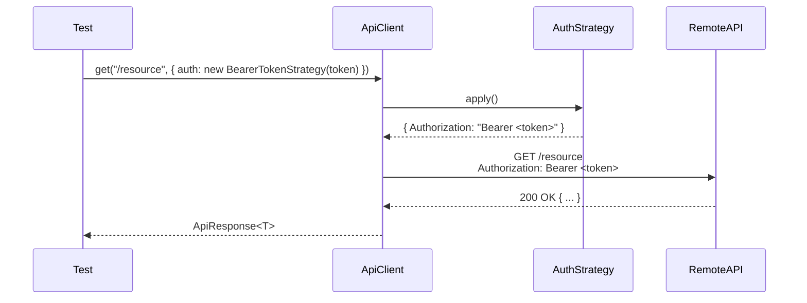

# Authentication

> OminAPI framework — Phase 4 authentication strategies.
> Repo: <https://github.com/omiinayak25/ominapi-playwright-framework>

---

## Overview

OminAPI implements authentication through the **Strategy pattern**. Every auth scheme is a small class that implements a single `AuthStrategy` interface. The `ApiClient` accepts any strategy — either as a client-wide default or as a per-request override — so swapping schemes requires changing one object, never rewriting request logic.

---

## Purpose

- Decouple "how we obtained a credential" from "how we attach it to a request."
- Eliminate per-test header construction (DRY).
- Make unauthenticated calls an explicit, intentional choice (`NoAuthStrategy`) instead of an accidental omission.
- Provide a testable surface for negative auth (missing or wrong credentials).

---

## Architecture

### The Strategy Interface

**File:** [`../src/auth/auth.types.ts`](../src/auth/auth.types.ts)

```typescript
export type AuthHeaders = Record<string, string>;

export interface AuthStrategy {
  readonly scheme: string; // e.g. "Basic", "Bearer"
  apply(): AuthHeaders | Promise<AuthHeaders>; // sync or async
}
```

`apply()` returns a plain header map. The `ApiClient` `await`s it and merges the result with request headers before every call.

### Auth resolution order in `ApiClient`

**File:** [`../src/api-client/api-client.ts`](../src/api-client/api-client.ts)

```
per-request auth option  →  wins
        ↓ falls back to
client-level auth (constructor)  →  wins
        ↓ falls back to
no auth headers
```

---

## The Five Strategies

### Auth-type → Mechanism Table

| Strategy class        | `scheme`        | Header produced                 | Typical use                                    |
| --------------------- | --------------- | ------------------------------- | ---------------------------------------------- |
| `BasicAuthStrategy`   | `"Basic"`       | `Authorization: Basic <base64>` | Dev APIs, postman-echo, httpbin                |
| `BearerTokenStrategy` | `"Bearer"`      | `Authorization: Bearer <token>` | JWT, opaque tokens, OAuth2 resource server     |
| `ApiKeyStrategy`      | `"ApiKey"`      | `<configurable-name>: <key>`    | Service-to-service (x-api-key, X-RapidAPI-Key) |
| `CookieTokenStrategy` | `"CookieToken"` | `Cookie: token=<token>`         | Restful Booker session (PUT/PATCH/DELETE)      |
| `NoAuthStrategy`      | `"None"`        | _(empty)_                       | Unauthenticated calls, negative-auth tests     |

---

### 1. BasicAuthStrategy

**File:** [`../src/auth/strategies/basic-auth.strategy.ts`](../src/auth/strategies/basic-auth.strategy.ts)

Encodes `username:password` as Base64 using Node's `Buffer`. The encoding happens once in the constructor-less `apply()` — callers never compute it manually.

```typescript
public apply(): AuthHeaders {
  // Base64-encode "username:password" per RFC 7617
  const encoded = Buffer.from(`${this.username}:${this.password}`).toString('base64');
  return { Authorization: `Basic ${encoded}` };
}
```

**Usage in tests:**

```typescript
// tests/authentication/basic-auth.spec.ts
// Attach Basic credentials for this single request via the auth option
const res = await echo.get<EchoBasicAuth>('/basic-auth', {
  auth: new BasicAuthStrategy('postman', 'password'),
});
expect(res.status).toBe(HttpStatus.OK);
expect(res.body.authenticated).toBe(true);
```

---

### 2. BearerTokenStrategy

**File:** [`../src/auth/strategies/bearer-token.strategy.ts`](../src/auth/strategies/bearer-token.strategy.ts)

Wraps any string token as `Authorization: Bearer <token>`. A JWT is just a string from the client's perspective — so one strategy covers both opaque bearer tokens and JWTs.

```typescript
public apply(): AuthHeaders {
  // Present the token (opaque or JWT) as a Bearer credential per RFC 6750
  return { Authorization: `Bearer ${this.token}` };
}
```

**Usage in tests:**

```typescript
// tests/authentication/bearer-jwt.spec.ts
// Send a Bearer token; httpbin echoes it back when accepted
const res = await httpbin.get<BearerResponse>('/bearer', {
  auth: new BearerTokenStrategy('opaque-token-abc123'),
});
expect(res.body.authenticated).toBe(true);
expect(res.body.token).toBe('opaque-token-abc123');
```

---

### 3. ApiKeyStrategy

**File:** [`../src/auth/strategies/api-key.strategy.ts`](../src/auth/strategies/api-key.strategy.ts)

The header name is a constructor parameter so one class handles every vendor convention (`x-api-key`, `apikey`, `X-RapidAPI-Key`, etc.).

```typescript
public apply(): AuthHeaders {
  // Place the key under the vendor-specific header name supplied at construction
  return { [this.headerName]: this.key };
}
```

**Usage in tests:**

```typescript
// tests/authentication/api-key.spec.ts
// Send the key under the "x-api-key" header
const res = await echo.get<PostmanEcho>('/get', {
  auth: new ApiKeyStrategy('x-api-key', 'omni-secret-key-123'),
});
expect(res.body.headers['x-api-key']).toBe('omni-secret-key-123');

// Different header name — same strategy class:
await echo.get('/get', {
  auth: new ApiKeyStrategy('X-RapidAPI-Key', 'rapid-789'),
});
```

---

### 4. CookieTokenStrategy

**File:** [`../src/auth/strategies/cookie-token.strategy.ts`](../src/auth/strategies/cookie-token.strategy.ts)

Sends the token in the `Cookie` header rather than `Authorization`. Restful Booker requires exactly this for all mutating operations (PUT/PATCH/DELETE). The cookie name defaults to `"token"` but is configurable.

```typescript
public apply(): AuthHeaders {
  // Transport the token via the Cookie header instead of Authorization
  return { Cookie: `${this.cookieName}=${this.token}` };
}
```

**Usage in tests:**

```typescript
// tests/authentication/token-session.spec.ts
// Acquire a session token from POST /auth, then thread it through the cookie
const token = await auth.loginBooker(
  config.credentials.username,
  config.credentials.password,
);
const authorized = await booker.del(`/booking/${id}`, {
  auth: new CookieTokenStrategy(token),
});
// Booker returns 201 (not 204) on a successful authorized DELETE
expect(authorized.status).toBe(HttpStatus.CREATED);
```

---

### 5. NoAuthStrategy (Null Object)

**File:** [`../src/auth/strategies/no-auth.strategy.ts`](../src/auth/strategies/no-auth.strategy.ts)

Returns an empty header map. Keeps `ApiClient` free of `if (auth)` guards. Makes unauthenticated intent visible in test code.

```typescript
public apply(): AuthHeaders {
  // Null Object: contribute no auth headers
  return {};
}
```

**Usage in tests:**

```typescript
// tests/authentication/basic-auth.spec.ts
// No credentials sent → endpoint rejects with 401
const res = await echo.get('/basic-auth', { auth: new NoAuthStrategy() });
expect(res.status).toBe(HttpStatus.UNAUTHORIZED);
```

---

## AuthService — Obtaining Tokens at Login

**File:** [`../src/auth/auth.service.ts`](../src/auth/auth.service.ts)

Strategies format a token into headers, but something must first _acquire_ that token. `AuthService` encapsulates the `POST /auth` login call for Restful Booker and fails fast if the server does not return a token.

```typescript
public async loginBooker(username: string, password: string): Promise<string> {
  // Exchange credentials for a session token via the Booker auth endpoint
  const res = await this.client.post<AuthTokenResponse>('/auth', {
    data: { username, password },
  });
  const token = res.body?.token;
  // Fail fast: a non-200 or missing token aborts setup loudly
  if (res.status !== 200 || !token) {
    throw new Error(`[AuthService] Booker login failed (status ${res.status}). Body: ${res.rawText}`);
  }
  return token;
}
```

**Injected into tests via the `auth` fixture:**

```typescript
// src/fixtures/api.fixtures.ts
auth: async ({}, use) => {
  // Provision a Booker-scoped client, expose an AuthService, dispose on teardown
  await withClient(config.endpoints.booker, 'booker-auth', (c) =>
    use(new AuthService(c)),
  );
},
```

---

## Per-request vs Client-level Auth

| Scope            | How to set                                                       | When to use                                             |
| ---------------- | ---------------------------------------------------------------- | ------------------------------------------------------- |
| **Client-level** | Pass `auth` to the `ApiClient` constructor                       | All requests from that client need the same credentials |
| **Per-request**  | Pass `auth` in the `RequestOptions` to `.get()`, `.post()`, etc. | One-off override; mixed auth within a client            |

Per-request auth always overrides the client default.

```typescript
// Client-level (every request uses this strategy):
const client = new ApiClient(context, 'my-api', new BearerTokenStrategy(token));

// Per-request override (this one call uses Basic instead):
// The per-request auth option takes precedence over the client default
const res = await client.get('/protected', {
  auth: new BasicAuthStrategy('admin', 'secret'),
});
```

---

## OAuth2 Simulation

> **Important:** OminAPI does not connect to a real OAuth2 authorization server. The flow is explicitly labelled a simulation.

There is no free, keyless OAuth2 client-credentials sandbox available to the framework. The simulation models the two-step pattern honestly using two real APIs:

| OAuth2 role                                | Real service used                                         |
| ------------------------------------------ | --------------------------------------------------------- |
| Authorization Server (issues access token) | Restful Booker `POST /auth` via `AuthService.loginBooker` |
| Resource Server (validates bearer token)   | httpbin `GET /bearer` via `BearerTokenStrategy`           |

The pattern — `AuthService` to obtain a token, `BearerTokenStrategy` to present it — is identical to what you use against a real OAuth2 provider.

```typescript
// tests/authentication/oauth2-simulation.spec.ts
test('obtain a token from the auth server, then access a protected resource', async ({
  auth,
  httpbin,
}) => {
  // STEP 1 — Authorization Server: exchange credentials for an access token.
  const accessToken = await auth.loginBooker(
    config.credentials.username,
    config.credentials.password,
  );

  // STEP 2 — Resource Server: present the token as a Bearer credential.
  const res = await httpbin.get<BearerResponse>('/bearer', {
    auth: new BearerTokenStrategy(accessToken),
  });

  expect(res.status).toBe(HttpStatus.OK);
  expect(res.body.authenticated).toBe(true);
  expect(res.body.token).toBe(accessToken);
});
```

---

## Negative Auth Tests

Negative auth (asserting that missing or wrong credentials are rejected) is as important as positive tests. Use `NoAuthStrategy` to strip credentials, or supply wrong values deliberately.

```typescript
// Missing credentials -> 401
const res = await echo.get('/basic-auth', { auth: new NoAuthStrategy() });
expect(res.status).toBe(HttpStatus.UNAUTHORIZED);

// Wrong password -> 401
const res2 = await httpbin.get('/basic-auth/admin/secret', {
  auth: new BasicAuthStrategy('admin', 'WRONG'),
});
expect(res2.status).toBe(HttpStatus.UNAUTHORIZED);

// No token on a Booker DELETE -> 403 (auth enforced)
const res3 = await booker.del(`/booking/${id}`, { auth: new NoAuthStrategy() });
// Client returns the status rather than throwing, so this assertion works
expect(res3.status).toBe(HttpStatus.FORBIDDEN);
```

`ApiClient` never throws on 4xx/5xx by default (`failOnStatusCode = false`) — the status is returned in `ApiResponse.status` so assertions like the above work cleanly.

---

## Flow Diagram



For the token-session / OAuth2 flow, an `AuthService.loginBooker` call precedes the above sequence to obtain the token.

---

## Best Practices

- Import `test` and `expect` from `../../src/fixtures/api.fixtures.js` — the fixtures inject ready-to-use clients.
- Always write a negative auth test alongside each positive test.
- Use `NoAuthStrategy` to express "intentionally unauthenticated" — never omit the `auth` option and rely on the absence of a default.
- Store credentials in environment variables (`BOOKER_USERNAME`, `BOOKER_PASSWORD`); read them via `config.credentials`.
- Never hard-code tokens. Call `auth.loginBooker(...)` in `test.step` at the start of the test body so the token is fresh each run.

---

## Common Mistakes

| Mistake                                                                      | Correct approach                                                             |
| ---------------------------------------------------------------------------- | ---------------------------------------------------------------------------- |
| Omitting `auth` and wondering why the request has no credentials             | Pass `new NoAuthStrategy()` to make intent explicit                          |
| Manually constructing `Authorization: Basic ...` in tests                    | Use `new BasicAuthStrategy(user, pass)`                                      |
| Expecting `ApiClient` to throw on 403                                        | Check `res.status` — the client returns, not throws, on 4xx                  |
| Confusing `Cookie: token=<x>` with `Authorization: Bearer <x>`               | Booker uses Cookie transport; use `CookieTokenStrategy` for Booker mutations |
| Using `BearerTokenStrategy` for JWTs and a different class for opaque tokens | One class handles both — a JWT is just a string                              |

---

## Real Project Usage

The token-session spec demonstrates the exact pattern used in production E2E suites: login once per test scenario, thread the token through `CookieTokenStrategy`, and verify authorization is enforced with a 403 before proving it works with a 201.

The lifecycle test (`tests/chaining/booking-lifecycle.spec.ts`) extends this further into a full create → update → delete chain — see [CRUD.md](CRUD.md).

---

## Interview Questions

1. **What is the Strategy pattern and why does OminAPI use it for auth?**
   Each scheme implements `AuthStrategy.apply()` returning headers. Swapping schemes requires changing one constructor argument, not test logic.

2. **What does `NoAuthStrategy` solve that `undefined` does not?**
   It is an explicit, intentional Null Object — it documents that "no auth" is a deliberate choice and keeps `ApiClient` free of null checks.

3. **How does per-request auth override client-level auth in `ApiClient`?**
   `const strategy = auth ?? this.auth;` — the per-request option takes precedence.

4. **Why is the OAuth2 flow in OminAPI called a simulation?**
   No free keyless OAuth2 server exists for public testing. Restful Booker `/auth` plays the authorization server and httpbin `/bearer` plays the resource server. The two-step pattern is real; the servers are stand-ins.

5. **Why does Restful Booker return 201 on a successful DELETE?**
   That is a documented Booker quirk. The framework asserts `HttpStatus.CREATED` (201), not 200 or 204, to match the actual API behavior.

6. **How does `AuthService.loginBooker` fail fast?**
   It throws if `res.status !== 200` or if `res.body?.token` is falsy — so a misconfigured credential crashes setup loudly rather than producing confusing 403s later.

---

## References

- Restful Booker API: <https://restful-booker.herokuapp.com/apidoc>
- httpbin bearer endpoint: <https://httpbingo.org/#/Auth/get_bearer>
- RFC 7617 (Basic auth): <https://datatracker.ietf.org/doc/html/rfc7617>
- RFC 6750 (Bearer auth): <https://datatracker.ietf.org/doc/html/rfc6750>

---

## Related Modules

| Module                      | Path                                                                                                     |
| --------------------------- | -------------------------------------------------------------------------------------------------------- |
| Auth types                  | [`../src/auth/auth.types.ts`](../src/auth/auth.types.ts)                                                 |
| AuthService                 | [`../src/auth/auth.service.ts`](../src/auth/auth.service.ts)                                             |
| BasicAuthStrategy           | [`../src/auth/strategies/basic-auth.strategy.ts`](../src/auth/strategies/basic-auth.strategy.ts)         |
| BearerTokenStrategy         | [`../src/auth/strategies/bearer-token.strategy.ts`](../src/auth/strategies/bearer-token.strategy.ts)     |
| ApiKeyStrategy              | [`../src/auth/strategies/api-key.strategy.ts`](../src/auth/strategies/api-key.strategy.ts)               |
| CookieTokenStrategy         | [`../src/auth/strategies/cookie-token.strategy.ts`](../src/auth/strategies/cookie-token.strategy.ts)     |
| NoAuthStrategy              | [`../src/auth/strategies/no-auth.strategy.ts`](../src/auth/strategies/no-auth.strategy.ts)               |
| ApiClient (auth resolution) | [`../src/api-client/api-client.ts`](../src/api-client/api-client.ts)                                     |
| Auth fixtures               | [`../src/fixtures/api.fixtures.ts`](../src/fixtures/api.fixtures.ts)                                     |
| Basic auth tests            | [`../tests/authentication/basic-auth.spec.ts`](../tests/authentication/basic-auth.spec.ts)               |
| Bearer/JWT tests            | [`../tests/authentication/bearer-jwt.spec.ts`](../tests/authentication/bearer-jwt.spec.ts)               |
| API-key tests               | [`../tests/authentication/api-key.spec.ts`](../tests/authentication/api-key.spec.ts)                     |
| Token-session tests         | [`../tests/authentication/token-session.spec.ts`](../tests/authentication/token-session.spec.ts)         |
| OAuth2 simulation           | [`../tests/authentication/oauth2-simulation.spec.ts`](../tests/authentication/oauth2-simulation.spec.ts) |
| CRUD doc                    | [CRUD.md](CRUD.md)                                                                                       |
| Booking model               | [`../src/models/booking.model.ts`](../src/models/booking.model.ts)                                       |
