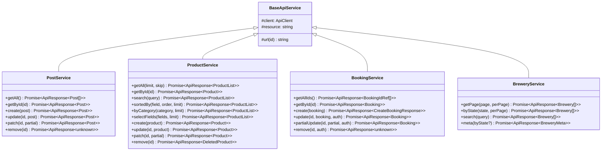

# CRUD

> OminAPI framework — Phase 3 repository pattern and CRUD operations.
> Repo: <https://github.com/omiinayak25/ominapi-playwright-framework>

---

## Overview

OminAPI implements the **Repository pattern** for every API resource. Tests call domain-language methods (`posts.create(...)`, `products.search(...)`, `bookings.remove(...)`) — never raw HTTP paths. A common abstract base (`BaseApiService`) enforces structure; concrete services absorb API quirks so test code stays clean regardless of the underlying API's oddities.

---

## Purpose

- Give tests a domain-language interface over HTTP resources.
- Centralize API quirks (DummyJSON envelope, non-standard `/add` path, Booker auth requirements) in one file per service.
- Enable full-CRUD assertions (status codes, body shapes, timing) through the normalized `ApiResponse<T>`.
- Decouple tests from URL paths — a path change touches only the service, not dozens of tests.

---

## Architecture

### BaseApiService

**File:** [`../src/services/base.service.ts`](../src/services/base.service.ts)

```typescript
export abstract class BaseApiService {
  protected constructor(
    protected readonly client: ApiClient,
    protected readonly resource: string, // e.g. "/posts", "/products"
  ) {}

  protected url(id: number | string): string {
    return `${this.resource}/${id}`; // e.g. "/posts/42"
  }
}
```

- `abstract` — cannot be instantiated directly.
- `protected` members are visible to subclasses but hidden from tests.
- The `client` is injected (Dependency Injection), never constructed inside the service.

### Concrete Services

| Service          | Resource path   | Backing API     | Notable quirks                                                                        |
| ---------------- | --------------- | --------------- | ------------------------------------------------------------------------------------- |
| `PostService`    | `/posts`        | JSONPlaceholder | Bare array on GET /posts; simulated persistence                                       |
| `ProductService` | `/products`     | DummyJSON       | Paging envelope `{ products, total, skip, limit }`; CREATE via `/products/add`        |
| `BookingService` | `/booking`      | Restful Booker  | Collection returns id refs only; mutations require `AuthStrategy`; DELETE returns 201 |
| `BreweryService` | `/v1/breweries` | Open Brewery DB | Page-based pagination; bare array result; `/meta` for total                           |

---

## Flow Diagram



---

## PostService — JSONPlaceholder `/posts`

**File:** [`../src/services/post.service.ts`](../src/services/post.service.ts)

JSONPlaceholder is a simulated API: it validates and echoes responses but does not persist. Ideal for learning CRUD mechanics and status codes.

| Method               | HTTP   | Path          | Returns                                  |
| -------------------- | ------ | ------------- | ---------------------------------------- |
| `getAll()`           | GET    | `/posts`      | `ApiResponse<Post[]>` — 100 posts        |
| `getById(id)`        | GET    | `/posts/{id}` | `ApiResponse<Post>`                      |
| `create(post)`       | POST   | `/posts`      | `ApiResponse<Post>` — status 201, id 101 |
| `update(id, post)`   | PUT    | `/posts/{id}` | `ApiResponse<Post>` — full replace       |
| `patch(id, partial)` | PATCH  | `/posts/{id}` | `ApiResponse<Post>` — partial update     |
| `remove(id)`         | DELETE | `/posts/{id}` | `ApiResponse<unknown>` — status 200      |

**Code example from tests:**

```typescript
// tests/crud/posts.crud.spec.ts
test('CREATE — returns 201 with a server-assigned id', async ({ posts }) => {
  const payload: NewPost = {
    // NewPost omits id — the server assigns it
    userId: 1,
    title: 'OminAPI Phase 3',
    body: 'Repository pattern in action',
  };
  const res = await posts.create(payload); // POST /posts via the repository
  expect(res.status).toBe(HttpStatus.CREATED);
  expect(res.body.id).toBe(101); // JSONPlaceholder always echoes id 101 on create
  expect(res.body.title).toBe(payload.title);
});

test('PATCH — partially updates only the provided fields', async ({
  posts,
}) => {
  // Send only the title; other fields are left untouched
  const res = await posts.patch(1, { title: 'Only the title changed' });
  expect(res.status).toBe(HttpStatus.OK);
  expect(res.body.title).toBe('Only the title changed');
});
```

---

## ProductService — DummyJSON `/products`

**File:** [`../src/services/product.service.ts`](../src/services/product.service.ts)

DummyJSON exposes real-world quirks that the repository absorbs:

- **Paging envelope:** `GET /products` returns `{ products: [...], total, skip, limit }`, modelled as `ProductList`.
- **Non-standard CREATE:** `POST /products/add` (not `POST /products`).
- **Soft-delete:** `DELETE /products/{id}` returns the product with `{ isDeleted: true, deletedOn: "..." }`.
- **Dedicated search:** `GET /products/search?q=...`

| Method                          | HTTP   | Path                       | Returns                             |
| ------------------------------- | ------ | -------------------------- | ----------------------------------- |
| `getAll(limit, skip)`           | GET    | `/products?limit=&skip=`   | `ApiResponse<ProductList>`          |
| `getById(id)`                   | GET    | `/products/{id}`           | `ApiResponse<Product>`              |
| `search(query)`                 | GET    | `/products/search?q=`      | `ApiResponse<ProductList>`          |
| `sortedBy(field, order, limit)` | GET    | `/products?sortBy=&order=` | `ApiResponse<ProductList>`          |
| `byCategory(category, limit)`   | GET    | `/products/category/{cat}` | `ApiResponse<ProductList>`          |
| `selectFields(fields, limit)`   | GET    | `/products?select=`        | `ApiResponse<ProductList>`          |
| `create(product)`               | POST   | `/products/add`            | `ApiResponse<Product>` — status 201 |
| `update(id, product)`           | PUT    | `/products/{id}`           | `ApiResponse<Product>`              |
| `patch(id, partial)`            | PATCH  | `/products/{id}`           | `ApiResponse<Product>`              |
| `remove(id)`                    | DELETE | `/products/{id}`           | `ApiResponse<DeletedProduct>`       |

**Code example from tests:**

```typescript
// tests/crud/products.crud.spec.ts
test('READ ALL — returns a paging envelope honoring the limit', async ({
  products,
}) => {
  const res = await products.getAll(5, 0); // limit=5, skip=0
  expect(res.status).toBe(HttpStatus.OK);
  expect(res.body.products.length).toBe(5); // items live under the paging envelope
  expect(res.body.total).toBeGreaterThan(5); // total reflects the full dataset
  expect(res.body.limit).toBe(5);
});

test('DELETE — returns the product with soft-delete metadata', async ({
  products,
}) => {
  const res = await products.remove(1); // DummyJSON soft-deletes rather than removing
  expect(res.status).toBe(HttpStatus.OK);
  expect(res.body.isDeleted).toBe(true); // soft-delete flag set on the returned product
  expect(res.body.deletedOn).toBeTruthy();
});
```

---

## BookingService — Restful Booker `/booking`

**File:** [`../src/services/booking.service.ts`](../src/services/booking.service.ts)

Restful Booker is a real, stateful API. Its quirks:

- `GET /booking` returns only id references (`{ bookingid: number }[]`), not full bookings.
- Reads and creates require no auth; updates, patches, and deletes require an `AuthStrategy`.
- DELETE returns **201** (not 200 or 204) — a documented Booker peculiarity.

The service makes the auth requirement structurally explicit: `update`, `partialUpdate`, and `remove` demand an `AuthStrategy` parameter. A test physically cannot call them without presenting credentials.

| Method                             | HTTP   | Path            | Auth required | Returns                                 |
| ---------------------------------- | ------ | --------------- | ------------- | --------------------------------------- |
| `getAllIds()`                      | GET    | `/booking`      | No            | `ApiResponse<BookingIdRef[]>`           |
| `getById(id)`                      | GET    | `/booking/{id}` | No            | `ApiResponse<Booking>`                  |
| `create(booking)`                  | POST   | `/booking`      | No            | `ApiResponse<CreateBookingResponse>`    |
| `update(id, booking, auth)`        | PUT    | `/booking/{id}` | **Yes**       | `ApiResponse<Booking>`                  |
| `partialUpdate(id, partial, auth)` | PATCH  | `/booking/{id}` | **Yes**       | `ApiResponse<Booking>`                  |
| `remove(id, auth)`                 | DELETE | `/booking/{id}` | **Yes**       | `ApiResponse<unknown>` — status **201** |

**Code example from tests:**

```typescript
// tests/crud/posts.crud.spec.ts (BookingService used in chaining)
// tests/chaining/booking-lifecycle.spec.ts
const res = await bookings.create(original); // create requires no auth
expect(res.status).toBe(HttpStatus.OK);
const bookingId = res.body.bookingid; // extract id for the follow-up delete

// remove() demands an AuthStrategy — credentials are structurally required
const del = await bookings.remove(bookingId, new CookieTokenStrategy(token));
expect(del.status).toBe(HttpStatus.CREATED); // Booker quirk: 201 on delete
```

---

## Full CRUD Chaining — Booking Lifecycle

**File:** [`../tests/chaining/booking-lifecycle.spec.ts`](../tests/chaining/booking-lifecycle.spec.ts)

The canonical real-world flow: each step consumes data extracted from the previous one. A typed `ctx` object threads extracted values (token, bookingId) through `test.step()` calls.

```typescript
test('login -> create -> read -> update -> patch -> delete -> verify', async ({
  auth,
  bookings,
}) => {
  const ctx: ChainContext = {}; // typed bag that threads values across steps

  await test.step('1) login and extract token', async () => {
    ctx.token = await auth.loginBooker(
      config.credentials.username,
      config.credentials.password,
    ); // stash the auth token for later mutating steps
  });

  await test.step('2) create booking and extract id', async () => {
    const res = await bookings.create(
      BookingFactory.forGuest('Chain', 'Tester'),
    );
    ctx.bookingId = res.body.bookingid; // carry the new id forward
  });

  await test.step('4) full update (PUT) with auth', async () => {
    const res = await bookings.update(
      ctx.bookingId!, // id from step 2
      BookingFactory.forGuest('Updated', 'Guest'),
      new CookieTokenStrategy(ctx.token!), // token from step 1
    );
    expect(res.body.firstname).toBe('Updated'); // PUT replaced the record
  });

  await test.step('6) delete with auth', async () => {
    const res = await bookings.remove(
      ctx.bookingId!,
      new CookieTokenStrategy(ctx.token!),
    );
    expect(res.status).toBe(HttpStatus.CREATED); // Booker returns 201 on delete
  });

  await test.step('7) verify deletion (now 404)', async () => {
    const res = await bookings.getById(ctx.bookingId!); // re-read the deleted id
    expect(res.status).toBe(HttpStatus.NOT_FOUND); // confirms it is gone
  });
});
```

---

## Domain Models

| Model file                                                         | Types exported                                                                          |
| ------------------------------------------------------------------ | --------------------------------------------------------------------------------------- |
| [`../src/models/post.model.ts`](../src/models/post.model.ts)       | `Post`, `NewPost`                                                                       |
| [`../src/models/product.model.ts`](../src/models/product.model.ts) | `Product`, `ProductList`, `NewProduct`, `DeletedProduct`                                |
| [`../src/models/booking.model.ts`](../src/models/booking.model.ts) | `Booking`, `BookingDates`, `CreateBookingResponse`, `BookingIdRef`, `AuthTokenResponse` |
| [`../src/models/brewery.model.ts`](../src/models/brewery.model.ts) | `Brewery`, `BreweryMeta`                                                                |

`NewPost` omits `id` (the server assigns it); `Post` includes it. This prevents the classic bug of sending a client-chosen id on creation.

---

## Best Practices

- Always inject the `ApiClient` — never construct one directly in a test. Use the fixtures (`posts`, `products`, `bookings`, `breweries`).
- Assert on response body fields, not just status codes. The repository returns the full `ApiResponse<T>` so both are available.
- For Booker mutations, pass a fresh `CookieTokenStrategy(token)` — do not reuse tokens across tests.
- Verify DELETE by reading the deleted resource and asserting 404 in a follow-up step.
- Use `BookingFactory` helpers (`BookingFactory.valid()`, `BookingFactory.forGuest(...)`) to build consistent payloads instead of inline literals.

---

## Common Mistakes

| Mistake                                                                   | Correct approach                                                               |
| ------------------------------------------------------------------------- | ------------------------------------------------------------------------------ |
| Calling `products.create(...)` and expecting `POST /products`             | DummyJSON CREATE uses `/products/add` — the service handles this transparently |
| Asserting `res.body.length` on a DummyJSON list                           | List is wrapped: use `res.body.products.length`                                |
| Expecting DELETE on Booker to return 200 or 204                           | Booker returns **201**; assert `HttpStatus.CREATED`                            |
| Calling `bookings.remove(id)` without passing auth                        | TypeScript compile error — `auth: AuthStrategy` is a required parameter        |
| Using `booker` (raw `ApiClient`) instead of `bookings` (`BookingService`) | `bookings` fixture provides the repository with domain methods                 |

---

## Interview Questions

1. **What is the Repository pattern and why does OminAPI use it?**
   A Repository provides domain-language methods over a data source (here, an API). Tests call `posts.create(...)`, not `client.post('/posts', ...)`. If the path or verb changes, only the repository file changes.

2. **Why is `BaseApiService` abstract?**
   "A resource repository" is a concept, not a concrete thing. `abstract` prevents `new BaseApiService()` and encodes that rule in the type system.

3. **How does `ProductService` absorb DummyJSON's non-standard CREATE path?**
   `create()` calls `this.client.post(\`${this.resource}/add\`, ...)`. Tests call `products.create(payload)`and never see`/add`.

4. **Why do `BookingService` mutating methods take an `AuthStrategy` parameter?**
   To make the auth requirement structurally explicit. A test cannot compile a DELETE call without supplying credentials.

5. **What is the `ctx` object pattern in the lifecycle test?**
   A typed `ChainContext` object accumulates extracted values (token, bookingId) across `test.step()` calls. This is preferable to module-level globals because it is scoped to one test and type-safe.

6. **Why does `PostService.remove()` return `ApiResponse<unknown>` while `ProductService.remove()` returns `ApiResponse<DeletedProduct>`?**
   JSONPlaceholder returns an empty object `{}` on DELETE; DummyJSON returns the product with soft-delete metadata. Each service types its return to what its API actually produces.

---

## References

- JSONPlaceholder: <https://jsonplaceholder.typicode.com/>
- DummyJSON: <https://dummyjson.com/docs/products>
- Restful Booker: <https://restful-booker.herokuapp.com/apidoc>

---

## Related Modules

| Module                       | Path                                                                                         |
| ---------------------------- | -------------------------------------------------------------------------------------------- |
| BaseApiService               | [`../src/services/base.service.ts`](../src/services/base.service.ts)                         |
| PostService                  | [`../src/services/post.service.ts`](../src/services/post.service.ts)                         |
| ProductService               | [`../src/services/product.service.ts`](../src/services/product.service.ts)                   |
| BookingService               | [`../src/services/booking.service.ts`](../src/services/booking.service.ts)                   |
| BreweryService               | [`../src/services/brewery.service.ts`](../src/services/brewery.service.ts)                   |
| Post model                   | [`../src/models/post.model.ts`](../src/models/post.model.ts)                                 |
| Product model                | [`../src/models/product.model.ts`](../src/models/product.model.ts)                           |
| Booking model                | [`../src/models/booking.model.ts`](../src/models/booking.model.ts)                           |
| Brewery model                | [`../src/models/brewery.model.ts`](../src/models/brewery.model.ts)                           |
| ApiClient                    | [`../src/api-client/api-client.ts`](../src/api-client/api-client.ts)                         |
| Fixtures                     | [`../src/fixtures/api.fixtures.ts`](../src/fixtures/api.fixtures.ts)                         |
| Posts CRUD tests             | [`../tests/crud/posts.crud.spec.ts`](../tests/crud/posts.crud.spec.ts)                       |
| Products CRUD tests          | [`../tests/crud/products.crud.spec.ts`](../tests/crud/products.crud.spec.ts)                 |
| Booking lifecycle (chaining) | [`../tests/chaining/booking-lifecycle.spec.ts`](../tests/chaining/booking-lifecycle.spec.ts) |
| Authentication doc           | [Authentication.md](Authentication.md)                                                       |
| Pagination doc               | [Pagination.md](Pagination.md)                                                               |
