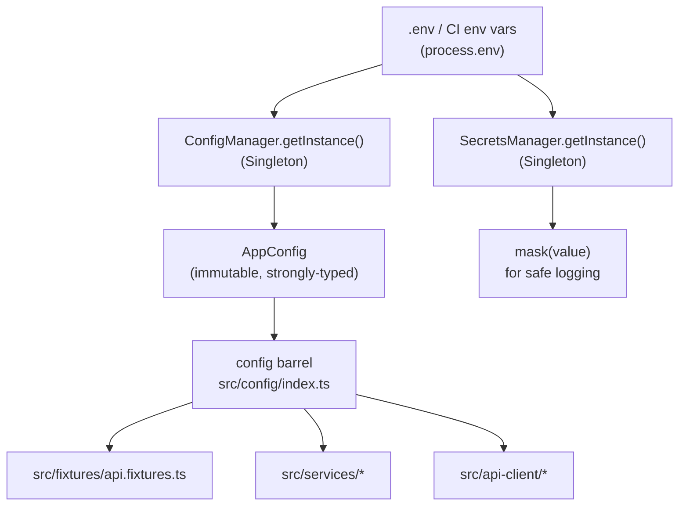

# Configuration

How OminAPI reads, validates, and distributes framework configuration —
covering `ConfigManager`, `SecretsManager`, every environment variable, the
typed config interfaces, and the fail-fast validation strategy.

---

## Overview

All configuration enters the framework through a single gateway:
`ConfigManager` reads `process.env`, converts raw strings to typed values,
validates them against allowed sets, and exposes one immutable `AppConfig`
object to the rest of the codebase. The `SecretsManager` sits alongside it
for runtime-only secrets that must never appear unmasked in logs.

**12-Factor principle**: configuration lives in the environment, not in code.
The same built artefact runs against `dev`, `staging`, or `prod` by swapping
`.env` only.

---

## Architecture



---

## ConfigManager (Singleton)

**File:** `src/config/config.manager.ts`

`ConfigManager` implements the Singleton pattern: the constructor is private,
and access is exclusively through `ConfigManager.getInstance()`. The instance
is created on the first call (lazy initialisation) and reused forever after.

```typescript
import { ConfigManager } from '@config/config.manager';

// Access the validated config
const cfg = ConfigManager.getInstance().config;
console.log(cfg.env); // 'dev' | 'staging' | 'prod'
console.log(cfg.baseUrl); // validated, non-empty string
```

### Convenience barrel

`src/config/index.ts` pre-calls `getInstance()` and re-exports the result as
`config`, so most consumers write:

```typescript
import { config } from '@config/index';

// config is the fully-validated AppConfig object
const url = config.endpoints.dummyJson;
```

### Fail-fast validation

`ConfigManager.load()` is called once inside the private constructor. It:

1. Calls `parseEnum('TEST_ENV', ...)` — throws if the value is not in
   `['dev', 'staging', 'prod']`.
2. Calls `required('BASE_URL', ...)` — throws if the value is empty or
   undefined.
3. Calls `parseNumber('API_TIMEOUT_MS', ...)` — throws if the value is not a
   valid number.
4. For boolean flags: strict string comparison (`=== 'true'`).

All errors include the variable name and the received value. A misconfigured
environment crashes in `global-setup.ts` — before a single test runs.

### Test-only reset

```typescript
ConfigManager.reset(); // clears the cached instance
```

This escape hatch lets unit tests force a re-read with different env vars.
Never call it in production code.

---

## SecretsManager (Singleton)

**File:** `src/config/secrets.ts`

`SecretsManager` reads secrets from `process.env` at call time (not at startup)
and provides a masking helper for safe logging.

```typescript
import { SecretsManager } from '@config/secrets';

const secrets = SecretsManager.getInstance();

// Required secret — throws if absent or empty
const token = secrets.get('MY_API_TOKEN');

// Optional secret — returns undefined if not set
const optional = secrets.getOptional('OPTIONAL_KEY');

// Mask for logging: first 2 + last 2 chars visible, rest hidden
logger.info(`Token: ${secrets.mask(token)}`); // "ab***yz"
```

Secrets shorter than 5 characters are fully masked as `****`.

---

## TypeScript Config Interfaces

**File:** `src/types/config.types.ts`

These interfaces are the single source of truth for the shape of validated
configuration. All framework consumers depend on these types, not on
`process.env`.

```typescript
/** Supported deployment/test environments. */
export type Environment = 'dev' | 'staging' | 'prod';

/** Winston-compatible log levels, most-severe to most-verbose. */
export type LogLevel = 'error' | 'warn' | 'info' | 'http' | 'debug';

/** Base URLs for every public API the framework targets. */
export interface ApiEndpoints {
  readonly booker: string;
  readonly dummyJson: string;
  readonly reqres: string;
  readonly jsonPlaceholder: string;
  readonly httpbin: string;
  readonly postmanEcho: string;
  readonly openBrewery: string;
  readonly countriesGraphql: string;
  readonly graphqlZero: string;
}

/** Demo credentials for auth phases (public sandbox APIs only). */
export interface Credentials {
  readonly username: string;
  readonly password: string;
}

/** The fully-validated application configuration (immutable after load). */
export interface AppConfig {
  readonly env: Environment;
  readonly baseUrl: string;
  readonly endpoints: ApiEndpoints;
  readonly credentials: Credentials;
  readonly logLevel: LogLevel;
  readonly timeoutMs: number;
  readonly ignoreHttpsErrors: boolean;
}
```

---

## Environment Variables Reference

All variables are read from `.env` (loaded by `dotenv` in both
`config.manager.ts` and `playwright.config.ts`) or injected directly by the
CI pipeline. Copy `.env.example` to `.env` and edit as needed.

### Environment Selection

| Variable   | Type          | Default | Valid Values             | Where Used                     |
| ---------- | ------------- | ------- | ------------------------ | ------------------------------ |
| `TEST_ENV` | `Environment` | `dev`   | `dev`, `staging`, `prod` | `ConfigManager` → `config.env` |

`TEST_ENV` selects which environment profile the suite runs against. It does
not load different files automatically — it is exposed as `config.env` for
tests and services that need to branch on environment.

Override at runtime:

```bash
TEST_ENV=staging npm test
```

### API Endpoints

| Variable              | Default                                | Maps to                                                           |
| --------------------- | -------------------------------------- | ----------------------------------------------------------------- |
| `BASE_URL`            | `https://restful-booker.herokuapp.com` | `config.baseUrl`, `config.endpoints.booker`, Playwright `baseURL` |
| `DUMMYJSON_URL`       | `https://dummyjson.com`                | `config.endpoints.dummyJson`                                      |
| `REQRES_URL`          | `https://reqres.in`                    | `config.endpoints.reqres`                                         |
| `JSONPLACEHOLDER_URL` | `https://jsonplaceholder.typicode.com` | `config.endpoints.jsonPlaceholder`                                |
| `HTTPBIN_URL`         | `https://httpbingo.org`                | `config.endpoints.httpbin`                                        |
| `POSTMAN_ECHO_URL`    | `https://postman-echo.com`             | `config.endpoints.postmanEcho`                                    |
| `OPEN_BREWERY_URL`    | `https://api.openbrewerydb.org`        | `config.endpoints.openBrewery`                                    |
| `COUNTRIES_GQL_URL`   | `https://countries.trevorblades.com`   | `config.endpoints.countriesGraphql`                               |
| `GRAPHQL_ZERO_URL`    | `https://graphqlzero.almansi.me`       | `config.endpoints.graphqlZero`                                    |

`BASE_URL` is special: it is also read directly by `playwright.config.ts` and
set as Playwright's `use.baseURL`, making it the default for any test that
uses the raw Playwright `request` fixture rather than a named client fixture.

Note: `OPEN_BREWERY_URL` stores the **origin only** — no `/v1` path suffix.
`BreweryService` appends the resource path. This avoids the `new URL()` pitfall
where a base URL with a path would drop that path when a leading-slash request
path is used.

### Credentials

| Variable          | Default       | Maps to                       |
| ----------------- | ------------- | ----------------------------- |
| `BOOKER_USERNAME` | `admin`       | `config.credentials.username` |
| `BOOKER_PASSWORD` | `password123` | `config.credentials.password` |

These are demo credentials for the Restful Booker sandbox API. They are not
real secrets. In a production-like environment, use `SecretsManager.get()` for
truly sensitive values.

### Logging

| Variable    | Type       | Default | Valid Values                             | Maps to           |
| ----------- | ---------- | ------- | ---------------------------------------- | ----------------- |
| `LOG_LEVEL` | `LogLevel` | `info`  | `error`, `warn`, `info`, `http`, `debug` | `config.logLevel` |

`LOG_LEVEL` controls Winston verbosity. Set to `debug` to log full request and
response bodies:

```bash
LOG_LEVEL=debug npm test
```

The logger is configured in `src/utils/logger.ts` and reads `config.logLevel`
at startup.

### Timeouts

| Variable         | Type     | Default | Maps to            | Also Used In                                                               |
| ---------------- | -------- | ------- | ------------------ | -------------------------------------------------------------------------- |
| `API_TIMEOUT_MS` | `number` | `30000` | `config.timeoutMs` | `withClient()` in fixtures, Playwright `timeout` in `playwright.config.ts` |

The per-test timeout is set to 30 s in `playwright.config.ts` (`timeout:
30_000`). The `API_TIMEOUT_MS` env var feeds `config.timeoutMs`, which the
fixture layer passes to each `APIRequestContext` it creates.

### Network Behaviour

| Variable              | Type      | Default | Maps to                    | Also Used In                                   |
| --------------------- | --------- | ------- | -------------------------- | ---------------------------------------------- |
| `IGNORE_HTTPS_ERRORS` | `boolean` | `false` | `config.ignoreHttpsErrors` | `playwright.config.ts` `use.ignoreHTTPSErrors` |

Set to `true` only when testing against services with self-signed TLS
certificates (e.g. local mTLS environments).

---

## global-setup.ts — Startup Gate

**File:** `src/global-setup.ts`

Registered in `playwright.config.ts` as `globalSetup`. It runs once before any
test. Importing `config` from `src/config/index.ts` triggers `ConfigManager`
validation — so an invalid `.env` causes an immediate, clear error rather than
a mysterious test failure 30 seconds in.

It also logs a startup banner via the Winston logger:

```
OminAPI suite starting { env: 'dev', baseUrl: '...', logLevel: 'info', ci: false }
```

This banner is captured in CI logs, providing an audit trail of which
configuration each run used.

---

## playwright.config.ts Integration

`playwright.config.ts` reads env vars independently of `ConfigManager` (dotenv
is called at the top of the file). It uses:

- `process.env.BASE_URL` → `use.baseURL`
- `process.env.IGNORE_HTTPS_ERRORS` → `use.ignoreHTTPSErrors`
- `process.env.CI` → `forbidOnly`, `retries`, `workers`

The `ConfigManager` then performs a second, more thorough validation pass
(type coercion, enum checks, number parsing) and provides the typed `config`
object to the rest of the framework.

---

## Environment-Specific Data Files

Beyond `.env`, the `data/env/` folder contains JSON datasets keyed by
environment name:

```
data/env/
├── dev.json
└── staging.json
```

These are loaded by the data-driven test suite (`tests/data-driven/
environment-data.spec.ts`) using the `DataLoader` utility from
`src/utils/data-loader.ts`. The active environment is selected via
`config.env`.

---

## Best Practices

- Consume `config` from `@config/index`, not `ConfigManager.getInstance().config`
  directly — it is shorter and the intention is clearer.
- Never read `process.env` directly in a test or service. Channel everything
  through `config` or `SecretsManager`.
- Keep `BOOKER_USERNAME` / `BOOKER_PASSWORD` in `.env` for local runs. In CI,
  inject them as pipeline secrets so they never appear in version control.
- Changing an endpoint (e.g. pointing `DUMMYJSON_URL` at a mock server) takes
  one line in `.env`. No test file changes are needed.
- Use `SecretsManager.mask()` whenever a secret must appear in a log message.

---

## Common Mistakes

| Mistake                           | Effect                                            | Fix                                            |
| --------------------------------- | ------------------------------------------------- | ---------------------------------------------- |
| Setting `TEST_ENV=qa`             | `ConfigManager` throws: invalid enum value        | Use `dev`, `staging`, or `prod`                |
| Setting `API_TIMEOUT_MS=thirty`   | `ConfigManager` throws: not a number              | Use an integer string, e.g. `30000`            |
| Leaving `BASE_URL` empty          | `ConfigManager` throws: missing required variable | Provide a non-empty URL                        |
| Committing `.env`                 | Secrets in version history                        | `.env` is in `.gitignore` — never force-add it |
| Reading `process.env.X` in a test | Bypasses validation; `undefined` at runtime       | Use `config.endpoints.x` instead               |

---

## Interview Questions

1. **Why is `ConfigManager` a Singleton?** Configuration is global, read-only,
   and expensive to validate. A single shared instance guarantees one
   consistent, validated view across the entire test suite.
2. **What is fail-fast validation and why does it matter?** The framework
   crashes immediately with a clear error if configuration is invalid, rather
   than silently hitting the wrong URL and producing confusing failures 30
   tests later.
3. **Why is `BASE_URL` treated as `required` while other endpoint vars have
   defaults?** `BASE_URL` is the primary API under test and drives Playwright's
   `baseURL`. An empty value would silently break all request construction.
4. **How does `SecretsManager.mask()` work?** It keeps the first 2 and last 2
   characters of the secret, replacing everything in between with `***`. Values
   of 4 characters or fewer become `****`.
5. **Why does `ConfigManager.reset()` exist?** It provides a test-only escape
   hatch to clear the Singleton's cached instance so unit tests can re-run
   `load()` with different env var values without restarting the process.

---

## References

- [src/config/config.manager.ts](../src/config/config.manager.ts)
- [src/config/secrets.ts](../src/config/secrets.ts)
- [src/config/index.ts](../src/config/index.ts)
- [src/types/config.types.ts](../src/types/config.types.ts)
- [src/global-setup.ts](../src/global-setup.ts)
- [.env.example](../.env.example)
- [playwright.config.ts](../playwright.config.ts)

## Related Modules

- [Installation.md](Installation.md)
- [GettingStarted.md](GettingStarted.md)
- [FolderStructure.md](FolderStructure.md)
