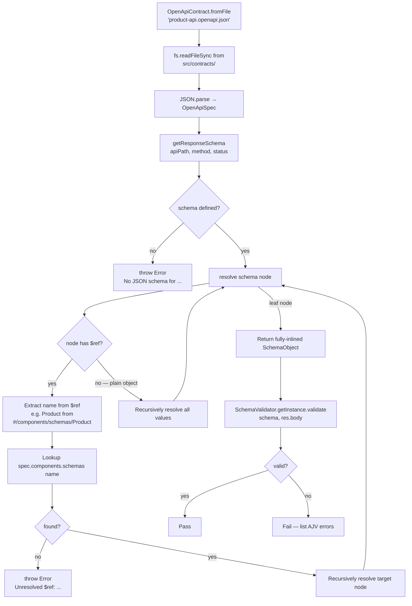

# Contract Testing — OpenAPI Validation and Breaking-Change Detection

> **Modules:** `src/utils/openapi.ts` · `src/utils/contract-diff.ts` · `src/contracts/product-api.openapi.json`
> **Repo:** <https://github.com/omiinayak25/ominapi-playwright-framework>

---

## Overview

Contract testing verifies that a live provider's responses match a published
specification, and that API evolution does not silently break existing consumers.
The framework implements two complementary layers:

| Layer                         | Module                       | What it does                                                                                        |
| ----------------------------- | ---------------------------- | --------------------------------------------------------------------------------------------------- |
| **OpenAPI validation**        | `src/utils/openapi.ts`       | Load a spec, extract a response schema (with `$ref` resolution), validate real and mocked responses |
| **Breaking-change detection** | `src/utils/contract-diff.ts` | Compare two schema versions and classify each change as safe or breaking                            |

---

## Purpose

- A provider that changes `id` from `integer` to `string` will pass all unit
  tests — but immediately break every consumer. Contract tests catch this before
  consumers do.
- A spec committed to source control (`src/contracts/`) is a shared truth: both
  the test suite and the provider team can reference it.
- `detectBreakingChanges` gives a machine-readable list of breaking changes
  suitable for gating CI on schema evolution.

---

## Architecture

```
src/contracts/
  └── product-api.openapi.json      – committed OpenAPI 3.0.3 spec

src/utils/
  ├── openapi.ts                    – OpenApiContract (load + $ref resolution)
  └── contract-diff.ts              – detectBreakingChanges / isBackwardCompatible

src/validators/
  └── schema.validator.ts           – SchemaValidator (used to validate against extracted schemas)

tests/contract/
  ├── openapi-validation.spec.ts    – live provider + mocked drift
  ├── backward-compatibility.spec.ts – breaking vs safe schema evolution
  └── version-validation.spec.ts    – version assertion + provider evolution
```

---

## OpenAPI Contract Flow



---

## `OpenApiContract` API

### `OpenApiContract.fromFile(relative: string)`

Loads a spec from `src/contracts/` (resolved from `process.cwd()`). Throws if
the file is missing or not valid JSON.

```typescript
const contract = OpenApiContract.fromFile('product-api.openapi.json');
```

### `contract.version`

Returns `spec.info.version` — use this to assert the spec's declared version in
tests, or to gate CI on expected version strings.

```typescript
expect(contract.version).toBe('1.0.0');
```

### `contract.getResponseSchema(apiPath, method, status = '200')`

Navigates `spec.paths[apiPath][method].responses[status].content['application/json'].schema`
and returns a **fully inlined** `SchemaObject` with all `$ref` pointers resolved.
Throws fast (fail-fast principle) if the path, method, status code, or
`application/json` media type is not present in the spec.

```typescript
const productSchema = contract.getResponseSchema(
  '/products/{id}',
  'get',
  '200',
);
// Returns the Product schema with $ref resolved — ready for SchemaValidator
```

### `$ref` Resolution

`resolve(node)` walks the schema tree recursively:

- If a node has a `$ref` string (e.g. `"#/components/schemas/Product"`), it
  extracts the component name, looks it up in `spec.components.schemas`, and
  recurses into the target.
- Plain objects: all values are resolved recursively.
- Arrays and primitives: passed through unchanged.

The result is a self-contained `SchemaObject` that `SchemaValidator` can compile
without any further `$ref` references.

---

## Committed Contract: `product-api.openapi.json`

```json
// src/contracts/product-api.openapi.json (abridged)
{
  "openapi": "3.0.3",
  "info": { "title": "OminAPI Product Contract", "version": "1.0.0" },
  "paths": {
    "/products/{id}": {
      "get": {
        "responses": {
          "200": {
            "content": {
              "application/json": {
                "schema": { "$ref": "#/components/schemas/Product" }
              }
            }
          }
        }
      }
    }
  },
  "components": {
    "schemas": {
      "Product": {
        "type": "object",
        "required": [
          "id",
          "title",
          "price",
          "description",
          "category",
          "stock"
        ],
        "additionalProperties": true,
        "properties": {
          "id": { "type": "integer" },
          "title": { "type": "string" },
          "price": { "type": "number" },
          "description": { "type": "string" },
          "category": { "type": "string" },
          "stock": { "type": "integer" }
        }
      }
    }
  }
}
```

`additionalProperties: true` is deliberate — DummyJSON returns many extra fields
(`rating`, `tags`, `images`, `reviews`, `meta`, …). The contract covers only the
six fields consumers depend on and tolerates everything else.

---

## Breaking-Change Detection

### `detectBreakingChanges(oldSchema, newSchema): BreakingChange[]`

Compares two `SchemaObject` instances (old → new, consumer perspective) and
returns a list of breaking changes. Three kinds are detected:

| `kind`               | Condition                                                                               | Why it breaks consumers                                                                   |
| -------------------- | --------------------------------------------------------------------------------------- | ----------------------------------------------------------------------------------------- |
| `'removed-field'`    | A field in `oldSchema.properties` is absent in `newSchema.properties`                   | Consumer code reading that field breaks or returns `undefined`                            |
| `'type-changed'`     | A field's `type` differs between old and new                                            | Consumer code casting or processing the value breaks                                      |
| `'required-removed'` | A field was in `oldSchema.required` but not in `newSchema.required` (and still present) | Consumer code that trusted the field to always be present now gets unexpected `undefined` |

Safe change (not detected as breaking):

| Change                                    | Why it's safe                                            |
| ----------------------------------------- | -------------------------------------------------------- |
| Adding a new field (optional or required) | Consumers ignore unknown fields; no existing code breaks |

### `isBackwardCompatible(oldSchema, newSchema): boolean`

Convenience wrapper: returns `true` when `detectBreakingChanges` returns an
empty array.

---

## Code Examples

### Validate a live provider response against the spec

```typescript
// tests/contract/openapi-validation.spec.ts
import { OpenApiContract } from '../../src/utils/openapi.js';
import { SchemaValidator } from '../../src/validators/index.js';

const contract = OpenApiContract.fromFile('product-api.openapi.json');
const productSchema = contract.getResponseSchema(
  '/products/{id}',
  'get',
  '200',
);
const validator = SchemaValidator.getInstance();

test('the live provider response satisfies the contract', async ({
  products,
}) => {
  const res = await products.getById(1);
  const result = validator.validate(productSchema, res.body);
  expect(result.valid, result.errors.join('; ')).toBe(true);
});
```

### Detect a drifting provider using the mock server

```typescript
test('a drifting provider response VIOLATES the contract', async ({ mock }) => {
  // Simulate a provider that changed `id` to string and dropped required fields
  mock.server.stub('GET', '/products/1', {
    body: { id: 'one', title: 'Broken' },
  });
  const res = await mock.client.get('/products/1');

  const result = validator.validate(productSchema, res.body);
  expect(result.valid).toBe(false);
  expect(result.errors.join(' ')).toMatch(/id|required/);
});
```

### Fail fast when the spec has no schema for an operation

```typescript
test('extracting a schema for an undefined operation fails fast', () => {
  expect(() => contract.getResponseSchema('/nope', 'get')).toThrow(
    /No JSON schema/,
  );
});
```

### Breaking vs safe schema evolution

```typescript
// tests/contract/backward-compatibility.spec.ts
import {
  detectBreakingChanges,
  isBackwardCompatible,
} from '../../src/utils/contract-diff.js';

const v1: SchemaObject = {
  type: 'object',
  required: ['id', 'name'],
  properties: {
    id: { type: 'integer' },
    name: { type: 'string' },
    price: { type: 'number' },
  },
};

test('adding a new optional field is backward COMPATIBLE', () => {
  const v2 = {
    ...v1,
    properties: { ...v1.properties, discount: { type: 'number' } },
  };
  expect(isBackwardCompatible(v1, v2)).toBe(true);
  expect(detectBreakingChanges(v1, v2)).toHaveLength(0);
});

test('removing a field is BREAKING', () => {
  const v2 = {
    type: 'object',
    required: ['id', 'name'],
    properties: { id: { type: 'integer' }, name: { type: 'string' } },
  };
  const changes = detectBreakingChanges(v1, v2);
  expect(isBackwardCompatible(v1, v2)).toBe(false);
  expect(
    changes.some((c) => c.kind === 'removed-field' && c.field === 'price'),
  ).toBe(true);
});

test('changing a field type is BREAKING', () => {
  const v2 = {
    ...v1,
    properties: { ...v1.properties, id: { type: 'string' } },
  }; // integer → string
  const changes = detectBreakingChanges(v1, v2);
  expect(
    changes.some((c) => c.kind === 'type-changed' && c.field === 'id'),
  ).toBe(true);
});

test('dropping a field from required is BREAKING', () => {
  const v2 = { ...v1, required: ['id'] }; // name no longer required
  const changes = detectBreakingChanges(v1, v2);
  expect(
    changes.some((c) => c.kind === 'required-removed' && c.field === 'name'),
  ).toBe(true);
});
```

### Version validation

```typescript
// tests/contract/version-validation.spec.ts
test('the contract declares its version', () => {
  expect(contract.version).toBe('1.0.0');
});

test('a v2 provider that ADDS a field stays compatible with v1 contract', async ({
  mock,
}) => {
  mock.server.stub('GET', '/products/1', {
    body: {
      id: 1,
      title: 'Phone',
      price: 499,
      description: 'A phone',
      category: 'smartphones',
      stock: 10,
      warrantyYears: 2,
    }, // NEW in v2
  });
  const res = await mock.client.get('/products/1');
  expect(validator.validate(productSchema, res.body).valid).toBe(true);
});

test('a v2 provider that DROPS a required field breaks the contract', async ({
  mock,
}) => {
  mock.server.stub('GET', '/products/1', {
    body: {
      id: 1,
      title: 'Phone',
      description: 'A phone',
      category: 'smartphones',
      stock: 10,
    }, // price missing
  });
  const res = await mock.client.get('/products/1');
  const result = validator.validate(productSchema, res.body);
  expect(result.valid).toBe(false);
  expect(result.errors.join(' ')).toMatch(/price|required/);
});
```

---

## Best Practices

- **Commit specs to source control** in `src/contracts/`. A spec that lives only
  in a wiki or Confluence cannot be diffed, versioned, or referenced by the test
  suite.
- **Use `getResponseSchema` at module scope** (outside `test()`). The extracted
  schema is a stable object reference and benefits from `SchemaValidator`'s
  compiled-schema cache.
- **Always check `result.errors.join('; ')` in the `expect` message** so CI logs
  tell you exactly which field violated the contract.
- **Run `detectBreakingChanges` in CI** when updating a spec. Gate the build on
  `isBackwardCompatible` to prevent accidental breaking releases.
- **Use the mock server for drift simulation** — it lets you test contract
  violations without needing a broken real provider.
- **Prefer `additionalProperties: true` in specs for third-party APIs** you don't
  control; use `false` only for APIs you own.
- **Explicitly test the fail-fast path** (`getResponseSchema` on an unknown
  operation) — it confirms the spec loading is correct and the error message is
  useful.

---

## Common Mistakes

| Mistake                                                            | Fix                                                                                                                                 |
| ------------------------------------------------------------------ | ----------------------------------------------------------------------------------------------------------------------------------- |
| Storing the contract or schema inside a `test()` body              | Define `contract` and `productSchema` at module scope for cache efficiency                                                          |
| Calling `getResponseSchema('/products/1', ...)` with a concrete ID | Use the path template: `'/products/{id}'` — the spec defines parametric paths                                                       |
| Forgetting `$ref` resolution and passing the raw schema to AJV     | Always use `getResponseSchema` — it calls `resolve()` internally; never pass `{ $ref: '...' }` to `SchemaValidator`                 |
| Treating `'required-removed'` as safe                              | It is breaking for consumers who trusted the field to always be present                                                             |
| Using `detectBreakingChanges` for REQUEST schemas                  | The function is designed for RESPONSE schemas (consumer perspective). Request schema analysis differs.                              |
| Not testing the mock-drift path                                    | Without a mock test, you only know the real provider is currently correct — not that your validation logic would catch a regression |

---

## Real Project Usage

| Test file                                       | What is tested                                                                                            |
| ----------------------------------------------- | --------------------------------------------------------------------------------------------------------- |
| `tests/contract/openapi-validation.spec.ts`     | Live DummyJSON provider against committed spec; mocked drift detection; fail-fast for undefined operation |
| `tests/contract/backward-compatibility.spec.ts` | All four breaking-change kinds vs the safe "add optional field" case                                      |
| `tests/contract/version-validation.spec.ts`     | `contract.version` assertion; v2 add-field (safe); v2 drop-required-field (breaking)                      |

---

## Interview Questions

1. **What is the difference between schema validation and contract testing?**
   Schema validation confirms a body's structure against a JSON Schema. Contract
   testing additionally anchors that schema to a published specification
   (OpenAPI), ensuring the test's expectations match what was agreed between
   provider and consumer — not just what the test author happened to write.

2. **Why does `getResponseSchema` resolve `$ref` pointers instead of passing them
   to AJV directly?**
   AJV's `compile()` requires a self-contained schema. A schema with
   `{ "$ref": "#/components/schemas/Product" }` is not self-contained; AJV would
   need the full spec object as additional context. `resolve()` inlines the
   referenced component, producing a schema AJV can compile standalone.

3. **What three changes does `detectBreakingChanges` classify as breaking?**
   Removed field (`'removed-field'`), type changed (`'type-changed'`), and a
   field dropped from `required` while still present (`'required-removed'`).

4. **Why is "adding a new field" safe from a consumer perspective?**
   Existing consumers only read fields they know about. An unknown new field is
   ignored. No existing code path breaks — which is why Postel's law ("be liberal
   in what you accept") applies to additive API changes.

5. **How do you test contract violations without a broken real provider?**
   Use the in-process `MockServer` fixture. `mock.server.stub(...)` returns a
   crafted body (e.g. with a wrong type or missing field), and `mock.client` makes
   requests against it. The mock is ephemeral and isolated per test.

6. **What happens if the spec file is missing or the path is wrong?**
   `OpenApiContract.fromFile` calls `fs.readFileSync` synchronously; Node throws
   an `ENOENT` error immediately at load time. `getResponseSchema` throws
   `[OpenApiContract] No JSON schema for ...` if the operation is not in the spec.
   Both fail fast, keeping the error signal close to its cause.

7. **Why is the `$ref` name extracted with `.split('/').pop()`?**
   OpenAPI `$ref` values are JSON Pointer strings like
   `"#/components/schemas/Product"`. `.split('/').pop()` extracts `"Product"` —
   the component name — which is then used to look up
   `spec.components.schemas["Product"]`. This handles the standard `#/components/schemas/`
   prefix; deeper nesting would require a full JSON Pointer resolver.

---

## References

- [`src/utils/openapi.ts`](../src/utils/openapi.ts)
- [`src/utils/contract-diff.ts`](../src/utils/contract-diff.ts)
- [`src/contracts/product-api.openapi.json`](../src/contracts/product-api.openapi.json)
- [`tests/contract/openapi-validation.spec.ts`](../tests/contract/openapi-validation.spec.ts)
- [`tests/contract/backward-compatibility.spec.ts`](../tests/contract/backward-compatibility.spec.ts)
- [`tests/contract/version-validation.spec.ts`](../tests/contract/version-validation.spec.ts)

---

## Related Modules

- [Validation.md](Validation.md) — `expectMatchesSchema` and response assertion helpers
- [SchemaValidation.md](SchemaValidation.md) — `SchemaValidator` singleton + schema definitions
- [`src/validators/schema.validator.ts`](../src/validators/schema.validator.ts) — compiles and caches AJV validators
- [`src/schemas/product.schema.ts`](../src/schemas/product.schema.ts) — standalone `productSchema` (mirrors the spec's Product component)
- [`src/utils/mock-server.ts`](../src/utils/mock-server.ts) — in-process stub server used for drift simulation
