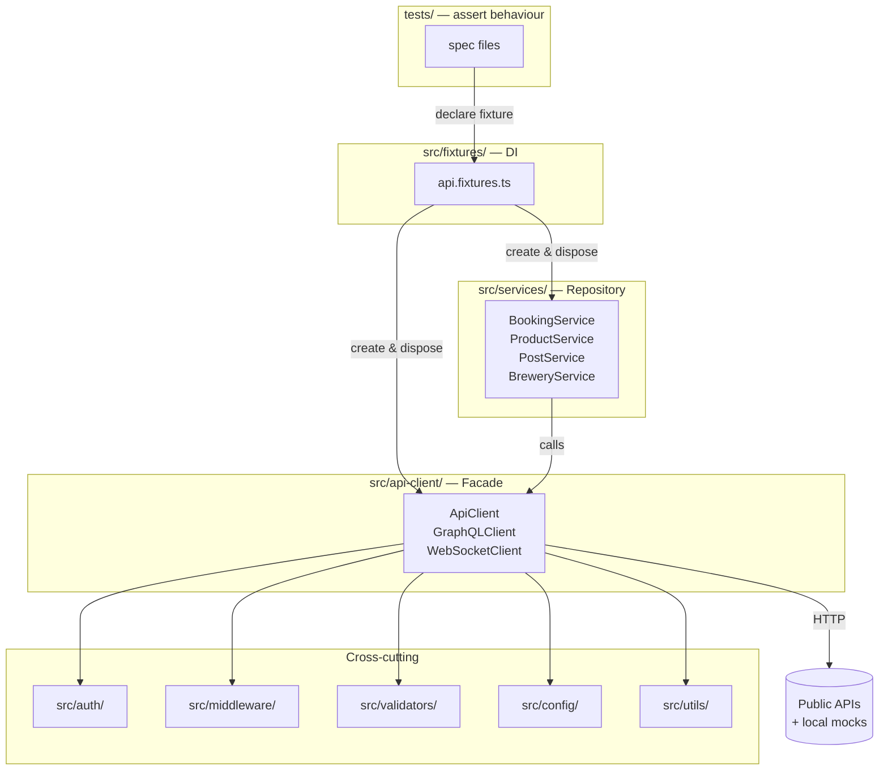

# Folder Structure

A map of every directory and key file in OminAPI, with the responsibility of
each `src/` subfolder and each `tests/` phase folder.

---

## Overview

The repository follows a clean separation between **framework code** (`src/`)
and **test specs** (`tests/`). Supporting assets live in `data/`. Root-level
files govern tooling and CI. The `docs/` folder holds this documentation set.

---

## Full Directory Tree

```
ominapi-playwright-framework/
│
├── .github/
│   └── workflows/
│       └── ci.yml                  # GitHub Actions: quality gate → sharded tests → merged report
│
├── .husky/
│   └── pre-commit                  # Runs lint-staged on every commit
│
├── data/                           # Data-driven test inputs (committed, not generated)
│   ├── env/
│   │   ├── dev.json                # Environment-specific dataset for dev
│   │   └── staging.json            # Environment-specific dataset for staging
│   ├── bookings.csv                # CSV dataset for csv-driven tests
│   ├── products.xlsx               # Excel dataset for excel-driven tests
│   └── status-cases.json           # JSON dataset for status-code-driven tests
│
├── docs/                           # Documentation (this set)
│   ├── Installation.md
│   ├── GettingStarted.md
│   ├── Configuration.md
│   └── FolderStructure.md          # (this file) + many more
│
├── src/                            # Reusable framework code — the "product"
│   ├── api-client/                 # HTTP / GraphQL / WebSocket facades
│   ├── auth/                       # Authentication service + strategy implementations
│   ├── builders/                   # Fluent builder and named factories for test data
│   ├── config/                     # ConfigManager (Singleton), SecretsManager, barrel
│   ├── constants/                  # HTTP status codes, OWASP security payloads
│   ├── contracts/                  # Committed OpenAPI specification documents
│   ├── fixtures/                   # Playwright fixtures (Dependency Injection)
│   ├── middleware/                 # Cross-cutting request/response hooks
│   ├── models/                     # Typed domain models (Booking, Product, Post, Brewery)
│   ├── reporters/                  # Custom Playwright SummaryReporter
│   ├── schemas/                    # AJV JSON Schema definitions
│   ├── services/                   # Repository layer — one service per API resource
│   ├── types/                      # Shared TypeScript interfaces and type aliases
│   ├── utils/                      # Logger, retry, cache, circuit breaker, and more
│   ├── validators/                 # Response, schema (AJV), and security validators
│   └── global-setup.ts             # Playwright global setup — config validation + banner
│
├── tests/                          # One folder per phase / topic (20 folders)
│   ├── foundation/                 # Phase 2  — HTTP basics
│   ├── crud/                       # Phase 3  — CRUD via Repository
│   ├── authentication/             # Phase 4  — Auth strategies
│   ├── builders/                   # Phase 5  — Builder and Factory patterns
│   ├── validation/                 # Phase 6  — Multi-dimension assertions
│   ├── chaining/                   # Phase 7  — Request chaining lifecycle
│   ├── data-driven/                # Phase 8  — JSON / CSV / Excel / env datasets
│   ├── negative/                   # Phase 9  — Error paths and malformed payloads
│   ├── pagination/                 # Phase 10 — Offset, page-based, collect-all
│   ├── file/                       # Phase 11 — Upload and download
│   ├── security/                   # Phase 12 — OWASP, JWT tampering, IDOR
│   ├── performance/                # Phase 13 — Latency SLAs and load smoke
│   ├── schema/                     # Phase 14 — AJV JSON-Schema validation
│   ├── graphql/                    # Phase 15 — GraphQL queries and mutations
│   ├── mocking/                    # Phase 16 — In-process fake HTTP server
│   ├── websocket/                  # Phase 17 — WebSocket connection and messaging
│   ├── contract/                   # Phase 18 — OpenAPI conformance and diffing
│   ├── enterprise/                 # Phase 19 — Retry, circuit breaker, cache
│   ├── e2e/                        # Placeholder — no specs yet
│   └── regression/                 # Placeholder — no specs yet
│
├── allure-results/                 # Allure raw output (git-ignored, generated at runtime)
├── playwright-report/              # Playwright HTML report (git-ignored)
├── test-results/                   # JUnit XML + summary.json (git-ignored)
│
├── .dockerignore
├── .env.example                    # Annotated environment variable template
├── .nvmrc                          # Pins Node 22
├── .prettierrc.json                # Prettier formatting rules
├── azure-pipelines.yml             # Azure DevOps pipeline definition
├── Dockerfile                      # Containerised test runner (node:22-bookworm-slim)
├── eslint.config.mjs               # ESLint 9 flat config + typescript-eslint
├── framework-info.json             # Framework metadata (generated)
├── Jenkinsfile                     # Jenkins pipeline definition
├── LICENSE                         # MIT
├── package.json                    # Scripts, dependencies, lint-staged config
├── package-lock.json
├── playwright.config.ts            # Test runner control centre
├── project-metadata.json           # Project metadata (generated)
├── README.md                       # Repository overview and quick-start
├── repository-info.json            # Repository metadata (generated)
└── tsconfig.json                   # Strict TypeScript + path aliases
```

---

## src/ Subfolders

### `src/api-client/`

The Facade layer. All HTTP communication flows through these clients — no test
file ever calls Playwright's `request` object directly.

| File                  | Purpose                                                                                                                                                          |
| --------------------- | ---------------------------------------------------------------------------------------------------------------------------------------------------------------- |
| `api-client.ts`       | `ApiClient` — wraps `APIRequestContext`; exposes `get`, `post`, `put`, `patch`, `del`; normalises responses to `ApiResponse<T>`; opt-in retry, cache, middleware |
| `api-client.types.ts` | `ApiResponse<T>`, request option types                                                                                                                           |
| `graphql-client.ts`   | `GraphQLClient` — thin GraphQL-over-HTTP facade                                                                                                                  |
| `ws-client.ts`        | `WebSocketClient` — WebSocket connection, messaging, and event handling                                                                                          |
| `index.ts`            | Barrel export                                                                                                                                                    |

### `src/auth/`

Pluggable authentication following the Strategy pattern. `AuthService` performs
login flows; the strategies attach credentials to requests.

| File                                  | Purpose                                                                  |
| ------------------------------------- | ------------------------------------------------------------------------ |
| `auth.service.ts`                     | `AuthService` — orchestrates login (e.g. POST `/auth` on Restful Booker) |
| `auth.types.ts`                       | `AuthStrategy` interface and auth-related types                          |
| `index.ts`                            | Barrel export                                                            |
| `strategies/api-key.strategy.ts`      | Adds `X-API-Key` header                                                  |
| `strategies/basic-auth.strategy.ts`   | RFC 7617 Basic auth header                                               |
| `strategies/bearer-token.strategy.ts` | `Authorization: Bearer <token>`                                          |
| `strategies/cookie-token.strategy.ts` | Restful Booker cookie-style token                                        |
| `strategies/no-auth.strategy.ts`      | Null Object — explicit "no auth", removes null checks                    |

### `src/builders/`

Builder and Factory patterns for generating typed, reusable test data.

| File                  | Purpose                                                                                 |
| --------------------- | --------------------------------------------------------------------------------------- |
| `booking.builder.ts`  | `BookingBuilder` — fluent, defaulted, deep-copy builder for Booking payloads            |
| `booking.factory.ts`  | `BookingFactory` — named scenarios (e.g. `future()`, `past()`) that compose the builder |
| `negative.factory.ts` | `NegativeBookingFactory` — invalid payloads for negative/security tests                 |
| `index.ts`            | Barrel export                                                                           |

### `src/config/`

The single configuration gateway. See [Configuration.md](Configuration.md) for
full documentation.

| File                | Purpose                                                                  |
| ------------------- | ------------------------------------------------------------------------ |
| `config.manager.ts` | `ConfigManager` (Singleton) — reads, validates, and exposes `AppConfig`  |
| `secrets.ts`        | `SecretsManager` (Singleton) — required/optional secret access + masking |
| `index.ts`          | Barrel: pre-calls `getInstance()`, exports `config` and `ConfigManager`  |

### `src/constants/`

Shared, typed constants to eliminate magic strings and numbers.

| File                   | Purpose                                                                                           |
| ---------------------- | ------------------------------------------------------------------------------------------------- |
| `http-status.ts`       | `HttpStatus` enum/object — named HTTP status codes (e.g. `HttpStatus.OK`, `HttpStatus.NOT_FOUND`) |
| `security-payloads.ts` | OWASP injection strings, JWT tampering payloads used in security tests                            |

### `src/contracts/`

Committed API specification files used by the contract-testing phase.

| File                       | Purpose                                                                          |
| -------------------------- | -------------------------------------------------------------------------------- |
| `product-api.openapi.json` | OpenAPI 3.x specification for the DummyJSON product API (Swagger Petstore-style) |

### `src/fixtures/`

Playwright dependency injection layer. Every named fixture creates, provides,
and disposes a typed client or service.

| File              | Purpose                                                                     |
| ----------------- | --------------------------------------------------------------------------- |
| `api.fixtures.ts` | Extends `base` with `ApiFixtures` — all injectable clients and repositories |
| `index.ts`        | Barrel export                                                               |

### `src/middleware/`

Cross-cutting hooks that run on every request/response without touching test
code.

| File                        | Purpose                                                                        |
| --------------------------- | ------------------------------------------------------------------------------ |
| `correlation.middleware.ts` | Injects a unique `X-Correlation-ID` header into every request for traceability |
| `types.ts`                  | `RequestMiddleware` / `ResponseMiddleware` function type definitions           |
| `index.ts`                  | Barrel export                                                                  |

### `src/models/`

TypeScript interfaces for every domain resource. Services and tests depend on
these types — never on raw API response shapes.

| File               | Purpose                                              |
| ------------------ | ---------------------------------------------------- |
| `booking.model.ts` | `Booking`, `NewBooking`, `BookingDates`, `BookingId` |
| `brewery.model.ts` | `Brewery` (Open Brewery DB)                          |
| `post.model.ts`    | `Post`, `NewPost` (JSONPlaceholder)                  |
| `product.model.ts` | `Product`, `NewProduct` (DummyJSON)                  |

### `src/reporters/`

Custom Playwright reporter for enhanced run summaries.

| File                  | Purpose                                                                                                                                            |
| --------------------- | -------------------------------------------------------------------------------------------------------------------------------------------------- |
| `summary.reporter.ts` | `SummaryReporter` — prints a formatted console block after the run and writes `test-results/summary.json` with counts, duration, and slowest tests |

### `src/schemas/`

AJV-compiled JSON Schema definitions for runtime response validation.

| File                | Purpose                              |
| ------------------- | ------------------------------------ |
| `booking.schema.ts` | JSON Schema for the Booking resource |
| `post.schema.ts`    | JSON Schema for the Post resource    |
| `product.schema.ts` | JSON Schema for the Product resource |
| `index.ts`          | Barrel export                        |

### `src/services/`

Repository layer — one class per API resource. Services translate domain
method calls into `ApiClient` calls and return typed results.

| File                 | Purpose                                                               |
| -------------------- | --------------------------------------------------------------------- |
| `base.service.ts`    | `BaseApiService` — abstract base with shared helpers                  |
| `booking.service.ts` | `BookingService` — CRUD for Restful Booker `/booking`                 |
| `brewery.service.ts` | `BreweryService` — listing and pagination for Open Brewery DB         |
| `post.service.ts`    | `PostService` — CRUD for JSONPlaceholder `/posts`                     |
| `product.service.ts` | `ProductService` — CRUD + search/pagination for DummyJSON `/products` |
| `index.ts`           | Barrel export                                                         |

### `src/types/`

Shared TypeScript types that do not belong to a single module.

| File               | Purpose                                                               |
| ------------------ | --------------------------------------------------------------------- |
| `config.types.ts`  | `AppConfig`, `ApiEndpoints`, `Credentials`, `Environment`, `LogLevel` |
| `httpbin.types.ts` | `PostmanEcho` and httpbingo response shapes                           |

### `src/utils/`

Seventeen utility modules covering resilience, data access, logging, and more.

| File                 | Purpose                                                                   |
| -------------------- | ------------------------------------------------------------------------- |
| `cache.ts`           | TTL-based in-memory cache — avoid redundant API calls                     |
| `circuit-breaker.ts` | Circuit Breaker — open/half-open/closed state machine                     |
| `contract-diff.ts`   | API backward-compatibility diffing utilities                              |
| `data-loader.ts`     | `DataLoader` — reads JSON, CSV (`csv-parse`), and Excel (`exceljs`) files |
| `date.ts`            | Date formatting helpers for Booking test data                             |
| `errors.ts`          | Typed error classes (`ApiError`, `ValidationError`, etc.)                 |
| `file.ts`            | Magic-byte detection for binary downloads; file read/write helpers        |
| `json.ts`            | `safeJsonParse` — parses JSON without throwing; handles non-JSON bodies   |
| `jwt.ts`             | JWT decode and tamper helpers for security tests                          |
| `logger.ts`          | Winston logger configured from `config.logLevel`                          |
| `mock-server.ts`     | `MockServer` — in-process HTTP fake server for mocking tests              |
| `openapi.ts`         | OpenAPI spec loading and request/response validation (AJV)                |
| `pagination.ts`      | `collectAllPages` — exhausts paginated API responses                      |
| `perf.ts`            | Latency percentile calculation (p50, p90, p95, p99)                       |
| `random.ts`          | UUID and random data helpers (wraps `crypto`)                             |
| `retry.ts`           | Configurable retry with exponential back-off                              |
| `ws-server.ts`       | `MockWebSocketServer` — in-process WebSocket echo server                  |

### `src/validators/`

Assertion helpers that sit above raw `expect` calls and provide reusable,
named assertion logic.

| File                    | Purpose                                                                                                                |
| ----------------------- | ---------------------------------------------------------------------------------------------------------------------- |
| `response.validator.ts` | `ResponseValidator` — `expectStatus`, `expectOk`, `expectHeaderContains`, `expectResponseTimeUnder`, `expectSizeUnder` |
| `schema.validator.ts`   | `SchemaValidator` — AJV compile-and-cache; `expectMatchesSchema`                                                       |
| `security.validator.ts` | `SecurityValidator` — checks for data exposure, insecure headers, etc.                                                 |
| `index.ts`              | Barrel export                                                                                                          |

---

## tests/ Phase Folders

Tests are grouped by concept. Each folder contains one or more `*.spec.ts`
files and maps to a numbered learning phase.

| Folder            | Phase | Spec Files | Focus                                                                                                       |
| ----------------- | ----- | ---------- | ----------------------------------------------------------------------------------------------------------- |
| `foundation/`     | 2     | 8          | HTTP verbs, headers, cookies, query params, content types, status codes, body round-trips, framework health |
| `crud/`           | 3     | 2          | Full CRUD lifecycle via PostService and ProductService (Repository pattern)                                 |
| `authentication/` | 4     | 5          | Basic, Bearer/JWT, API-Key, Cookie/session token, OAuth2 simulation                                         |
| `builders/`       | 5     | 3          | `BookingBuilder`, `BookingFactory`, data utility helpers                                                    |
| `validation/`     | 6     | 1          | Multi-dimension response assertions via `ResponseValidator`                                                 |
| `chaining/`       | 7     | 1          | Login → create booking → read → update (PUT) → patch → delete → verify 404                                  |
| `data-driven/`    | 8     | 4          | JSON-driven, CSV-driven (`bookings.csv`), Excel-driven (`products.xlsx`), environment-dataset-driven        |
| `negative/`       | 9     | 2          | 4xx/5xx paths, malformed and missing-field payloads                                                         |
| `pagination/`     | 10    | 4          | Offset pagination, page-based pagination (Brewery DB), `collectAllPages`, filter/sort/search                |
| `file/`           | 11    | 3          | Multipart file upload, binary download with magic-byte detection, file type assertions                      |
| `security/`       | 12    | 5          | OWASP injection, JWT manipulation, IDOR, broken auth, data exposure via headers                             |
| `performance/`    | 13    | 4          | Response-time SLA assertions, concurrent requests, large-payload handling, smoke load                       |
| `schema/`         | 14    | 1          | AJV JSON-Schema validation via `SchemaValidator`                                                            |
| `graphql/`        | 15    | 4          | Queries, mutations, variables and fragments, GraphQL error handling                                         |
| `mocking/`        | 16    | 4          | Route mocking, stub responses, dynamic mocking, request spy via `MockServer`                                |
| `websocket/`      | 17    | 4          | WS connection, message round-trips, reconnect/disconnect, message validation                                |
| `contract/`       | 18    | 3          | OpenAPI request/response validation, backward-compatibility diffing, version validation                     |
| `enterprise/`     | 19    | 4          | Retry logic, circuit breaker, TTL cache, middleware correlation IDs, typed error handling                   |
| `e2e/`            | —     | 0          | **Empty placeholder** — reserved for future end-to-end scenarios                                            |
| `regression/`     | —     | 0          | **Empty placeholder** — reserved for future regression suite                                                |

---

## data/ Folder

Test data files committed to the repository and loaded at runtime by
`DataLoader` (`src/utils/data-loader.ts`).

| Path                     | Format | Used By                                                          |
| ------------------------ | ------ | ---------------------------------------------------------------- |
| `data/env/dev.json`      | JSON   | `tests/data-driven/environment-data.spec.ts` when `TEST_ENV=dev` |
| `data/env/staging.json`  | JSON   | Same spec when `TEST_ENV=staging`                                |
| `data/bookings.csv`      | CSV    | `tests/data-driven/csv-driven.spec.ts`                           |
| `data/products.xlsx`     | Excel  | `tests/data-driven/excel-driven.spec.ts`                         |
| `data/status-cases.json` | JSON   | `tests/data-driven/json-driven.spec.ts`                          |

---

## Key Root Files

| File                   | Purpose                                                                                                                  |
| ---------------------- | ------------------------------------------------------------------------------------------------------------------------ |
| `playwright.config.ts` | Central test runner config: `testDir`, `globalSetup`, timeouts, `fullyParallel`, `forbidOnly`, reporters, `use` defaults |
| `tsconfig.json`        | Strict TypeScript compiler options, ESM module system, path aliases (`@config/*`, `@utils/*`, etc.)                      |
| `eslint.config.mjs`    | ESLint 9 flat config: `typescript-eslint` recommended + type-aware rules + prettier disables                             |
| `.prettierrc.json`     | Prettier: single quotes, 2-space indent, trailing commas, 80-char print width, LF line endings                           |
| `.nvmrc`               | Pins Node 22 (`nvm use` reads this)                                                                                      |
| `.env.example`         | Annotated template for all environment variables; copy to `.env` and edit                                                |
| `package.json`         | All npm scripts, runtime and dev dependencies, lint-staged config                                                        |
| `Dockerfile`           | `FROM node:22-bookworm-slim`; copies manifests, runs `npm ci`, copies source; default CMD is `npm run test:ci`           |
| `Jenkinsfile`          | Jenkins declarative pipeline for CI/CD                                                                                   |
| `azure-pipelines.yml`  | Azure DevOps pipeline definition                                                                                         |
| `README.md`            | Repository overview, quick-start, architecture diagrams, feature table, statistics                                       |
| `CHANGELOG.md`         | Version history                                                                                                          |

---

## Layer Responsibilities



---

## Path Aliases

`tsconfig.json` defines path aliases so imports avoid `../../../` chains:

| Alias           | Resolves to          |
| --------------- | -------------------- |
| `@config/*`     | `./src/config/*`     |
| `@utils/*`      | `./src/utils/*`      |
| `@constants/*`  | `./src/constants/*`  |
| `@types/*`      | `./src/types/*`      |
| `@api-client/*` | `./src/api-client/*` |
| `@services/*`   | `./src/services/*`   |
| `@models/*`     | `./src/models/*`     |
| `@builders/*`   | `./src/builders/*`   |
| `@auth/*`       | `./src/auth/*`       |
| `@validators/*` | `./src/validators/*` |
| `@schemas/*`    | `./src/schemas/*`    |
| `@fixtures/*`   | `./src/fixtures/*`   |
| `@middleware/*` | `./src/middleware/*` |

Test specs use relative paths (e.g. `../../src/fixtures/api.fixtures.js`)
rather than aliases, because Playwright's esbuild transform resolves aliases
from `tsconfig.json` but spec files import at runtime where the alias must
be resolvable from the file's own location.

---

## References

- [playwright.config.ts](../playwright.config.ts)
- [tsconfig.json](../tsconfig.json)
- [package.json](../package.json)
- [src/fixtures/api.fixtures.ts](../src/fixtures/api.fixtures.ts)

## Related Modules

- [Installation.md](Installation.md)
- [GettingStarted.md](GettingStarted.md)
- [Configuration.md](Configuration.md)
