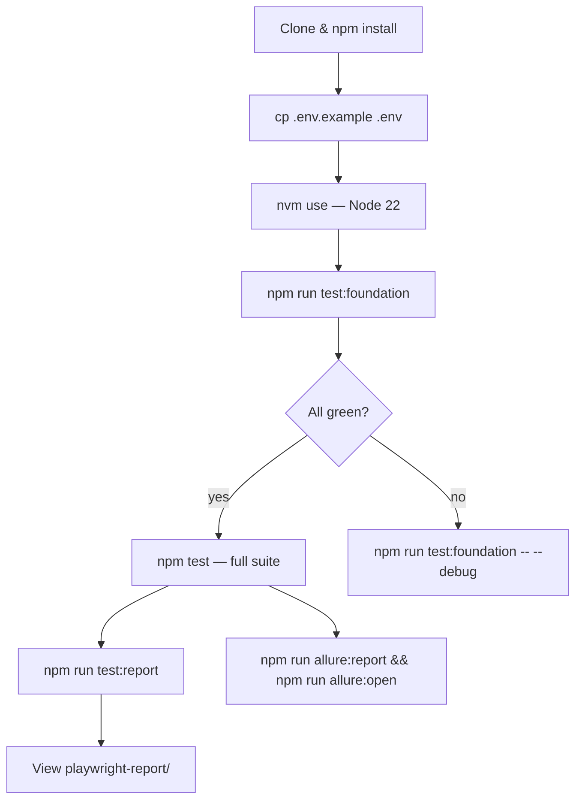

# Getting Started

A guided walkthrough from a fresh clone to a passing test run, with an
explanation of how tests are organised and how to add a new test.

---

## Overview

OminAPI is structured as a learning-progressive API test framework. Tests are
grouped into phase folders under `tests/`. Each phase teaches a specific
concept — from basic HTTP verbs (Phase 2) to enterprise resilience patterns
(Phase 20). All framework plumbing (clients, services, auth, validation) lives
in `src/` and is shared across phases.

---

## Step 1 — Install

Follow [Installation.md](Installation.md) to clone, activate Node 22, install
dependencies, and copy `.env.example` to `.env`.

Minimum commands:

```bash
git clone https://github.com/omiinayak25/ominapi-playwright-framework.git
cd ominapi-playwright-framework
nvm use
npm install
cp .env.example .env
```

---

## Step 2 — Configure

Open `.env` in an editor. For a first run the defaults in `.env.example` are
sufficient — all target APIs are free public services.

The `ConfigManager` reads every variable at startup, validates types and
allowed values, and fails fast with a descriptive error if anything is wrong.
You will see the error **before** the first test runs.

---

## Step 3 — Run a Single Phase

Start with the foundation phase — it has no auth, no complex setup, and
exercises the core HTTP verbs:

```bash
npm run test:foundation
```

Playwright discovers every `*.spec.ts` file under `tests/foundation/`, runs
them fully parallel, and streams a `list` reporter output to the console.

At the end, the custom `SummaryReporter` prints a console block with total
counts and the slowest tests, and writes `test-results/summary.json`.

---

## Step 4 — Read the Summary Output

A passing run looks like this (times will vary):

```
┌─────────────────────────────────────────┐
│          OminAPI Test Summary           │
├─────────────────────────────────────────┤
│  Total:    28    Passed:  28            │
│  Failed:    0    Skipped:  0            │
│  Duration: 4.3s                         │
└─────────────────────────────────────────┘
```

A detailed HTML report is written to `playwright-report/`. Open it with:

```bash
npm run test:report
```

---

## Step 5 — Run the Full Suite

```bash
npm test
```

This runs all 213 tests across all 20 phases in parallel.

---

## Test and Spec Layout

```
tests/
├── foundation/          # Phase 2  — HTTP verbs, headers, cookies, status codes
│   ├── http-methods.spec.ts
│   ├── headers.spec.ts
│   ├── cookies.spec.ts
│   ├── status-codes.spec.ts
│   ├── params.spec.ts
│   ├── content-types.spec.ts
│   ├── request-response-body.spec.ts
│   └── framework-health.spec.ts
├── crud/                # Phase 3  — CRUD via Repository pattern
│   ├── posts.crud.spec.ts
│   └── products.crud.spec.ts
├── authentication/      # Phase 4  — Basic, Bearer/JWT, API-Key, Cookie, OAuth2
├── builders/            # Phase 5  — Builder and Factory patterns
├── validation/          # Phase 6  — Multi-dimension response assertions
├── chaining/            # Phase 7  — Login → CRUD → verify lifecycle
├── data-driven/         # Phase 8  — JSON, CSV, Excel, environment datasets
├── negative/            # Phase 9  — 4xx/5xx paths, malformed payloads
├── pagination/          # Phase 10 — Offset, page-based, collect-all
├── file/                # Phase 11 — Multipart upload, binary download
├── security/            # Phase 12 — OWASP payloads, JWT tampering, IDOR
├── performance/         # Phase 13 — Latency SLA, concurrent requests, p-percentiles
├── schema/              # Phase 14 — AJV JSON-Schema validation
├── graphql/             # Phase 15 — Queries, mutations, variables, fragments
├── mocking/             # Phase 16 — In-process fake HTTP server
├── websocket/           # Phase 17 — Connection, messaging, reconnect
├── contract/            # Phase 18 — OpenAPI conformance, backward-compat diffing
├── enterprise/          # Phase 19 — Retry, circuit breaker, cache, middleware
├── e2e/                 # Placeholder — no specs yet
└── regression/          # Placeholder — no specs yet
```

Each spec file follows the same conventions:

1. Import `test` and `expect` from `../../src/fixtures/api.fixtures.js` (not
   directly from `@playwright/test`).
2. Declare which fixture(s) the test needs in the function parameter.
3. Write assertions in domain language — no raw HTTP plumbing in test bodies.

---

## How Fixtures Work

The fixture layer (`src/fixtures/api.fixtures.ts`) extends Playwright's base
`test` object with named, typed clients and repositories:

```typescript
// foundation/http-methods.spec.ts
import { test, expect } from '../../src/fixtures/api.fixtures.js';
import { HttpStatus } from '../../src/constants/http-status.js';

test.describe('Phase 2 · HTTP methods', () => {
  test('GET retrieves a resource', async ({ echo }) => {
    const res = await echo.get<PostmanEcho>('/get');

    expect(res.status).toBe(HttpStatus.OK);
    expect(res.body.url).toContain('/get');
  });
});
```

When Playwright sees `{ echo }` in the parameter list, it creates a disposable
`APIRequestContext` bound to `postman-echo.com`, wraps it in an `ApiClient`,
hands it to the test, and disposes it automatically after — regardless of pass
or fail.

Available fixtures:

| Fixture       | Type                 | Bound to                         |
| ------------- | -------------------- | -------------------------------- |
| `httpbin`     | `ApiClient`          | `HTTPBIN_URL` (httpbingo.org)    |
| `echo`        | `ApiClient`          | `POSTMAN_ECHO_URL`               |
| `posts`       | `PostService`        | `JSONPLACEHOLDER_URL`            |
| `products`    | `ProductService`     | `DUMMYJSON_URL`                  |
| `booker`      | `ApiClient`          | `BASE_URL` (Restful Booker)      |
| `auth`        | `AuthService`        | `BASE_URL`                       |
| `bookings`    | `BookingService`     | `BASE_URL`                       |
| `breweries`   | `BreweryService`     | `OPEN_BREWERY_URL`               |
| `dummyjson`   | `ApiClient`          | `DUMMYJSON_URL`                  |
| `countries`   | `GraphQLClient`      | `COUNTRIES_GQL_URL`              |
| `graphqlZero` | `GraphQLClient`      | `GRAPHQL_ZERO_URL`               |
| `mock`        | `{ server, client }` | In-process `MockServer`          |
| `ws`          | `{ server, client }` | In-process `MockWebSocketServer` |

---

## Adding a New Test

### Option A — Add to an Existing Phase

Pick the relevant phase folder and add a test to an existing spec file, or
create a new `*.spec.ts` file in that folder.

```typescript
// tests/foundation/my-new.spec.ts
import { test, expect } from '../../src/fixtures/api.fixtures.js';
import { HttpStatus } from '../../src/constants/http-status.js';

test.describe('My new tests', () => {
  test('Echo reflects my custom header', async ({ echo }) => {
    const res = await echo.get('/get', {
      headers: { 'X-My-Header': 'hello' },
    });

    expect(res.status).toBe(HttpStatus.OK);
    // postman-echo reflects request headers under res.body.headers
  });
});
```

Playwright discovers the file automatically on the next run.

### Option B — Add a New Phase Folder

1. Create `tests/my-phase/` and add at least one `*.spec.ts` file.
2. Import from `../../src/fixtures/api.fixtures.js`.
3. Run the full suite (`npm test`) or target the folder directly:
   ```bash
   npx playwright test tests/my-phase
   ```

### Option C — Add a New Service (Repository)

If the new tests need a dedicated resource repository (e.g. for a new API):

1. Create `src/services/my-resource.service.ts` extending `BaseApiService`.
2. Expose the needed methods (`getAll`, `getById`, `create`, etc.).
3. Add a fixture entry in `src/fixtures/api.fixtures.ts`.
4. Export from `src/services/index.ts`.
5. Use the fixture in tests: `async ({ myResource }) => { ... }`.

---

## Useful One-Liners

| Goal                          | Command                                                               |
| ----------------------------- | --------------------------------------------------------------------- |
| Run one spec file             | `npx playwright test tests/crud/posts.crud.spec.ts`                   |
| Filter by test name           | `npx playwright test -g "JWT"`                                        |
| Debug a failing test          | `npx playwright test --debug tests/authentication/bearer-jwt.spec.ts` |
| Interactive UI mode           | `npx playwright test --ui`                                            |
| Verbose request/response logs | `LOG_LEVEL=debug npm test`                                            |
| Run against staging           | `TEST_ENV=staging npm test`                                           |
| Parallel shards (4)           | `npx playwright test --shard=1/4`                                     |

---

## Flow Diagram



---

## Best Practices

- Always import `test` and `expect` from `@fixtures/api.fixtures` (or the
  relative path `../../src/fixtures/api.fixtures.js`), not from
  `@playwright/test`. This gives you the typed fixtures.
- Never build an `APIRequestContext` inside a test — use a fixture or open a
  service PR to add one.
- Use `HttpStatus` constants from `src/constants/http-status.ts` instead of
  raw numbers.
- Run `npm run verify` before pushing — it mirrors what CI checks.

---

## References

- [playwright.config.ts](../playwright.config.ts)
- [src/fixtures/api.fixtures.ts](../src/fixtures/api.fixtures.ts)
- [src/constants/http-status.ts](../src/constants/http-status.ts)

## Related Modules

- [Installation.md](Installation.md)
- [Configuration.md](Configuration.md)
- [FolderStructure.md](FolderStructure.md)
