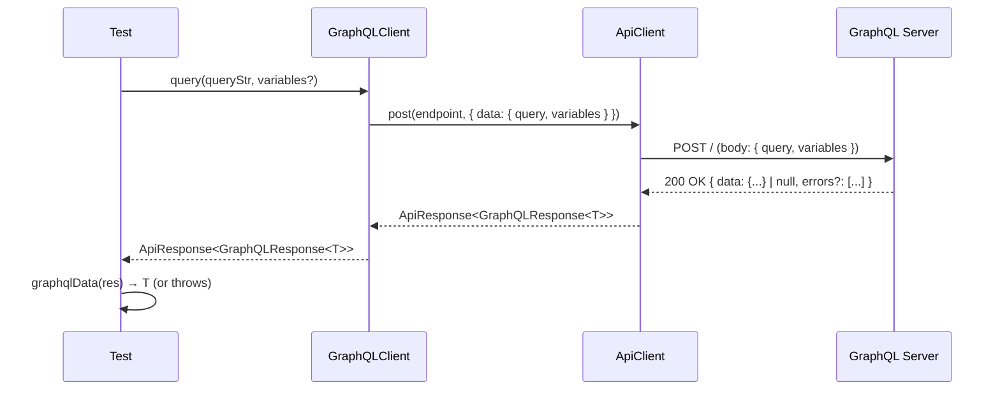

# GraphQL Testing — OminAPI Framework

## Overview

OminAPI provides first-class GraphQL support through `GraphQLClient`, a thin layer
over `ApiClient` that handles the GraphQL transport contract and response envelope.
Two real public APIs are exercised in the test suite:

| Fixture       | Endpoint                                   | Used for                      |
| ------------- | ------------------------------------------ | ----------------------------- |
| `countries`   | `https://countries.trevorblades.com` → `/` | Queries, variables, fragments |
| `graphqlZero` | `https://graphqlzero.almansi.me` → `/api`  | Mutations                     |

---

## Purpose

GraphQL differs from REST in three ways that require dedicated handling:

1. **Single endpoint** — all operations go to one URL via HTTP `POST`.
2. **Fixed request body** — always `{ query, variables }` as JSON.
3. **Silent failure** — errors arrive in `body.errors` with `HTTP 200`. Checking
   the status code is not enough; you must inspect the response body.

`GraphQLClient` encapsulates rules 1 and 2. The `graphqlData()` helper enforces
rule 3 by throwing when `errors` is present or `data` is `null`.

---

## Architecture

```
Test
 │
 ├── countries.query(…)          ← GraphQLClient.query()
 │     │
 │     └── GraphQLClient.execute()
 │           └── ApiClient.post(endpoint, { data: { query, variables } })
 │                 └── Playwright APIRequestContext.fetch()
 │
 └── graphqlData(res)            ← unwrapper; throws on errors / null data
```

`GraphQLClient` owns only the GraphQL envelope. All actual HTTP mechanics —
timing, logging, header merging, retry — come from the injected `ApiClient`.

### Key types

```ts
// src/api-client/graphql-client.ts

export interface GraphQLError {
  readonly message: string;
  readonly path?: (string | number)[];
  readonly extensions?: Record<string, unknown>;
}

export interface GraphQLResponse<T> {
  readonly data: T | null;
  readonly errors?: GraphQLError[];
}

export type GraphQLVariables = Record<string, unknown>;
```

### Class: `GraphQLClient`

| Method                                        | Description                                   |
| --------------------------------------------- | --------------------------------------------- |
| `query<T>(query, variables?)`                 | Execute a read operation                      |
| `mutate<T>(mutation, variables?)`             | Execute a write operation                     |
| `execute<T>(operation, variables?)` (private) | Shared transport: `POST { query, variables }` |

Both `query` and `mutate` return `Promise<ApiResponse<GraphQLResponse<T>>>`.

---

## Flow Diagram



---

## Code Examples

### Basic query — single country

```ts
// tests/graphql/queries.spec.ts
import { test, expect } from '../../src/fixtures/api.fixtures.js';
import { graphqlData } from '../../src/api-client/index.js';

interface Country {
  name: string;
  capital: string;
  currency: string;
  emoji: string;
}

test('fetches a single country with selected fields', async ({ countries }) => {
  // Send a read operation; the generic types the returned data shape
  const res = await countries.query<{ country: Country }>(`
    {
      country(code: "US") {
        name
        capital
        currency
        emoji
      }
    }
  `);

  expect(res.status).toBe(200); // transport reached the server
  expect(res.body.errors).toBeUndefined(); // no GraphQL-level errors

  const data = graphqlData(res); // unwrap data; throws if errors / null
  expect(data.country.name).toBe('United States');
  expect(data.country.capital).toBe('Washington D.C.');
});
```

### Query with filter

```ts
// tests/graphql/queries.spec.ts
// Pass a server-side filter argument to narrow results to one continent
const res = await countries.query<{ countries: { code: string }[] }>(`
  {
    countries(filter: { continent: { eq: "EU" } }) {
      code
      name
    }
  }
`);
const data = graphqlData(res);
expect(data.countries.length).toBeGreaterThan(0); // EU has multiple countries
```

### Variables — same query, different inputs

```ts
// tests/graphql/variables-fragments.spec.ts
// One parameterized query reused with different runtime variables
const query = `
  query GetCountry($code: ID!) {
    country(code: $code) { name capital currency }
  }
`;

// Same query string, different variables map per call
const us = graphqlData(
  await countries.query<{ country: Country }>(query, { code: 'US' }),
);
const jp = graphqlData(
  await countries.query<{ country: Country }>(query, { code: 'JP' }),
);

expect(us.country.name).toBe('United States');
expect(jp.country.capital).toBe('Tokyo');
```

### Fragments — reusable field sets

```ts
// tests/graphql/variables-fragments.spec.ts
// Define a reusable field set once, then spread it into multiple aliased selections
const query = `
  fragment CountryFields on Country {
    name
    capital
    currency
  }
  query {
    us: country(code: "US") { ...CountryFields }
    fr: country(code: "FR") { ...CountryFields }
  }
`;

const data = graphqlData(
  await countries.query<{ us: Country; fr: Country }>(query),
);

expect(data.us.name).toBe('United States');
expect(data.fr.capital).toBe('Paris');
```

### Mutation with variables

```ts
// tests/graphql/mutations.spec.ts
interface CreatedPost {
  createPost: { id: string; title: string; body: string };
}

// Mutation declaring a typed input variable and selecting the created fields back
const mutation = `
  mutation CreatePost($input: CreatePostInput!) {
    createPost(input: $input) {
      id
      title
      body
    }
  }
`;

// mutate() sends the same POST as query(), passing the input object as a variable
const res = await graphqlZero.mutate<CreatedPost>(mutation, {
  input: { title: 'OminAPI Phase 14', body: 'GraphQL mutation test' },
});

const data = graphqlData(res);
expect(data.createPost.title).toBe('OminAPI Phase 14');
expect(data.createPost.id).toBeTruthy();
```

### The 200-with-errors trap

```ts
// tests/graphql/errors.spec.ts
const res = await countries.query(`
  {
    country(code: "US") { nonExistentField }
  }
`);

// Trap: the HTTP status is 200 — this assertion passes but proves nothing.
expect(res.status).toBe(200);

// The operation failed — the evidence is in body.errors.
expect(res.body.errors).toBeDefined();
expect(res.body.errors?.[0]?.message).toContain('nonExistentField');

// graphqlData() converts the silent 200 into a real thrown error.
expect(() => graphqlData(res)).toThrow(/GraphQL/);
```

---

## Best Practices

| Practice                                                                      | Rationale                                                                                   |
| ----------------------------------------------------------------------------- | ------------------------------------------------------------------------------------------- |
| Always call `graphqlData(res)` rather than reading `res.body.data` directly   | Throws on `errors` or `null data`; turns silent GraphQL failures into visible test failures |
| Also assert `res.body.errors` is `undefined` for the happy path               | Makes the expectation explicit and documents the "200 with errors" trap in the test itself  |
| Use typed generics: `query<{ country: Country }>`                             | TypeScript catches shape mismatches at compile time, not at runtime                         |
| Use variables instead of string-concatenating values into queries             | Safer (no injection risk), more readable, and reusable across test scenarios                |
| Use fragments for repeated field sets shared across multiple queries          | DRY principle; a single edit updates all usages                                             |
| Add `test.describe.configure({ retries: 2 })` on external-API describe blocks | Network blips on public endpoints are not test failures; retries isolate true bugs          |

---

## Common Mistakes

### 1. Trusting HTTP 200 as success

```ts
// WRONG — HTTP 200 does not mean the operation succeeded.
const res = await countries.query(`{ country(code: "US") { bogus } }`);
expect(res.status).toBe(200); // this passes even on error
// data will be null or partial, but the test continues silently

// CORRECT
const data = graphqlData(res); // throws immediately on errors
```

### 2. Forgetting `graphqlData()` and reading `.data` directly

```ts
// WRONG — res.body.data is null when errors occur; no exception is raised.
const data = res.body.data;
expect(data?.country.name).toBe('United States'); // may silently be undefined

// CORRECT
const data = graphqlData(res); // throws if errors or data === null
expect(data.country.name).toBe('United States');
```

### 3. Sending variables as string interpolation instead of the variables map

```ts
// WRONG — brittle, injection-prone, not idiomatic GraphQL.
const query = `{ country(code: "${code}") { name } }`;
await countries.query(query);

// CORRECT
const query = `query GetCountry($code: ID!) { country(code: $code) { name } }`;
await countries.query(query, { code });
```

### 4. Using `mutate` vs `query` — they are transport-identical but semantically distinct

Both methods send the same HTTP `POST`. Use `mutate` for mutation strings and
`query` for query/subscription strings; this documents intent and makes test
output clearer.

---

## Real Project Usage

The `countries` and `graphqlZero` fixtures are defined in
`../src/fixtures/api.fixtures.ts` and injected automatically:

```ts
// Countries API: GraphQL endpoint lives at the root path '/'
countries: async ({}, use) => {
  await withClient(config.endpoints.countriesGraphql, 'countries-gql', (c) =>
    use(new GraphQLClient(c, '/')),
  );
},
// GraphQLZero API: GraphQL endpoint lives at '/api'
graphqlZero: async ({}, use) => {
  await withClient(config.endpoints.graphqlZero, 'graphqlzero', (c) =>
    use(new GraphQLClient(c, '/api')),
  );
},
```

The endpoint (`/` or `/api`) is the only GraphQL-specific configuration. The
`ApiClient` supplies the `baseURL` from `config.endpoints.*`.

To point the Countries client at a different server, set:

```
COUNTRIES_GQL_URL=https://your-gql-server.example.com
```

---

## Interview Questions

**Q: Why does GraphQL use HTTP 200 even on failure?**
A: The HTTP layer only knows about transport (did the request reach the server?).
GraphQL errors are application-level (did the operation resolve correctly?).
Separating the concerns means a single request can partially succeed — some
fields resolve, others error — and both outcomes fit in one response.

**Q: What does `graphqlData()` do and why is it needed?**
A: It unwraps `res.body.data` and throws if `res.body.errors` is non-empty or
`data` is `null`. Without it, a test can receive an errored GraphQL response
with `HTTP 200`, read `data` (which is `null`), and proceed silently — a false
positive. `graphqlData()` converts that into a real exception.

**Q: What is the difference between a GraphQL variable and a fragment?**
A: Variables parameterize an operation at runtime (`$code: ID!`), substituting
values without string concatenation. Fragments are compile-time field-set macros
(`fragment CountryFields on Country { ... }`) that let multiple selections share
a definition without repeating it.

**Q: Why does `GraphQLClient.mutate()` send an HTTP POST like `query()`?**
A: GraphQL mutations and queries use the same transport: `POST` with body
`{ query, variables }`. The distinction between query and mutation is at the
GraphQL semantic layer (the server treats mutations as side-effecting), not the
HTTP layer. The separate method exists for readability and developer intent only.

**Q: How would you test a GraphQL subscription in this framework?**
A: The current `GraphQLClient` covers HTTP-based operations only. Subscriptions
typically use WebSockets (the `ws-client.ts` / `WebSocketClient`) or
Server-Sent Events. You would connect via `WebSocketClient`, send the GraphQL
subscription payload as JSON, and use `waitForJson()` to assert each event.

---

## References

- Source: [`../src/api-client/graphql-client.ts`](../src/api-client/graphql-client.ts)
- Fixtures: [`../src/fixtures/api.fixtures.ts`](../src/fixtures/api.fixtures.ts)
- Test — queries: [`../tests/graphql/queries.spec.ts`](../tests/graphql/queries.spec.ts)
- Test — mutations: [`../tests/graphql/mutations.spec.ts`](../tests/graphql/mutations.spec.ts)
- Test — variables/fragments: [`../tests/graphql/variables-fragments.spec.ts`](../tests/graphql/variables-fragments.spec.ts)
- Test — errors: [`../tests/graphql/errors.spec.ts`](../tests/graphql/errors.spec.ts)

---

## Related Modules

- [WebSocket.md](WebSocket.md) — `WebSocketClient` for GraphQL subscriptions over WS
- [Mocking.md](Mocking.md) — `MockServer` for offline GraphQL endpoint simulation
- [`../src/api-client/api-client.ts`](../src/api-client/api-client.ts) — the underlying HTTP facade
- [`../src/api-client/api-client.types.ts`](../src/api-client/api-client.types.ts) — `ApiResponse<T>` type
