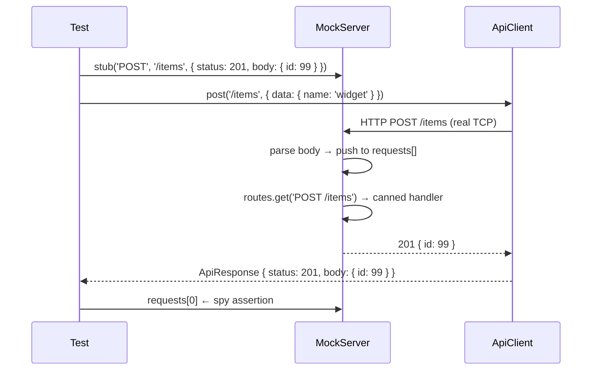
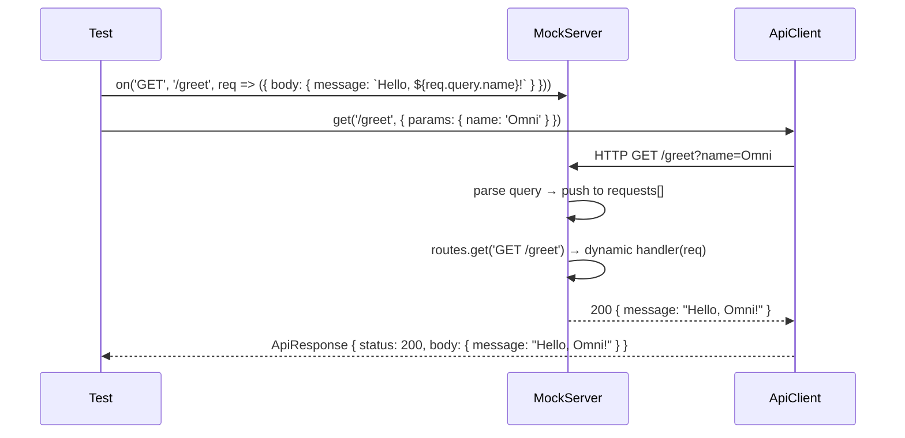

# HTTP Mocking — OminAPI Framework

## Overview

OminAPI mocks HTTP dependencies through `MockServer`, an in-process real HTTP
server built on Node's `http` module. It is wired into tests via the `mock`
fixture in `src/fixtures/api.fixtures.ts` and exercised in `tests/mocking/`.

| Class        | File                       | Role                                                            |
| ------------ | -------------------------- | --------------------------------------------------------------- |
| `MockServer` | `src/utils/mock-server.ts` | Runs a real local HTTP server; stub/dynamic routes; request spy |

---

## Purpose

### Why a real in-process server — not Playwright route interception?

Playwright's `page.route()` / `context.route()` intercepts browser-page network
traffic. Playwright's `APIRequestContext` — used by OminAPI's `ApiClient` —
**does not go through the browser page** and therefore cannot be intercepted with
route handlers.

To mock at the API-client layer, the framework starts a real HTTP server bound
to `127.0.0.1` on an ephemeral OS-assigned port. The `ApiClient` is then pointed
at `http://127.0.0.1:<port>` as its `baseURL`. Every "mock" call is a genuine
HTTP round-trip — deterministic, offline, and fully controlled.

**Additional advantages of the real-server approach:**

| Advantage                      | Explanation                                                                        |
| ------------------------------ | ---------------------------------------------------------------------------------- |
| Forces exact status codes      | Live APIs rarely return 500 on demand; `stub()` does                               |
| Forces custom response headers | Set `Location`, `X-Request-Id`, or any header without live API cooperation         |
| Spies on what the client sent  | `requests[]` records every incoming request, enabling consumer-contract assertions |
| Fully offline                  | No network dependency; tests run in CI without external access                     |
| Ephemeral port per test        | OS assigns a free port; zero port-collision risk across parallel workers           |

---

## Architecture

```
Test
 │
 ├── mock.server.stub('POST', '/items', { status: 201, body: {...} })
 │     └── routes.set('POST /items', () => { status: 201, body: {...} })
 │
 ├── mock.client.post('/items', { data: {...} })
 │     └── ApiClient → Playwright APIRequestContext → HTTP → 127.0.0.1:<port>
 │
 └── MockServer.handle()
       ├── readBody()         → parse raw bytes to UTF-8 string
       ├── JSON.parse()       → body becomes object if Content-Type is JSON
       ├── requests.push()    → spy records the request
       ├── routes.get(key)    → find the matching handler
       └── send(res, mock)    → JSON-encode body, writeHead, end
```

### Key types

```ts
// src/utils/mock-server.ts

export interface MockRequest {
  readonly method: string;
  readonly path: string;
  readonly query: Record<string, string>;
  readonly headers: http.IncomingHttpHeaders;
  readonly body: unknown;
}

export interface MockResponse {
  readonly status?: number; // default 200
  readonly body?: unknown; // JSON-encoded if object
  readonly headers?: Record<string, string>;
}

export type MockHandler = (
  req: MockRequest,
) => MockResponse | Promise<MockResponse>;
```

---

## Flow Diagram

### stub() path (fixed canned response)



### on() path (dynamic handler)



---

## API Reference

### `MockServer` — `src/utils/mock-server.ts`

| Member / Method                | Description                                                                    |
| ------------------------------ | ------------------------------------------------------------------------------ |
| `stub(method, path, response)` | Register a fixed canned response for `METHOD path`; returns `this` (chainable) |
| `on(method, path, handler)`    | Register a dynamic handler `(MockRequest) => MockResponse`; returns `this`     |
| `reset()`                      | Clear all routes and recorded requests (reuse between scenarios)               |
| `start()`                      | Listen on an ephemeral OS-assigned port; resolves when listening               |
| `stop()`                       | Close the server and release the port                                          |
| `url`                          | `http://127.0.0.1:<port>` once started                                         |
| `requests`                     | `MockRequest[]` — every request received, in order (spy)                       |

**Route key format:** `"METHOD /path"` (e.g. `"POST /items"`). Method is
uppercased automatically. An unmatched route returns `404` with a JSON error body.

---

## Code Examples

### Stub — fixed status, body, and headers

```ts
// tests/mocking/stub-responses.spec.ts
import { test, expect } from '../../src/fixtures/api.fixtures.js';

test('forces a 201 Created with custom headers', async ({ mock }) => {
  const { server, client } = mock;
  // Register a canned response for POST /items
  server.stub('POST', '/items', {
    status: 201,
    body: { id: 99, created: true },
    headers: { location: '/items/99', 'x-request-id': 'mock-123' },
  });

  // Real HTTP call hits the in-process mock server
  const res = await client.post<{ id: number }>('/items', {
    data: { name: 'widget' },
  });

  expect(res.status).toBe(201); // assert the forced status and headers
  expect(res.body.id).toBe(99);
  expect(res.headers['location']).toBe('/items/99');
  expect(res.headers['x-request-id']).toBe('mock-123');
});

test('forces a 500 error to test failure handling', async ({ mock }) => {
  const { server, client } = mock;
  // Stub a deterministic server error to exercise client error handling
  server.stub('GET', '/flaky', {
    status: 500,
    body: { error: 'simulated outage' },
  });

  const res = await client.get<{ error: string }>('/flaky');
  expect(res.status).toBe(500);
  expect(res.body.error).toBe('simulated outage');
});
```

### Route registration — unregistered routes return 404

```ts
// tests/mocking/route-mocking.spec.ts
test('a stubbed route returns the canned response', async ({ mock }) => {
  const { server, client } = mock;
  // Stub GET /users with a fixed array body (status defaults to 200)
  server.stub('GET', '/users', {
    body: [
      { id: 1, name: 'Ada' },
      { id: 2, name: 'Linus' },
    ],
  });

  const res = await client.get<{ id: number; name: string }[]>('/users');
  expect(res.status).toBe(200);
  expect(res.body).toHaveLength(2);
  expect(res.body[0]?.name).toBe('Ada');
});

test('an unregistered route returns 404', async ({ mock }) => {
  // No stub registered → mock server replies 404 with a JSON error
  const res = await mock.client.get('/not-mocked');
  expect(res.status).toBe(404);
});
```

### Dynamic handler — response computed from request

```ts
// tests/mocking/dynamic-mocking.spec.ts
test('response is computed from query parameters', async ({ mock }) => {
  const { server, client } = mock;
  // Dynamic handler builds the body from the incoming query string
  server.on('GET', '/greet', (req) => ({
    body: { message: `Hello, ${req.query.name ?? 'stranger'}!` },
  }));

  const res = await client.get<{ message: string }>('/greet', {
    params: { name: 'Omni' },
  });
  expect(res.body.message).toBe('Hello, Omni!');
});

test('handler echoes the posted body', async ({ mock }) => {
  const { server, client } = mock;
  // Reflect the parsed request body straight back to the caller
  server.on('POST', '/echo', (req) => ({ body: { received: req.body } }));

  const payload = { a: 1, nested: { b: 2 } };
  const res = await client.post<{ received: typeof payload }>('/echo', {
    data: payload,
  });
  expect(res.body.received).toEqual(payload);
});

test('handler returns a conditional status based on input', async ({
  mock,
}) => {
  const { server, client } = mock;
  // Branch the status code on the request's query value
  server.on('GET', '/resource', (req) =>
    req.query.id === '1'
      ? { status: 200, body: { id: 1 } }
      : { status: 404, body: { error: 'not found' } },
  );

  // Same route, two inputs → two different outcomes
  const found = await client.get('/resource', { params: { id: 1 } });
  const missing = await client.get('/resource', { params: { id: 999 } });

  expect(found.status).toBe(200);
  expect(missing.status).toBe(404);
});
```

### Request spy — consumer-contract assertions

```ts
// tests/mocking/request-spy.spec.ts
import { ApiKeyStrategy } from '../../src/auth/index.js';

test('captures method, path, headers and body the client sent', async ({
  mock,
}) => {
  const { server, client } = mock;
  server.stub('POST', '/track', { status: 202, body: { ok: true } });

  // Send a request carrying auth + a custom header for the spy to capture
  await client.post('/track', {
    data: { event: 'signup', userId: 42 },
    headers: { 'x-correlation-id': 'trace-abc' },
    auth: new ApiKeyStrategy('x-api-key', 'secret-key'),
  });

  expect(server.requests).toHaveLength(1); // exactly one request recorded
  const captured = server.requests[0]; // inspect what the client actually sent
  expect(captured?.method).toBe('POST');
  expect(captured?.path).toBe('/track');
  expect(captured?.body).toEqual({ event: 'signup', userId: 42 });
  // Auth strategy and custom header were actually transmitted on the wire.
  expect(captured?.headers['x-api-key']).toBe('secret-key');
  expect(captured?.headers['x-correlation-id']).toBe('trace-abc');
});

test('records multiple requests in order', async ({ mock }) => {
  const { server, client } = mock;
  server.stub('GET', '/a', { body: {} });
  server.stub('GET', '/b', { body: {} });

  await client.get('/a');
  await client.get('/b');

  // Spy preserves arrival order of the two calls
  expect(server.requests.map((r) => r.path)).toEqual(['/a', '/b']);
});
```

---

## Best Practices

| Practice                                                                                  | Rationale                                                                                      |
| ----------------------------------------------------------------------------------------- | ---------------------------------------------------------------------------------------------- |
| Use `stub()` for fixed scenarios; use `on()` when the response depends on request content | Keeps intent clear and separates static from dynamic mocking                                   |
| Assert `server.requests[0]` after every mutating call                                     | Verifies the consumer side of the contract — method, path, body, and headers your client sends |
| Use `server.reset()` between scenarios within the same test                               | Prevents route and spy state from one scenario leaking into the next                           |
| Never share a `MockServer` instance across tests                                          | The `mock` fixture starts a fresh server per test; sharing breaks isolation                    |
| Stub unrecoverable errors (`status: 500`) and verify your client handles them             | Live APIs rarely fail on demand; the mock server makes edge cases trivially reproducible       |
| Chain `stub()` calls: `server.stub(...).stub(...)`                                        | `stub()` returns `this` for fluent registration of multiple routes                             |

---

## Common Mistakes

### 1. Using wrong HTTP method in `stub()` / `on()`

```ts
// WRONG — registered as GET; client sends POST → 404
server.stub('GET', '/items', { body: [] });
await client.post('/items', { data: {} }); // 404

// CORRECT
server.stub('POST', '/items', { body: {} });
```

### 2. Querying `requests[]` before awaiting the client call

```ts
// WRONG — the request hasn't arrived yet.
const promise = client.post('/track', { data: {} });
expect(server.requests).toHaveLength(1); // 0 — race condition

// CORRECT
await client.post('/track', { data: {} });
expect(server.requests).toHaveLength(1);
```

### 3. Forgetting that query parameter values are always strings

`MockRequest.query` is `Record<string, string>`. Numeric query params must be
compared as strings:

```ts
// WRONG — req.query.id is "1" (string), not 1 (number)
server.on('GET', '/r', (req) => req.query.id === 1 ? ... : ...);

// CORRECT
server.on('GET', '/r', (req) => req.query.id === '1' ? ... : ...);
```

### 4. Assuming `MockServer` can handle HTTPS

`MockServer` uses `node:http`, not `node:https`. For TLS testing, use
`ignoreHTTPSErrors: true` in `playwrightRequest.newContext()` and a real HTTPS
endpoint, or a TLS-terminating proxy.

### 5. Attempting Playwright `page.route()` interception with `ApiClient`

`page.route()` only intercepts browser-page fetch/XHR traffic. `ApiClient`
uses `APIRequestContext` (a Playwright Node.js HTTP engine), which bypasses
the browser entirely. Route interception has no effect; the real `MockServer`
is the correct mechanism.

---

## Real Project Usage

The `mock` fixture (defined in `src/fixtures/api.fixtures.ts`) creates a
`MockServer` and an `ApiClient` bound to its URL per test:

```ts
// src/fixtures/api.fixtures.ts
mock: async ({}, use) => {
  const server = new MockServer();
  await server.start(); // bind to an ephemeral port for this test
  // Point a Playwright request context at the mock server's URL
  const context = await playwrightRequest.newContext({
    baseURL: server.url,
    extraHTTPHeaders: { Accept: 'application/json' },
  });
  try {
    // Hand the test a server (to stub/spy) and a client bound to it
    await use({ server, client: new ApiClient(context, 'mock') });
  } finally {
    // Always release resources, even if the test throws
    await context.dispose();
    await server.stop();
  }
},
```

The `MockServer` instance is scoped to a single test. If a test needs to reset
routes between steps without stopping the server, call `server.reset()`:

```ts
// Reset routes and spy state mid-test without stopping the server
server.reset();
server.stub('GET', '/v2/items', { body: [] });
```

---

## Interview Questions

**Q: Why can't Playwright route interception be used to mock `ApiClient` requests?**
A: `page.route()` and `context.route()` operate on the browser's network stack.
`ApiClient` wraps `APIRequestContext`, which is a separate Node.js HTTP engine
— not the browser. Requests made through `APIRequestContext` bypass the browser
page entirely, so route handlers never see them. A real in-process server is the
only mechanism that works at this layer.

**Q: How does `MockServer` resolve the method + path to a handler?**
A: The route key is `"METHOD /path"` (e.g. `"POST /items"`). `stub()` and
`on()` both store handlers under this key in a `Map`. On each incoming request,
`handle()` builds the same key and performs a `Map.get()`. An exact match is
required; there is no wildcard or pattern matching.

**Q: What does the `requests[]` array enable that a live API cannot?**
A: Consumer-contract verification. A live API only shows you what it returned;
`requests[]` shows you exactly what your client sent — method, path, query
parameters, request headers, and parsed body. This lets you assert that
authentication headers, correlation IDs, and body shapes are correct on the
wire, not just that the API responded successfully.

**Q: How does the `MockServer` handle a JSON body vs a non-JSON body?**
A: `readBody()` collects all incoming chunks as a UTF-8 string. Then, if
`Content-Type` includes `application/json`, `JSON.parse()` is attempted; on
parse failure, the raw string is kept. Non-JSON content types store the raw
string in `body` unchanged.

**Q: What happens when a request path has no registered route?**
A: `handle()` calls `MockServer.send()` with `status: 404` and a body of
`{ error: "No mock registered for METHOD /path" }`. This makes unmatched routes
immediately visible in test output rather than timing out or returning misleading
empty responses.

**Q: How is port isolation guaranteed when tests run in parallel?**
A: `MockServer.start()` listens on port `0`, which instructs the OS to assign
any available ephemeral port. After binding, the assigned port is read from
`server.address()` and stored. Each parallel worker gets its own server on a
distinct OS-chosen port — no manual port management required.

---

## References

- Source: [`../src/utils/mock-server.ts`](../src/utils/mock-server.ts)
- Fixtures: [`../src/fixtures/api.fixtures.ts`](../src/fixtures/api.fixtures.ts)
- Test — stub responses: [`../tests/mocking/stub-responses.spec.ts`](../tests/mocking/stub-responses.spec.ts)
- Test — dynamic mocking: [`../tests/mocking/dynamic-mocking.spec.ts`](../tests/mocking/dynamic-mocking.spec.ts)
- Test — route mocking: [`../tests/mocking/route-mocking.spec.ts`](../tests/mocking/route-mocking.spec.ts)
- Test — request spy: [`../tests/mocking/request-spy.spec.ts`](../tests/mocking/request-spy.spec.ts)

---

## Related Modules

- [GraphQL.md](GraphQL.md) — mocking a GraphQL endpoint offline with `MockServer`
- [WebSocket.md](WebSocket.md) — `MockWebSocketServer` (analogous in-process WS server)
- [`../src/api-client/api-client.ts`](../src/api-client/api-client.ts) — HTTP facade (`ApiClient`) pointed at the mock URL
- [`../src/auth/strategies/api-key.strategy.ts`](../src/auth/strategies/api-key.strategy.ts) — `ApiKeyStrategy` used in request-spy tests
