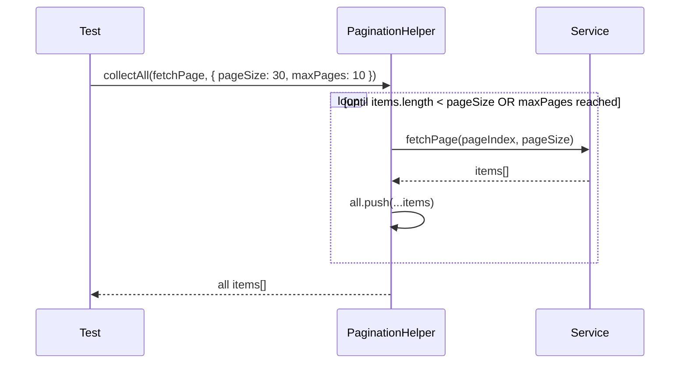

# Pagination

> OminAPI framework — Phase 10 pagination patterns.
> Repo: <https://github.com/omiinayak25/ominapi-playwright-framework>

---

## Overview

OminAPI covers three pagination styles found in real-world APIs:

| Style                      | API used        | Parameters                          | Result shape                                       |
| -------------------------- | --------------- | ----------------------------------- | -------------------------------------------------- |
| **Offset / limit**         | DummyJSON       | `skip`, `limit`                     | Paging envelope `{ products, total, skip, limit }` |
| **Page-based**             | Open Brewery DB | `page`, `per_page`                  | Bare array                                         |
| **Cursor-style emulation** | DummyJSON       | `skip` advanced as an opaque cursor | Same envelope as offset                            |

All three styles also support filtering, sorting, searching, and sparse field selection. `PaginationHelper.collectAll` auto-iterates pages without the caller writing loop logic.

---

## Purpose

- Demonstrate the key invariants of paginated APIs (no overlap, stable total, short last page).
- Provide a reusable `PaginationHelper` that works with any page-fetching function.
- Show how repositories (`ProductService`, `BreweryService`) hide query-param conventions behind domain methods.
- Document the `baseURL` leading-slash pitfall that affects APIs with path prefixes.

---

## Architecture

### PaginationHelper

**File:** [`../src/utils/pagination.ts`](../src/utils/pagination.ts)

```typescript
export type PageFetcher<T> = (
  pageIndex: number,
  pageSize: number,
) => Promise<T[]>;

export interface CollectAllOptions {
  readonly pageSize?: number; // default: 20
  readonly maxPages?: number; // default: 100 (safety cap)
}

export class PaginationHelper {
  // Iterate page-by-page and accumulate every item into a single array.
  public static async collectAll<T>(
    fetchPage: PageFetcher<T>,
    options: CollectAllOptions = {},
  ): Promise<T[]> {
    const pageSize = options.pageSize ?? 20; // fall back to defaults when omitted
    const maxPages = options.maxPages ?? 100; // hard safety cap on iterations
    const all: T[] = [];
    for (let page = 0; page < maxPages; page++) {
      const items = await fetchPage(page, pageSize); // caller-supplied fetch closure
      all.push(...items);
      if (items.length < pageSize) break; // short/empty page = last page
    }
    return all;
  }
}
```

The helper is API-agnostic. The caller supplies a `fetchPage(pageIndex, pageSize)` closure that adapts the math for their API. `pageIndex` is zero-based; the closure adds 1 for 1-based page APIs.

---

## Flow Diagram



---

## Offset / Limit Pagination — DummyJSON

**Service:** [`../src/services/product.service.ts`](../src/services/product.service.ts)
**Tests:** [`../tests/pagination/offset-pagination.spec.ts`](../tests/pagination/offset-pagination.spec.ts)

DummyJSON uses `?skip=<offset>&limit=<count>`. The response is a paging envelope:

```typescript
interface ProductList {
  products: Product[];
  total: number; // total items in the collection (stable across pages)
  skip: number; // the skip/offset that was applied
  limit: number; // the limit that was applied
}
```

### Repository method

```typescript
// Fetch one offset page: skip=<offset>, limit=<count>.
public getAll(limit = 30, skip = 0): Promise<ApiResponse<ProductList>> {
  return this.client.get<ProductList>(this.resource, {
    params: { limit, skip }, // DummyJSON offset/limit query params
  });
}
```

### Key invariants to assert

```typescript
// tests/pagination/offset-pagination.spec.ts

test('a page honors limit and reports a stable total', async ({ products }) => {
  const res = await products.getAll(5, 0); // first page of 5
  expect(res.body.products).toHaveLength(5); // page size is respected
  expect(res.body.limit).toBe(5); // server echoes the applied limit
  expect(res.body.total).toBeGreaterThan(5); // collection is larger than one page
});

test('consecutive pages do not overlap', async ({ products }) => {
  const page1 = await products.getAll(5, 0); // items 0-4
  const page2 = await products.getAll(5, 5); // items 5-9

  const ids1 = page1.body.products.map((p) => p.id);
  const ids2 = page2.body.products.map((p) => p.id);
  const overlap = ids1.filter((id) => ids2.includes(id)); // ids shared by both pages

  expect(overlap).toHaveLength(0); // adjacent pages are disjoint
  expect(page1.body.total).toBe(page2.body.total); // total is stable
});

test('skipping past the end yields an empty page', async ({ products }) => {
  const res = await products.getAll(5, 100_000); // skip far beyond the dataset
  expect(res.body.products).toHaveLength(0); // empty page, not an error
});
```

---

## Cursor-Style Emulation

DummyJSON's `skip` parameter can emulate cursor-based pagination: treat `skip` as an opaque cursor and advance it by `pageSize` after each call. This mirrors the pattern used by APIs that return a `nextCursor` value.

```typescript
// tests/pagination/offset-pagination.spec.ts
test('CURSOR-style: treat skip as an opaque cursor advanced each call', async ({
  products,
}) => {
  const pageSize = 4;
  let cursor = 0; // opaque cursor == current skip offset
  const firstBatch = (await products.getAll(pageSize, cursor)).body.products;
  cursor += pageSize; // advance the cursor
  const secondBatch = (await products.getAll(pageSize, cursor)).body.products;

  expect(firstBatch).toHaveLength(pageSize); // full first page
  expect(secondBatch[0]?.id).not.toBe(firstBatch[0]?.id); // cursor moved forward
});
```

---

## Page-Based Pagination — Open Brewery DB

**Service:** [`../src/services/brewery.service.ts`](../src/services/brewery.service.ts)
**Tests:** [`../tests/pagination/page-pagination.spec.ts`](../tests/pagination/page-pagination.spec.ts)

Open Brewery DB uses `?page=<n>&per_page=<count>` with **1-based** page numbers. The response is a bare array (no envelope). A separate `/meta` endpoint returns the total.

```typescript
// Includes the /v1 API prefix in the resource path:
super(client, '/v1/breweries');

// Fetch one 1-based page using page/per_page params; returns a bare array.
public getPage(page: number, perPage: number): Promise<ApiResponse<Brewery[]>> {
  return this.client.get<Brewery[]>(this.resource, {
    params: { page, per_page: perPage },
  });
}

// Query the /meta endpoint for totals, optionally scoped to a state.
public meta(byState?: string): Promise<ApiResponse<BreweryMeta>> {
  return this.client.get<BreweryMeta>(`${this.resource}/meta`, {
    ...(byState ? { params: { by_state: byState } } : {}), // only send filter when provided
  });
}
```

### Key invariants to assert

```typescript
// tests/pagination/page-pagination.spec.ts

test('per_page is honored', async ({ breweries }) => {
  const res = await breweries.getPage(1, 3); // page 1, 3 per page
  expect(res.body).toHaveLength(3); // exactly per_page records returned
});

test('different pages return different records', async ({ breweries }) => {
  const p1 = await breweries.getPage(1, 3);
  const p2 = await breweries.getPage(2, 3);
  const ids1 = p1.body.map((b) => b.id);
  const ids2 = p2.body.map((b) => b.id);
  expect(ids1.filter((id) => ids2.includes(id))).toHaveLength(0); // no overlap across pages
});

test('meta reports a positive total', async ({ breweries }) => {
  const res = await breweries.meta(); // total comes from a separate endpoint
  expect(Number(res.body.total)).toBeGreaterThan(0); // total is a numeric string
});
```

---

## PaginationHelper.collectAll — Auto-Collect All Pages

**Tests:** [`../tests/pagination/collect-all.spec.ts`](../tests/pagination/collect-all.spec.ts)

### Offset-based (DummyJSON products)

```typescript
const all = await PaginationHelper.collectAll<Product>(
  async (pageIndex, pageSize) => {
    // Translate 0-based pageIndex into a skip offset for DummyJSON.
    const res = await products.getAll(pageSize, pageIndex * pageSize);
    return res.body.products; // unwrap the envelope here
  },
  { pageSize: 30, maxPages: 10 },
);

// Global invariant: no duplicate ids across the entire dataset.
const ids = all.map((p) => p.id);
const uniqueIds = new Set(ids); // de-duplicate via Set
expect(ids.length).toBe(uniqueIds.size); // equal sizes => zero duplicates
```

### Page-based (Open Brewery DB)

```typescript
const all = await PaginationHelper.collectAll(
  async (pageIndex, pageSize) => {
    // pageIndex is 0-based; Brewery API is 1-based, so add 1.
    const res = await breweries.getPage(pageIndex + 1, pageSize);
    return res.body;
  },
  { pageSize: 50, maxPages: 3 },
);
expect(all.length).toBeGreaterThan(0);
```

---

## Filter / Sort / Search / Field Selection

**Tests:** [`../tests/pagination/filter-sort-search.spec.ts`](../tests/pagination/filter-sort-search.spec.ts)

Collection endpoints support result shaping beyond pagination. Assert semantics — not just status 200.

### Sort (DummyJSON)

```typescript
const res = await products.sortedBy('price', 'asc', 10); // ask API to sort by price ascending
const prices = res.body.products.map((p) => p.price);
const sorted = [...prices].sort((a, b) => a - b); // independently sort a copy
expect(prices).toEqual(sorted); // order is genuinely ascending
```

Repository method:

```typescript
// Server-side sort via DummyJSON's sortBy/order params.
public sortedBy(field: string, order: 'asc' | 'desc' = 'asc', limit = 30) {
  return this.client.get<ProductList>(this.resource, {
    params: { sortBy: field, order, limit },
  });
}
```

### Filter — every item matches

```typescript
const res = await products.byCategory('smartphones', 10); // category-filtered page
for (const p of res.body.products) {
  expect(p.category).toBe('smartphones'); // every item matches, not just some
}
```

Repository method (category filter):

```typescript
// Category filter lives in the path segment, not a query param.
public byCategory(category: string, limit = 30) {
  return this.client.get<ProductList>(`${this.resource}/category/${category}`, {
    params: { limit },
  });
}
```

### Search

```typescript
const res = await products.search('mascara'); // full-text search query
expect(
  // at least one result mentions the term somewhere in its fields
  res.body.products.some((p) =>
    JSON.stringify(p).toLowerCase().includes('mascara'),
  ),
).toBe(true);
```

### Sparse Field Selection (select)

```typescript
const res = await products.selectFields(['title', 'price'], 3); // request only title + price
const first = res.body.products[0] as unknown as Record<string, unknown>;
expect(first).toHaveProperty('title'); // requested field present
expect(first).toHaveProperty('price'); // requested field present
expect(first).not.toHaveProperty('description'); // not requested -> absent
```

Repository method:

```typescript
// Sparse fieldset: join requested fields into a comma-separated select param.
public selectFields(fields: readonly string[], limit = 5) {
  return this.client.get<ProductList>(this.resource, {
    params: { select: fields.join(','), limit },
  });
}
```

### Filter — page-based API (Open Brewery DB)

```typescript
const res = await breweries.byState('ohio', 5); // state-filtered page (bare array)
for (const b of res.body) {
  expect(b.state_province.toLowerCase()).toBe('ohio'); // every record is in Ohio
}
```

Repository method:

```typescript
// Filter by state and sort by name; combines filter + sort + pagination params.
public byState(state: string, perPage = 10) {
  return this.client.get<Brewery[]>(this.resource, {
    params: { by_state: state, per_page: perPage, sort: 'name:asc' },
  });
}
```

---

## The BaseURL Leading-Slash Pitfall

**Relevant code:** [`../src/config/config.manager.ts`](../src/config/config.manager.ts), [`../src/services/brewery.service.ts`](../src/services/brewery.service.ts)

When an `APIRequestContext` has a `baseURL` that includes a path (e.g., `https://api.openbrewerydb.org/v1`), appending a leading-slash path like `/breweries` drops the `v1` prefix per `new URL()` semantics.

OminAPI avoids this by:

1. Setting `openBrewery` in `ConfigManager` to the **origin only**: `https://api.openbrewerydb.org`
2. Including the `/v1` prefix inside `BreweryService`'s resource path: `super(client, '/v1/breweries')`

```typescript
// config.manager.ts — origin only:
openBrewery: (process.env.OPEN_BREWERY_URL ?? 'https://api.openbrewerydb.org',
  // brewery.service.ts — /v1 prefix is part of the resource path:
  super(client, '/v1/breweries'));
```

This pattern generalises: always configure `baseURL` as a bare origin when the API has a versioned path prefix, and include that prefix in the service's `resource`.

---

## Best Practices

- Assert the three offset pagination invariants in order: limit is honored → consecutive pages do not overlap → total is stable.
- Always verify the "skip past the end" case returns an empty page, not a 404 or error.
- Use `PaginationHelper.collectAll` with a conservative `maxPages` to avoid hitting real-API rate limits in tests.
- Pass `pageIndex + 1` inside the `collectAll` closure for 1-based page APIs (Open Brewery DB).
- Store `openBrewery` as an origin-only `baseURL`; put the `/v1` prefix in the service resource.
- When asserting filter results, check **every** returned item, not just the first.

---

## Common Mistakes

| Mistake                                                                              | Correct approach                                                                                                  |
| ------------------------------------------------------------------------------------ | ----------------------------------------------------------------------------------------------------------------- |
| Setting `baseURL` to `https://api.openbrewerydb.org/v1` and resource to `/breweries` | A leading `/` in the resource drops the `/v1` prefix; set baseURL to the origin and include `/v1` in the resource |
| Asserting only that `res.body.products.length > 0` for pagination                    | Also assert `length === limit`, total stability, and no overlap between pages                                     |
| Treating Open Brewery page numbers as 0-based in `collectAll`                        | Add 1 inside the closure: `breweries.getPage(pageIndex + 1, pageSize)`                                            |
| Not setting `maxPages` in `collectAll`                                               | The default is 100; set a lower value for large datasets to avoid rate limits                                     |
| Using `PaginationHelper.collectAll` without unwrapping the DummyJSON envelope        | The closure must return `res.body.products`, not `res.body`                                                       |
| Asserting `prices[0] < prices[1]` for sort                                           | Check the entire array: compare with `[...prices].sort(...)` and use `toEqual`                                    |

---

## Interview Questions

1. **What are the three pagination styles in OminAPI and how do their parameters differ?**
   Offset/limit (`skip` + `limit`, DummyJSON), page-based (`page` + `per_page`, Open Brewery), and cursor-style emulation (treating `skip` as an advancing opaque cursor). Offset and cursor differ only conceptually — cursor treats the offset as opaque and advances it linearly.

2. **What invariants should every offset-pagination test verify?**
   (a) The page size is honored (`products.length === limit`). (b) Consecutive pages do not share ids (no overlap). (c) `total` is the same across pages (stable). (d) A skip beyond the dataset returns an empty page, not an error.

3. **How does `PaginationHelper.collectAll` know when to stop?**
   When a page returns fewer items than `pageSize` (the standard last-page signal) or when `maxPages` is reached. The `maxPages` cap prevents infinite loops against misbehaving APIs.

4. **Why does `BreweryService` put `/v1` in the resource path instead of the baseURL?**
   `new URL('/breweries', 'https://api.openbrewerydb.org/v1')` resolves to `https://api.openbrewerydb.org/breweries` — dropping `/v1`. Keeping the origin-only in `baseURL` and including `/v1` in the resource avoids this silent truncation.

5. **How is `PaginationHelper` API-agnostic?**
   The caller supplies a `PageFetcher` closure that translates zero-based `pageIndex` and `pageSize` into whatever parameters the API expects. The helper only manages iteration and termination — it never knows about `skip`/`limit` or `page`/`per_page`.

6. **How do you assert that a sort result is genuinely sorted, not just non-empty?**
   Extract the values, sort a copy independently with `Array.sort`, then compare the original with `toEqual(sorted)`. This proves the API's ordering matches expected ordering for the entire page.

---

## References

- DummyJSON products docs: <https://dummyjson.com/docs/products>
- Open Brewery DB docs: <https://www.openbrewerydb.org/documentation>
- MDN `new URL()` path resolution: <https://developer.mozilla.org/en-US/docs/Web/API/URL/URL>

---

## Related Modules

| Module                   | Path                                                                                               |
| ------------------------ | -------------------------------------------------------------------------------------------------- |
| PaginationHelper         | [`../src/utils/pagination.ts`](../src/utils/pagination.ts)                                         |
| ProductService           | [`../src/services/product.service.ts`](../src/services/product.service.ts)                         |
| BreweryService           | [`../src/services/brewery.service.ts`](../src/services/brewery.service.ts)                         |
| Product model            | [`../src/models/product.model.ts`](../src/models/product.model.ts)                                 |
| Brewery model            | [`../src/models/brewery.model.ts`](../src/models/brewery.model.ts)                                 |
| ConfigManager (baseURL)  | [`../src/config/config.manager.ts`](../src/config/config.manager.ts)                               |
| Offset pagination tests  | [`../tests/pagination/offset-pagination.spec.ts`](../tests/pagination/offset-pagination.spec.ts)   |
| Page pagination tests    | [`../tests/pagination/page-pagination.spec.ts`](../tests/pagination/page-pagination.spec.ts)       |
| Collect-all tests        | [`../tests/pagination/collect-all.spec.ts`](../tests/pagination/collect-all.spec.ts)               |
| Filter/sort/search tests | [`../tests/pagination/filter-sort-search.spec.ts`](../tests/pagination/filter-sort-search.spec.ts) |
| CRUD doc                 | [CRUD.md](CRUD.md)                                                                                 |
