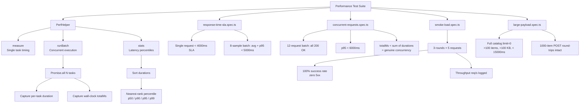

# Performance Testing

## Overview

OmniAPI includes a **smoke-level** performance test suite built around `PerfHelper`—a lightweight utility for timing individual requests, running concurrent batches, and computing latency percentiles. The suite validates SLAs and basic concurrency health as part of the functional test run.

> **Scope:** This is not a load-testing tool. For sustained high-RPS load testing use k6 or Gatling. OmniAPI's performance tests are a sanity gate that runs alongside functional tests to catch obvious regressions early.

---

## Purpose

| Goal                                                       | Test file                     |
| ---------------------------------------------------------- | ----------------------------- |
| Validate per-request SLA                                   | `response-time-sla.spec.ts`   |
| Validate aggregate latency (avg + p95) across a sample     | `response-time-sla.spec.ts`   |
| Prove genuine concurrency (wall-clock << sum of durations) | `concurrent-requests.spec.ts` |
| Validate tail latency (p95) under concurrent load          | `concurrent-requests.spec.ts` |
| Confirm API health under sustained modest traffic          | `smoke-load.spec.ts`          |
| Verify large responses arrive completely and within budget | `large-payload.spec.ts`       |
| Verify large request bodies round-trip intact              | `large-payload.spec.ts`       |

---

## Architecture

```
src/utils/
└── perf.ts           # PerfHelper — measure / runBatch / stats

tests/performance/
├── response-time-sla.spec.ts    # Single-request SLA + aggregate p95 SLA
├── concurrent-requests.spec.ts  # 12-request batch; wall-clock proof; p95 < 6000ms
├── smoke-load.spec.ts           # 3 rounds × 5 requests; 100% success; throughput logged
└── large-payload.spec.ts        # Full catalog (>100 items, >100 KB); 1000-item POST
```

---

## `PerfHelper` API

Defined in [`../src/utils/perf.ts`](../src/utils/perf.ts).

### `PerfHelper.measure<T>(task)`

Times a single async call. Returns `{ result: T; durationMs: number }`.

```ts
const { result, durationMs } = await PerfHelper.measure(() =>
  products.getById(1),
);
expect(durationMs).toBeLessThan(4000);
```

### `PerfHelper.runBatch<T>(task, count)`

Runs `count` copies of `task` concurrently via `Promise.all`. Returns:

```ts
interface BatchResult<T> {
  results: T[]; // return value of each task
  durations: number[]; // per-task elapsed ms
  totalMs: number; // wall-clock time for the whole batch
}
```

The `totalMs` is captured before any `Promise.all` settlement, making it the true wall-clock window—the basis for the concurrency proof.

```ts
const batch = await PerfHelper.runBatch(() => products.getById(1), 12);
// batch.totalMs < sum(batch.durations)  →  requests truly ran in parallel
```

### `PerfHelper.stats(durations)`

Computes summary statistics from an array of durations (ms). Returns `LatencyStats`:

```ts
interface LatencyStats {
  count: number;
  min: number;
  max: number;
  avg: number;
  p50: number;
  p90: number;
  p95: number;
  p99: number;
}
```

Percentiles use the **nearest-rank method**: `rank = ceil(p/100 * n)`.

```ts
const stats = PerfHelper.stats(batch.durations);
expect(stats.p95).toBeLessThan(6000); // tail SLA
```

---

## Why Percentiles, Not Averages

Averages hide the slow tail that users actually experience. Consider 10 requests where 9 complete in 100 ms and 1 takes 5000 ms:

| Metric | Value                                                |
| ------ | ---------------------------------------------------- |
| avg    | 590 ms — looks fine                                  |
| p95    | 5000 ms — the real user experience for 5% of traffic |
| p99    | 5000 ms                                              |

SLA assertions in OmniAPI always use **p95** or **p99**, not the average. `stats.avg` is logged for informational purposes only.

---

## Flow Diagram



---

## Concurrency Proof

`concurrent-requests.spec.ts` contains an explicit check that requests truly ran in parallel:

```ts
test('concurrency is genuinely parallel (wall-clock << sum of durations)', async ({
  products,
}) => {
  const CONCURRENCY = 10;
  const batch = await PerfHelper.runBatch(
    () => products.getById(1),
    CONCURRENCY,
  );

  const sumDurations = batch.durations.reduce((a, b) => a + b, 0);
  // If requests ran in parallel, total wall-clock is much less than the sum.
  expect(batch.totalMs).toBeLessThan(sumDurations);
});
```

If this test fails it means the executor is serializing requests—a fundamental framework bug.

---

## SLA Table

| Test                        | SLA Threshold              | Metric                      |
| --------------------------- | -------------------------- | --------------------------- |
| Single request              | `SINGLE_SLA_MS = 4000` ms  | `durationMs` from `measure` |
| 8-sample aggregate average  | `AGG_P95_SLA_MS = 5000` ms | `stats.avg`                 |
| 8-sample aggregate p95      | `AGG_P95_SLA_MS = 5000` ms | `stats.p95`                 |
| 12-request concurrent p95   | 6000 ms                    | `stats.p95`                 |
| Large response (>100 items) | 15 000 ms                  | `durationMs` from `measure` |

These thresholds are generous for public demo APIs; tighten them for production SLAs.

---

## Smoke Load

`smoke-load.spec.ts` runs **3 rounds of 5 concurrent requests** to httpbin `/get` and asserts:

- `serverErrors === 0` (no 5xx)
- `ok === totalRequests` (100% success rate)
- Throughput (req/s) is logged for historical comparison

```ts
const ROUNDS = 3;
const PER_ROUND = 5;
// Total: 15 requests in sustained bursts
```

This is intentionally small-scale. It catches crash-on-load regressions without being a substitute for k6/Gatling.

---

## Large Payload Tests

### Large response

Fetches the full DummyJSON product catalog with `limit=0` (returns all items):

```ts
const { result, durationMs } = await PerfHelper.measure(() =>
  products.getAll(0, 0),
);

expect(result.body.products.length).toBe(result.body.total); // complete
expect(result.body.products.length).toBeGreaterThan(100);
expect(result.sizeBytes).toBeGreaterThan(100_000); // >100 KB
expect(durationMs).toBeLessThan(15_000);
```

### Large request

Posts a 1000-element JSON array to httpbin `/post` and asserts the server echoed all 1000 items:

```ts
const bigArray = Array.from({ length: 1000 }, (_, i) => ({
  id: i,
  name: `item-${i}`,
  value: i * 7,
}));
const res = await echo.post('/post', { data: { items: bigArray } });
expect((res.body.json as { items: unknown[] }).items).toHaveLength(1000);
```

---

## Code Examples

### Time a single call

```ts
import { PerfHelper } from '../../src/utils/perf.js';

const { result, durationMs } = await PerfHelper.measure(() =>
  myService.getResource(42),
);
expect(result.status).toBe(200);
expect(durationMs).toBeLessThan(2000);
```

### Run a concurrent batch and check tail latency

```ts
const batch = await PerfHelper.runBatch(() => myService.getResource(1), 20);

for (const res of batch.results) {
  expect(res.status).toBe(200);
}

const stats = PerfHelper.stats(batch.durations);
expect(stats.p95).toBeLessThan(3000);
```

### Log stats for CI artifacts

```ts
import { logger } from '../../src/utils/logger.js';

const stats = PerfHelper.stats(batch.durations);
logger.info('Perf stats', { ...stats }); // captured in CI log; queryable in Allure
```

---

## Best Practices

- **Always assert p95, not just the average.** Averages hide slow outliers that affect real users.
- **Use `retries: 2` for SLA tests.** Public sandbox APIs are subject to network variability; a single transient spike should not fail CI.
- **Log stats to `logger.info`, not `console.log`.** Stats appear in the Allure report and CI logs, not just the terminal.
- **Keep smoke load small.** The goal is a regression gate, not a load test. If you need sustained throughput validation, use k6 or Gatling.
- **Assert `totalMs < sumDurations` for concurrency.** This proves parallelism rather than assuming it.
- **Calibrate SLA thresholds to your real environment.** The default thresholds are generous for public sandbox APIs; tighten them for staging/production.

---

## Common Mistakes

| Mistake                                                    | Correct Approach                                                     |
| ---------------------------------------------------------- | -------------------------------------------------------------------- |
| Asserting `avg < SLA` only                                 | Assert `p95 < SLA` — tail latency is what matters                    |
| Setting a tight SLA (< 500 ms) against public sandbox APIs | Use generous thresholds (2–6 s) for sandbox; tighten per environment |
| Not verifying concurrency is genuine                       | Assert `batch.totalMs < sumDurations`                                |
| Treating smoke-load tests as load tests                    | Smoke load is a sanity gate; for real load testing use k6/Gatling    |
| Missing `retries` on flaky network assertions              | Add `test.describe.configure({ retries: 2 })`                        |

---

## Real Project Usage

1. **Add to CI.** Performance tests run as part of `npm run test:ci`. SLA failures block the build.
2. **Trend percentiles over time.** Store `test-results/summary.json` in CI artifacts and plot `slowest` tests across builds.
3. **Promote thresholds on success.** When p95 is consistently well under the threshold for two sprints, tighten it by 20%.
4. **Use `measure` for assertions in non-performance tests.** Any service call can be wrapped in `measure` to add a lightweight latency check without dedicated test files.
5. **Replace sandbox targets.** Point `BASE_URL` at your staging environment to get meaningful SLA data against real infrastructure.

---

## Interview Questions

1. **Why do OmniAPI performance tests use p95 rather than the average?**
   Averages mask slow outliers. If 5% of requests take 5 seconds but the average is 600 ms, SLA-by-average passes while real users experience a slow tail. p95 captures the worst experience for 5% of traffic.

2. **What does `batch.totalMs < sumDurations` prove?**
   That the requests ran concurrently. If they were serialized, `totalMs` would approximate `sumDurations`. A much smaller `totalMs` is proof that `Promise.all` actually parallelized the network calls.

3. **How does `PerfHelper.stats` compute the p95 percentile?**
   It sorts the durations array ascending, then uses the nearest-rank method: `rank = ceil(0.95 * n)`, `index = rank - 1` (clamped). The value at that index is p95.

4. **What distinguishes smoke load (OmniAPI) from load testing (k6/Gatling)?**
   Smoke load runs a small number of rounds (3 × 5 requests) to confirm the API does not crash and returns a 100% success rate under modest traffic. k6/Gatling sustain high RPS for minutes or hours to find throughput limits, memory leaks, and degradation curves.

5. **Why are SLA tests annotated with `retries: 2`?**
   Public sandbox APIs are shared infrastructure with unpredictable network conditions. A single transient spike should not permanently fail CI. Two retries distinguish real regressions (fail all three attempts) from network noise (pass on retry).

---

## References

- [`../src/utils/perf.ts`](../src/utils/perf.ts) — `PerfHelper` source
- [Playwright `APIRequestContext`](https://playwright.dev/docs/api/class-apirequestcontext)
- [k6 — load testing tool](https://k6.io/)
- [Gatling — load testing tool](https://gatling.io/)

---

## Related Modules

- [`../src/utils/perf.ts`](../src/utils/perf.ts)
- [`../tests/performance/response-time-sla.spec.ts`](../tests/performance/response-time-sla.spec.ts)
- [`../tests/performance/concurrent-requests.spec.ts`](../tests/performance/concurrent-requests.spec.ts)
- [`../tests/performance/smoke-load.spec.ts`](../tests/performance/smoke-load.spec.ts)
- [`../tests/performance/large-payload.spec.ts`](../tests/performance/large-payload.spec.ts)
- [`../src/utils/logger.ts`](../src/utils/logger.ts)
- [Reporting.md](Reporting.md)
- [CI-CD.md](CI-CD.md)
