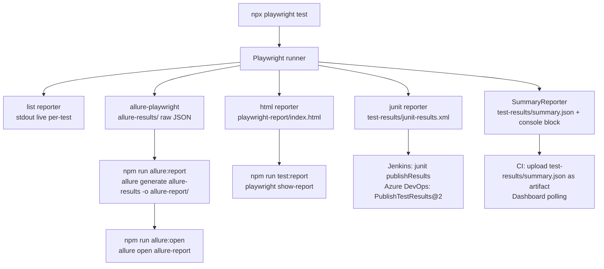

# Reporting

## Overview

OminAPI runs five reporters simultaneously on every test run. Four are configured in `playwright.config.ts`; one is the custom `SummaryReporter` implemented in `src/reporters/summary.reporter.ts`. Together they cover the spectrum from real-time terminal feedback to rich interactive dashboards to machine-readable CI artifacts.

---

## Purpose

| Need                                                         | Reporter                                            |
| ------------------------------------------------------------ | --------------------------------------------------- |
| Real-time per-test status in the terminal                    | `list`                                              |
| Interactive local drill-down after a run                     | `html` → `playwright-report/`                       |
| CI JUnit XML for test dashboards                             | `junit` → `test-results/junit-results.xml`          |
| Rich history-aware reports with steps and attachments        | `allure-playwright` → `allure-results/`             |
| Console summary block + machine-readable JSON for dashboards | `SummaryReporter` → `test-results/summary.json`     |
| Response body debugging                                      | `LOG_LEVEL=debug` via Winston logger                |
| CI flake debugging                                           | `trace: 'on-first-retry'` in `playwright.config.ts` |

---

## Reporter Configuration

All reporters are registered in [`../playwright.config.ts`](../playwright.config.ts):

```ts
reporter: [
  ['list'], // live per-test status to stdout
  ['html', { open: 'never', outputFolder: 'playwright-report' }], // interactive HTML report (no auto-open)
  ['junit', { outputFile: 'test-results/junit-results.xml' }], // JUnit XML for CI dashboards
  ['allure-playwright', { resultsDir: 'allure-results' }], // raw Allure result data
  ['./src/reporters/summary.reporter.ts'], // custom summary.json + console block
],
```

---

## Output Locations

| Reporter            | Output path                          | How to view                                           |
| ------------------- | ------------------------------------ | ----------------------------------------------------- |
| `list`              | stdout (terminal)                    | Displayed live during the run                         |
| `html`              | `playwright-report/index.html`       | `npm run test:report`                                 |
| `junit`             | `test-results/junit-results.xml`     | Import into Jenkins / Azure DevOps / any JUnit viewer |
| `allure-playwright` | `allure-results/` (raw data)         | `npm run allure:report` then `npm run allure:open`    |
| `SummaryReporter`   | `test-results/summary.json` + stdout | Read file or view CI artifact                         |

---

## Reporter Flow Diagram



---

## `list` Reporter

The built-in `list` reporter prints one line per test to stdout as each test completes. It is the primary feedback channel during local development and in CI logs.

```
  ✓  1 › security/injection.spec.ts › SQLi login is not bypassed  (812ms)
  ✓  2 › security/injection.spec.ts › SQLi in search (no 500)     (543ms)
```

No configuration required; registered as `['list']`.

---

## `html` Reporter

Produces an interactive, self-contained HTML report in `playwright-report/`. Includes test steps, attachments, error screenshots, and retry history.

- `open: 'never'` prevents auto-opening a browser after every run (appropriate for CI and headless environments).
- View locally: `npm run test:report` (runs `playwright show-report`).

---

## `junit` Reporter

Writes a JUnit-compatible XML file to `test-results/junit-results.xml`. Consumed by:

- **Jenkins:** `junit testResults: 'test-results/junit-results.xml'` in the `post { always { ... } }` block.
- **Azure DevOps:** `PublishTestResults@2` task with `testResultsFormat: JUnit`.
- Any CI system or test dashboard that accepts JUnit XML.

---

## Allure Reporter

`allure-playwright` writes raw result data to `allure-results/` during the test run. Post-processing is a two-step operation:

```bash
# Step 1: Generate the HTML report from the raw results
npm run allure:report
# → allure generate allure-results --clean -o allure-report

# Step 2: Open the generated report in a browser
npm run allure:open
# → allure open allure-report
```

Allure supports test history, trend graphs, categories, timeline views, and per-step attachments. The `allure-commandline` package (a dev dependency) provides the `allure` CLI.

---

## Custom `SummaryReporter`

Defined in [`../src/reporters/summary.reporter.ts`](../src/reporters/summary.reporter.ts). Implements Playwright's `Reporter` interface.

### Lifecycle

| Hook        | What it does                                                      |
| ----------- | ----------------------------------------------------------------- |
| `onBegin`   | Records `startTime = Date.now()`                                  |
| `onTestEnd` | Appends `{ title, status, durationMs }` to `records[]`            |
| `onEnd`     | Computes summary, writes `summary.json`, prints the console block |

### `summary.json` Schema

Written to `test-results/summary.json` after every run:

```json
{
  "result": "passed",
  "total": 120,
  "passed": 118,
  "failed": 1,
  "timedOut": 0,
  "skipped": 1,
  "durationMs": 42300,
  "slowest": [
    {
      "title": "Phase 13 · Large payloads › LARGE RESPONSE: full catalog",
      "durationMs": 9812
    },
    {
      "title": "Phase 13 · Smoke load › sustained rounds keep a 100% success rate",
      "durationMs": 7230
    }
  ]
}
```

The `slowest` array contains the **top 5 slowest tests** sorted by `durationMs` descending. This is the primary artifact for identifying performance hotspots in CI.

### Console Block

Printed to `process.stdout` at the end of every run:

```
──────────── OminAPI Run Summary ────────────
 result   : passed
 total    : 120
 passed   : 118
 failed   : 1
 timedOut : 0
 skipped  : 1
 duration : 42.3s
 slowest  :
   - 9812ms  Phase 13 · Large payloads › LARGE RESPONSE: full catalog ...
   - 7230ms  Phase 13 · Smoke load › sustained rounds keep a 100% success rate ...
─────────────────────────────────────────────
```

### Reporter Source

```ts
export default class SummaryReporter implements Reporter {
  private readonly records: TestRecord[] = []; // one entry per finished test
  private startTime = 0; // wall-clock start, set in onBegin

  public onBegin(_config: unknown, _suite: Suite): void {
    this.startTime = Date.now(); // capture run start for total-duration calc
  }

  public onTestEnd(test: TestCase, result: TestResult): void {
    // record each test's full title path, status, and duration as it finishes
    this.records.push({
      title: test.titlePath().filter(Boolean).join(' › '),
      status: result.status,
      durationMs: result.duration,
    });
  }

  public onEnd(result: FullResult): void {
    // builds summary, writes test-results/summary.json, prints console block
  }
}
```

Registration in `playwright.config.ts`:

```ts
['./src/reporters/summary.reporter.ts'];
```

---

## Debug Body Logging

Response bodies are logged at the `debug` level via the Winston logger in `src/utils/logger.ts`. To enable:

```bash
LOG_LEVEL=debug npx playwright test
```

This surfaces raw request/response payloads in the terminal. Do not set `LOG_LEVEL=debug` in CI by default — it generates excessive output. The logger level is driven by the `LOG_LEVEL` environment variable so no code changes are needed to toggle it.

---

## Trace on First Retry

`playwright.config.ts` enables trace capture on the first retry:

```ts
use: {
  trace: 'on-first-retry', // capture a trace only when a failed test is retried
},
```

When a test fails and is retried, Playwright records a `.zip` trace archive (network traffic, test steps, timing). Traces can be inspected with:

```bash
npx playwright show-trace <path-to-trace.zip>
```

In CI, trace files are included in the blob reports uploaded by the sharded test jobs (see [CI-CD.md](CI-CD.md)).

---

## `test-results/` Directory Contents

After a full run:

```
test-results/
├── junit-results.xml      # JUnit XML consumed by Jenkins / Azure DevOps
└── summary.json           # SummaryReporter output: counts + slowest 5 tests
```

---

## Best Practices

- **Never delete `test-results/` before a CI run** — the JUnit and summary artifacts are consumed by post-run steps.
- **Archive `allure-results/`** alongside `playwright-report/` and `test-results/summary.json` as CI artifacts to preserve Allure history trend data.
- **Use `LOG_LEVEL=debug` locally only.** Set `LOG_LEVEL=warn` or `LOG_LEVEL=error` in CI to reduce log noise.
- **Parse `summary.json` in CI dashboards.** The `slowest` array is a direct input for performance trend charts without re-parsing raw test output.
- **Keep `open: 'never'` in `html` reporter config.** Auto-opening a browser in a headless CI environment causes pipeline failures.
- **Generate Allure before opening.** `allure:report` must run before `allure:open`; they are separate steps by design.

---

## Common Mistakes

| Mistake                                                                     | Correct Approach                                                                |
| --------------------------------------------------------------------------- | ------------------------------------------------------------------------------- |
| Running `npm run allure:open` without first running `npm run allure:report` | Always run `allure:report` first to generate the `allure-report/` directory     |
| Setting `LOG_LEVEL=debug` in CI                                             | Use `LOG_LEVEL=warn` in CI; `debug` is for local investigation only             |
| Assuming `playwright-report/` contains the merged sharded report            | On GitHub Actions, the sharded blob reports are merged separately; see CI-CD.md |
| Not archiving `allure-results/` in CI                                       | Without the raw results, Allure cannot display historical trends                |
| Looking for `summary.json` in `playwright-report/`                          | It is in `test-results/summary.json`                                            |

---

## Real Project Usage

1. **Dashboard integration.** Poll `test-results/summary.json` from a Grafana/Datadog plugin to track pass rate and slowest tests over time.
2. **Slack notifications.** Parse `summary.json` in a CI post-step to send a Slack message with pass/fail counts and the top-slowest test.
3. **PR status gates.** Fail the PR if `summary.json` reports `result !== "passed"` or if `failed > 0`.
4. **Allure history.** Copy the `allure-results/` directory from the previous CI run into the current workspace before running `allure:report` to enable the trend graph.

---

## Interview Questions

1. **Why does SummaryReporter use `process.stdout.write` instead of `console.log`?**
   To avoid linting rules that flag `console.*` usage. `process.stdout.write` produces the same output without triggering ESLint's `no-console` rule.

2. **Why are five reporters active at once? Does that add overhead?**
   Reporters implement lifecycle hooks called once per test event. The overhead is negligible (file I/O on test end). Having all five active in a single run is far cheaper than re-running tests for different output formats.

3. **What is `trace: 'on-first-retry'` and why not `'on'`?**
   `'on'` records a trace for every test, including passing ones — enormous overhead. `'on-first-retry'` only traces when a test has already failed once, capturing just the debugging data you actually need without penalizing the happy path.

4. **How does `SummaryReporter` know the total run duration?**
   `onBegin` records `startTime = Date.now()`. `onEnd` computes `totalMs = Date.now() - startTime`. This is the wall-clock time for the entire run, including parallel test execution.

5. **What is in `allure-results/` and how does it differ from `allure-report/`?**
   `allure-results/` contains raw JSON and attachment files written by `allure-playwright` during the test run. `allure-report/` is the generated HTML report produced by `npm run allure:report`. Only `allure-report/` is human-viewable.

---

## References

- [Playwright Reporters documentation](https://playwright.dev/docs/test-reporters)
- [Playwright `Reporter` interface](https://playwright.dev/docs/api/class-reporter)
- [allure-playwright](https://www.npmjs.com/package/allure-playwright)
- [Allure Report](https://allurereport.org/)
- [Playwright Traces](https://playwright.dev/docs/trace-viewer)

---

## Related Modules

- [`../src/reporters/summary.reporter.ts`](../src/reporters/summary.reporter.ts)
- [`../src/utils/logger.ts`](../src/utils/logger.ts)
- [`../playwright.config.ts`](../playwright.config.ts)
- [CI-CD.md](CI-CD.md)
- [PerformanceTesting.md](PerformanceTesting.md)
