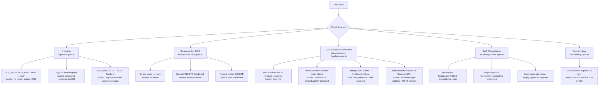

# Security Testing

## Overview

OminAPI includes an OWASP-style security test suite that fires known attack vectors at **public sandbox APIs** for authorized, defensive testing. The goal is to verify the API layer handles malicious inputs safely—not to exploit live production systems.

> **Scope:** All security tests target public sandbox endpoints (Restful-Booker, DummyJSON, httpbin). They are educational and defensive in nature. Never run these against systems you do not own or have explicit permission to test.

---

## Purpose

| Goal                                         | How it's achieved                                                                         |
| -------------------------------------------- | ----------------------------------------------------------------------------------------- |
| Verify SQLi does not bypass auth             | Fire `SQL_INJECTION_PAYLOADS` at login; assert no token is returned, no 5xx               |
| Verify XSS payloads are stored as inert data | Round-trip XSS strings via POST; assert payload is echoed verbatim as data                |
| Detect broken authentication                 | Empty credentials must not yield a session                                                |
| Detect IDOR                                  | Unauthenticated / forged-token DELETE must be rejected with 403                           |
| Surface sensitive data exposure              | `findSensitiveData` deep-scans response bodies for leaked secrets                         |
| Audit hardening headers                      | `auditSecurityHeaders` checks for HSTS, X-Content-Type-Options, X-Frame-Options, CSP      |
| Exercise JWT attack tooling                  | Forge tampered-payload and alg:none tokens to confirm the manipulation tooling is correct |
| Probe rate-limit resilience                  | 15-request burst must yield only 2xx or 429, never 5xx                                    |

---

## Architecture

```
src/
├── constants/
│   └── security-payloads.ts      # SQL_INJECTION_PAYLOADS, XSS_PAYLOADS, PATH_TRAVERSAL_PAYLOADS
├── utils/
│   └── jwt.ts                    # decodeJwt / createJwt / tamperPayload / toAlgNone
└── validators/
    └── security.validator.ts     # findSensitiveData / auditSecurityHeaders

tests/security/
├── injection.spec.ts             # SQLi login bypass, SQLi in search, XSS round-trip
├── broken-auth-idor.spec.ts      # Empty creds, IDOR with NoAuth, IDOR with forged cookie
├── data-exposure-headers.spec.ts # findSensitiveData, DummyJSON /users finding, header audit
├── jwt-manipulation.spec.ts      # decode / tamperPayload / alg:none tooling assertions
└── rate-limiting.spec.ts         # 15-request burst, no 5xx, detect optional 429
```

---

## OWASP Coverage Map

| OWASP Category                                     | Tests                                                  | Verdict                                                 |
| -------------------------------------------------- | ------------------------------------------------------ | ------------------------------------------------------- |
| **A01 – Broken Access Control (IDOR)**             | `broken-auth-idor.spec.ts`                             | Unauthorized DELETE returns 403                         |
| **A02 – Cryptographic Failures (data exposure)**   | `data-exposure-headers.spec.ts`                        | `findSensitiveData` catches leaked `password` fields    |
| **A03 – Injection (SQLi / XSS)**                   | `injection.spec.ts`                                    | No auth bypass, no 500, XSS stored as inert data        |
| **A07 – Identification & Authentication Failures** | `broken-auth-idor.spec.ts`, `jwt-manipulation.spec.ts` | Empty creds denied; tampered/alg:none tokens documented |
| **A09 – Security Logging & Monitoring**            | `data-exposure-headers.spec.ts`                        | Finding logged via `logger.warn` for traceability       |
| **Security Misconfiguration (headers)**            | `data-exposure-headers.spec.ts`                        | `auditSecurityHeaders` reports present/missing headers  |
| **Rate Limiting**                                  | `rate-limiting.spec.ts`                                | Burst produces only 2xx or 429, no crash                |

---

## Flow Diagram



---

## Tooling

### `src/constants/security-payloads.ts`

Three exported constant arrays — all `readonly string[]`:

```ts
// Classic SQL injection strings aimed at auth/where-clause bypass
export const SQL_INJECTION_PAYLOADS: readonly string[] = [
  "' OR '1'='1",
  "'; DROP TABLE users;--",
  "' OR 1=1--",
  "admin'--",
  '" OR ""="',
];

// Stored/reflected XSS vectors — the API must round-trip these as inert data
export const XSS_PAYLOADS: readonly string[] = [
  "<script>alert('xss')</script>",
  '',
  '"><svg/onload=alert(1)>',
  'javascript:alert(1)',
];

// Directory-traversal strings, including raw and URL-encoded variants
export const PATH_TRAVERSAL_PAYLOADS: readonly string[] = [
  '../../etc/passwd',
  '..\\..\\windows\\system32\\config\\sam',
  '%2e%2e%2f%2e%2e%2fetc%2fpasswd',
];
```

### `src/utils/jwt.ts`

| Function                        | Purpose                                                                                  |
| ------------------------------- | ---------------------------------------------------------------------------------------- |
| `decodeJwt(token)`              | Base64url-decode header, payload, signature — does NOT verify the signature              |
| `createJwt(payload, options?)`  | Forge a JWT from any payload with a fake signature (default `omni-fake-signature`)       |
| `tamperPayload(token, changes)` | Merge `changes` into payload, keep original signature — produces a signature mismatch    |
| `toAlgNone(token)`              | Produce `alg:"none"` variant with an empty signature segment — the unsigned-token attack |

```ts
// Forge a tampered token where role is escalated to "admin"
const original = createJwt({ sub: '1234', role: 'user' }); // baseline user token
const tampered = tamperPayload(original, { role: 'admin' }); // claims changed, sig stale
// decoded.payload.role === 'admin', but signature still matches the original payload

// Produce an alg:none token — a secure server must reject this
const none = toAlgNone(original); // strips the signature, sets alg to "none"
// none ends with '.' (empty signature segment)
```

### `src/validators/security.validator.ts`

#### `findSensitiveData(body, path?): string[]`

Recursively walks any JSON value and returns the dot-path of every key whose name matches the sensitive list and whose value is non-empty.

Sensitive keys scanned: `password`, `passwd`, `pwd`, `secret`, `apikey`, `api_key`, `privatekey`, `private_key`, `ssn`, `creditcard`.

```ts
// Deep-scan an object; returns dot-paths of any sensitive, non-empty keys
const hits = findSensitiveData({
  id: 1,
  username: 'bob',
  password: 'hunter2',
  nested: { apiKey: 'sk-123' }, // nested keys are reported with their path
});
// hits === ['password', 'nested.apiKey']
```

#### `auditSecurityHeaders(headers): SecurityHeaderReport`

Returns `{ present: string[], missing: string[] }` against the four standard hardening headers:

- `strict-transport-security`
- `x-content-type-options`
- `x-frame-options`
- `content-security-policy`

```ts
const report = auditSecurityHeaders(res.headers);
// report.present === ['x-content-type-options', 'strict-transport-security']
// report.missing === ['x-frame-options', 'content-security-policy']
```

---

## API-Layer vs Render-Layer Distinction

XSS payloads are tested at the **API layer only**. The assertion is that the server stores and returns the string verbatim without throwing a 500 or mangling it. Output encoding (escaping `<` to `&lt;`) is the responsibility of the **rendering layer** (browser/template engine). An API-level test correctly asserts round-trip fidelity, not rendering safety.

---

## Real Finding: DummyJSON `/users` Exposes Plaintext Passwords

`tests/security/data-exposure-headers.spec.ts` surfaces a genuine data-exposure issue:

```ts
test('FINDING: DummyJSON /users exposes plaintext passwords', async ({
  dummyjson,
}) => {
  const res = await dummyjson.get('/users', {
    // Ask only for the fields needed to demonstrate the leak
    params: { limit: 1, select: 'username,password' },
  });
  const hits = findSensitiveData(res.body);
  // Test passes precisely because the leak IS present and detected
  expect(hits.some((h) => h.toLowerCase().includes('password'))).toBe(true);
  logger.warn('Security finding: /users exposes password fields', { hits }); // record it in CI artifacts
});
```

This test is designed to **pass** (the exposure is detected and logged), demonstrating that the tooling correctly surfaces the problem. In a real project this finding would block a production deployment.

---

## Honest JWT Scope

httpbin's `/bearer` endpoint accepts **any** bearer token without verifying the signature. Therefore the JWT tests in `jwt-manipulation.spec.ts` assert only on the **manipulation tooling** itself (structural correctness of decoded/tampered/alg-none tokens). They do not assert that the server rejects the forged tokens, because httpbin cannot demonstrate that rejection.

Against a production signature-verifying API, sending a tampered-payload or alg:none token **must** yield a `401 Unauthorized`. The tooling produced here is ready for that scenario.

---

## Code Examples

### Run all security tests

```bash
# Run every spec under the security suite
npx playwright test tests/security
```

### Run a specific category

```bash
# Pass a single spec path to run just one attack category
npx playwright test tests/security/injection.spec.ts
npx playwright test tests/security/data-exposure-headers.spec.ts
npx playwright test tests/security/jwt-manipulation.spec.ts
```

### Iterate over a payload array

```ts
import { SQL_INJECTION_PAYLOADS } from '../../src/constants/security-payloads.js';

// Generate one parameterized test per payload from the central corpus
for (const payload of SQL_INJECTION_PAYLOADS) {
  test(`SQLi login is not bypassed: ${payload}`, async ({ booker }) => {
    const res = await booker.post('/auth', {
      data: { username: payload, password: payload },
    });
    expect(res.status).toBeLessThan(500); // invariant: server never crashes
    expect(res.body.token).toBeUndefined(); // and never issues a session
  });
}
```

---

## Best Practices

- **Authorize first.** Only run these tests against APIs you own or have explicit written permission to test.
- **Log findings, not failures.** Real findings (like the DummyJSON password leak) should be logged with `logger.warn` so CI artifacts capture them, even when the test is written to pass.
- **Retry on network flakiness.** Security tests that hit live APIs use `test.describe.configure({ retries: 2 })`.
- **Keep payload arrays centralized.** `security-payloads.ts` is the single source of truth; never inline payloads in individual tests.
- **Distinguish API-layer from render-layer.** XSS tests assert data fidelity at the wire, not rendering safety.
- **Document JWT sandbox limitations.** Always note when a target endpoint cannot verify signatures, so consumers of the test results understand what is and is not being asserted.

---

## Common Mistakes

| Mistake                                                                       | Correct Approach                                                               |
| ----------------------------------------------------------------------------- | ------------------------------------------------------------------------------ |
| Asserting `status === 400` for SQLi — some APIs return 200 with an error body | Assert `status < 500` (the invariant is no server crash)                       |
| Expecting XSS to be HTML-escaped at the API level                             | The API's job is to not crash; encoding is the renderer's job                  |
| Sending tampered JWT to httpbin and expecting 401                             | httpbin does not verify signatures; document this limitation explicitly        |
| Treating `auditSecurityHeaders` as a pass/fail gate                           | It is an audit reporter; apply pass/fail based on your project's header policy |
| Running security payloads against production                                  | These must only target sandbox or authorized environments                      |

---

## Real Project Usage

1. **Add to the quality gate.** Run `tests/security` in CI; fail the build on any 5xx or unexpected token issuance.
2. **Extend the payload corpus.** Add new OWASP vectors to `security-payloads.ts`—all tests pick them up automatically.
3. **Wire `findSensitiveData` into every CRUD test.** Call it on all non-trivial response bodies to catch accidental field exposure early.
4. **Replace httpbin with a real auth server.** Swap the JWT target for an endpoint that enforces signature verification to turn the tooling tests into live rejection assertions.

---

## Interview Questions

1. **Why does the XSS test assert `res.body.booking.firstname === payload` instead of checking that the payload is HTML-escaped?**
   The API layer's responsibility is safe storage and transmission. HTML escaping is a render-time concern. Asserting verbatim round-trip confirms the API neither rejects valid input nor corrupts it.

2. **What is an IDOR vulnerability? How does `broken-auth-idor.spec.ts` demonstrate detection?**
   IDOR (Insecure Direct Object Reference) occurs when a user can access or mutate a resource by guessing its ID without proper authorization. The test sends a DELETE to `/booking/1` with no credentials and asserts a `403`, confirming the endpoint enforces authorization.

3. **Why does `tamperPayload` keep the original signature?**
   Because the attack being simulated is privilege escalation: an attacker modifies the claims (e.g., `role: 'admin'`) but cannot re-sign with the server's secret. The original signature no longer matches the new payload—a secure server must detect this mismatch and return 401.

4. **What is the `alg:none` attack?**
   Setting the JWT header's `alg` field to `"none"` with an empty signature segment instructs a naive JWT library to skip signature verification entirely. `toAlgNone` produces this token so security tests can confirm a server rejects it.

5. **`findSensitiveData` found the DummyJSON password leak. Why does the test still pass?**
   The test is written to assert that the _detection works_—`hits` must include a path containing "password". The test surfaces the finding and logs it; it is the reviewer's responsibility to decide whether that finding blocks the release.

---

## References

- [OWASP Top 10](https://owasp.org/www-project-top-ten/)
- [OWASP Testing Guide – Testing for SQL Injection](https://owasp.org/www-project-web-security-testing-guide/)
- [RFC 7519 – JSON Web Token (JWT)](https://datatracker.ietf.org/doc/html/rfc7519)
- [DummyJSON](https://dummyjson.com/)
- [Restful-Booker](https://restful-booker.herokuapp.com/)

---

## Related Modules

- [`../src/constants/security-payloads.ts`](../src/constants/security-payloads.ts)
- [`../src/utils/jwt.ts`](../src/utils/jwt.ts)
- [`../src/validators/security.validator.ts`](../src/validators/security.validator.ts)
- [`../tests/security/injection.spec.ts`](../tests/security/injection.spec.ts)
- [`../tests/security/broken-auth-idor.spec.ts`](../tests/security/broken-auth-idor.spec.ts)
- [`../tests/security/data-exposure-headers.spec.ts`](../tests/security/data-exposure-headers.spec.ts)
- [`../tests/security/jwt-manipulation.spec.ts`](../tests/security/jwt-manipulation.spec.ts)
- [`../tests/security/rate-limiting.spec.ts`](../tests/security/rate-limiting.spec.ts)
- [Reporting.md](Reporting.md)
- [CI-CD.md](CI-CD.md)
