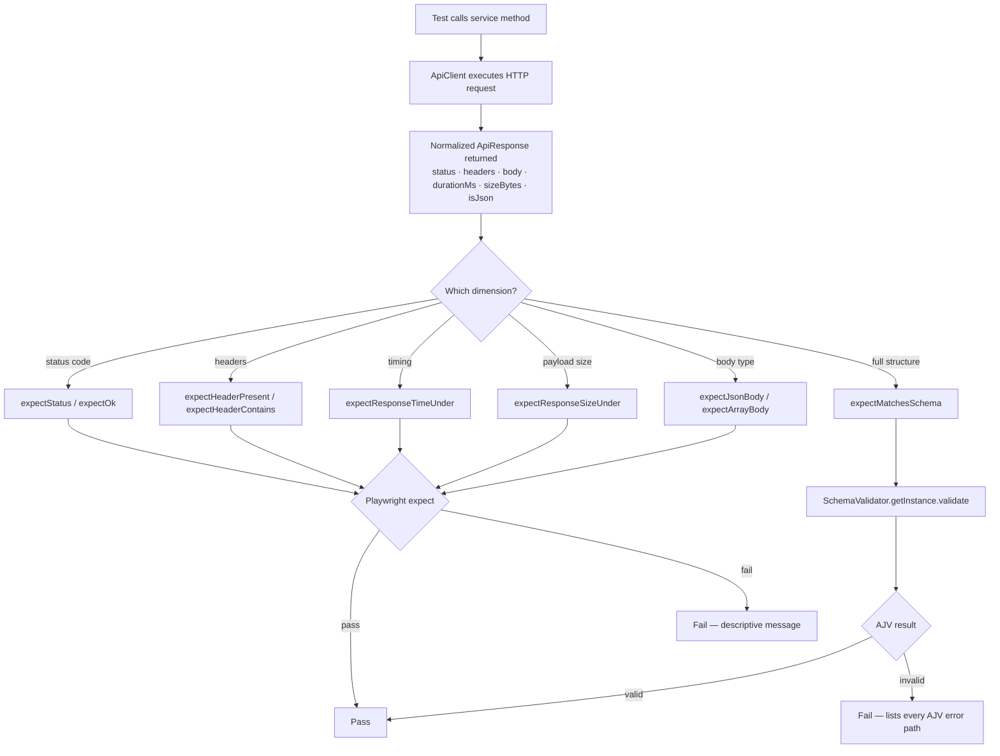

# Validation — Reusable Response Assertion Helpers

> **Module:** `src/validators/response.validator.ts` · `src/validators/index.ts`
> **Repo:** <https://github.com/omiinayak25/ominapi-playwright-framework>

---

## Overview

`response.validator.ts` provides a set of named, single-purpose assertion helpers
that operate on the framework's normalized `ApiResponse` type. Every helper wraps
Playwright's `expect` and emits a diagnostic failure message, making test output
read like a checklist of guarantees rather than raw assertion failures.

---

## Purpose

| Without helpers                                    | With helpers                                                     |
| -------------------------------------------------- | ---------------------------------------------------------------- |
| `expect(res.status).toBe(200)` — opaque on failure | `expectStatus(res, 200)` — "Expected status 200, got 404"        |
| Ad-hoc per-test checks, inconsistent messages      | Uniform DRY assertions across every suite                        |
| Silent pass on missing header                      | `expectHeaderPresent` fails with `Missing header "x-request-id"` |

The module eliminates repetition and provides "multi-dimensional" coverage: a
response is correct along six independent axes — status, headers, timing, size,
structure, and schema. Each axis has a dedicated helper.

---

## Architecture

```
ApiResponse (normalized wrapper)
        │
        ▼
src/validators/response.validator.ts
  ├── expectStatus           – status code axis
  ├── expectOk               – 2xx axis
  ├── expectHeaderPresent    – header existence axis
  ├── expectHeaderContains   – header value axis
  ├── expectResponseTimeUnder – SLA / timing axis
  ├── expectResponseSizeUnder – payload size axis
  ├── expectJsonBody         – content type axis
  ├── expectArrayBody        – collection shape axis
  └── expectMatchesSchema    – full JSON Schema axis (delegates to SchemaValidator)
        │
        └── src/validators/schema.validator.ts (SchemaValidator singleton)
```

All helpers are re-exported from `src/validators/index.ts` (barrel), so
consumers import from one location.

---

## Validation Flow



---

## Helper Reference

| Function                  | Signature                  | What it asserts                      |
| ------------------------- | -------------------------- | ------------------------------------ |
| `expectStatus`            | `(res, status: number)`    | Exact HTTP status code               |
| `expectOk`                | `(res)`                    | `res.ok === true` (any 2xx)          |
| `expectHeaderPresent`     | `(res, name: string)`      | Header key exists (case-insensitive) |
| `expectHeaderContains`    | `(res, name, substring)`   | Header value contains substring      |
| `expectResponseTimeUnder` | `(res, ms: number)`        | `res.durationMs < ms`                |
| `expectResponseSizeUnder` | `(res, bytes: number)`     | `res.sizeBytes < bytes`              |
| `expectJsonBody`          | `(res)`                    | `res.isJson === true`                |
| `expectArrayBody`         | `(res, minLength = 0)`     | Body is array; length >= minLength   |
| `expectMatchesSchema`     | `(res, schema: AnySchema)` | Full AJV schema validation           |

### `ApiResponse` fields used by validators

```typescript
// src/api-client/api-client.types.ts
interface ApiResponse<T = unknown> {
  status: number; // expectStatus, expectOk
  ok: boolean; // expectOk
  headers: Record<string, string>; // expectHeaderPresent/Contains (lower-cased)
  body: T; // expectArrayBody, expectMatchesSchema
  isJson: boolean; // expectJsonBody
  durationMs: number; // expectResponseTimeUnder
  sizeBytes: number; // expectResponseSizeUnder
}
```

---

## Code Examples

### Basic status and content-type check

```typescript
// tests/validation/response-assertions.spec.ts
import { test } from '../../src/fixtures/api.fixtures.js';
import {
  expectStatus,
  expectOk,
  expectJsonBody,
  expectHeaderPresent,
  expectHeaderContains,
} from '../../src/validators/index.js';
import { HttpStatus } from '../../src/constants/http-status.js';

test('status, ok, and JSON content-type', async ({ products }) => {
  const res = await products.getById(1); // single request, asserted on several axes

  expectStatus(res, HttpStatus.OK); // exact 200
  expectOk(res); // 2xx guard
  expectJsonBody(res); // body is JSON
  expectHeaderPresent(res, 'content-type'); // header exists
  expectHeaderContains(res, 'content-type', 'application/json');
});
```

### SLA and payload size guards

```typescript
test('response time is within a 5s SLA', async ({ products }) => {
  const res = await products.getById(1);
  expectResponseTimeUnder(res, 5000); // < 5 000 ms
});

test('a single-product body is reasonably small (< 50KB)', async ({
  products,
}) => {
  const res = await products.getById(1);
  expectResponseSizeUnder(res, 50_000); // < 50 000 bytes
});
```

### Collection / array assertions

```typescript
test('collection body is an array of the expected length', async ({
  posts,
}) => {
  const res = await posts.getAll(); // collection endpoint
  expectArrayBody(res, 1); // assert array shape + at least 1 element
  expect(res.body.length).toBe(100); // exact count
});
```

### Nested object and dynamic per-element assertions

```typescript
test('nested object and array fields are reachable and typed', async ({
  products,
}) => {
  const res = await products.getAll(3, 0); // limit 3, skip 0

  expect(res.body.products).toHaveLength(3); // paginated envelope holds 3 items
  const first = res.body.products[0];
  expect(typeof first?.title).toBe('string'); // nested field is reachable and typed

  // Dynamic rule applied across every element
  for (const p of res.body.products) {
    expect(
      p.price,
      `product ${p.id} should have a positive price`,
    ).toBeGreaterThan(0);
  }
});
```

### Full schema validation (delegates to `SchemaValidator`)

```typescript
import { expectMatchesSchema } from '../../src/validators/index.js';
import { postSchema } from '../../src/schemas/index.js';

test('post body matches declared schema', async ({ posts }) => {
  const res = await posts.getById(1);
  expectMatchesSchema(res, postSchema); // delegates to the AJV SchemaValidator singleton
  // On failure: "Body failed schema validation:\n  - /body must be string"
});
```

---

## Best Practices

- **Import from the barrel** (`src/validators/index.js`), never from the file
  directly. This decouples tests from implementation location.
- **Stack helpers** — call several on the same response to cover multiple
  dimensions without multiple round-trips.
- **Use `expectOk` as a gate** before more specific checks; a non-2xx body is
  often not JSON and later helpers would give misleading errors.
- **Prefer named helpers over raw `expect(res.status).toBe(200)`** — the
  diagnostic message is far more useful in CI output.
- **Set realistic SLA values** per environment. Use a generous bound (5 000 ms)
  in shared CI; tighten for performance suites.
- **Combine `expectArrayBody` + per-element loop** for collection endpoints to
  guarantee both shape and business invariants across every item.

---

## Common Mistakes

| Mistake                                                                 | Fix                                                                                                                   |
| ----------------------------------------------------------------------- | --------------------------------------------------------------------------------------------------------------------- |
| Importing directly from `response.validator.ts`                         | Import from `src/validators/index.js`                                                                                 |
| Calling `expectHeaderContains` with a mixed-case key                    | All keys are lower-cased internally; pass `'content-type'` not `'Content-Type'`                                       |
| Using `expectArrayBody` on a paginated envelope (`{ products: [...] }`) | Access the inner array first: `expectArrayBody({ ...res, body: res.body.products }, 1)` or assert with plain `expect` |
| Omitting `expectOk` before `expectJsonBody`                             | A 404 HTML error page has `isJson === false`; without an `expectOk` gate the message is confusing                     |
| Setting SLA thresholds too tight in CI                                  | Shared runners are slower; use 5 000 ms for functional tests, dedicated load suites for tighter bounds                |

---

## Real Project Usage

The helpers are used across all test suites:

- **`tests/validation/response-assertions.spec.ts`** — canonical multi-dimension demo
- **`tests/crud/products.crud.spec.ts`**, **`tests/crud/posts.crud.spec.ts`** — `expectStatus` + `expectOk` on every CRUD op
- **`tests/performance/response-time-sla.spec.ts`** — `expectResponseTimeUnder` with tight SLAs
- **`tests/schema/json-schema.spec.ts`** — `expectMatchesSchema` for structural drift detection
- **`tests/negative/api-negative.spec.ts`** — `expectStatus` with 4xx codes

---

## Interview Questions

1. **Why centralize assertions in named helpers instead of inlining `expect` calls?**
   Named helpers provide consistent failure messages, eliminate duplication across
   test suites, and make intent explicit. The test reads as a checklist of
   guarantees the API must uphold.

2. **Why is `expectHeaderPresent` case-insensitive?**
   The `ApiResponse` normalizes all header keys to lower-case. The helper
   lower-cases the argument before the lookup, so callers can use either casing.

3. **What is the difference between `expectOk` and `expectStatus`?**
   `expectOk` checks `res.ok` (any 2xx); `expectStatus` requires an exact code.
   Use `expectOk` when any success code is acceptable; use `expectStatus(res, 201)`
   when the exact code is part of the contract.

4. **How does `expectMatchesSchema` report multiple errors?**
   It calls `SchemaValidator.getInstance().validate()`, which uses AJV with
   `allErrors: true`. Every violation is collected and joined with `\n  - ` in
   the failure message, so a single run reveals all problems at once.

5. **What fields of `ApiResponse` do the performance helpers consume?**
   `expectResponseTimeUnder` reads `durationMs` (wall-clock ms) and
   `expectResponseSizeUnder` reads `sizeBytes` — both are measured and stored by
   `ApiClient` before returning the normalized response.

---

## References

- [`src/validators/response.validator.ts`](../src/validators/response.validator.ts)
- [`src/validators/index.ts`](../src/validators/index.ts)
- [`src/api-client/api-client.types.ts`](../src/api-client/api-client.types.ts)
- [`tests/validation/response-assertions.spec.ts`](../tests/validation/response-assertions.spec.ts)

---

## Related Modules

- [SchemaValidation.md](SchemaValidation.md) — AJV + `SchemaValidator` details
- [ContractTesting.md](ContractTesting.md) — OpenAPI contract validation
- [`src/validators/schema.validator.ts`](../src/validators/schema.validator.ts) — singleton cache
- [`src/validators/security.validator.ts`](../src/validators/security.validator.ts) — `findSensitiveData` / `auditSecurityHeaders`
- [`src/constants/http-status.ts`](../src/constants/http-status.ts) — `HttpStatus` constants
