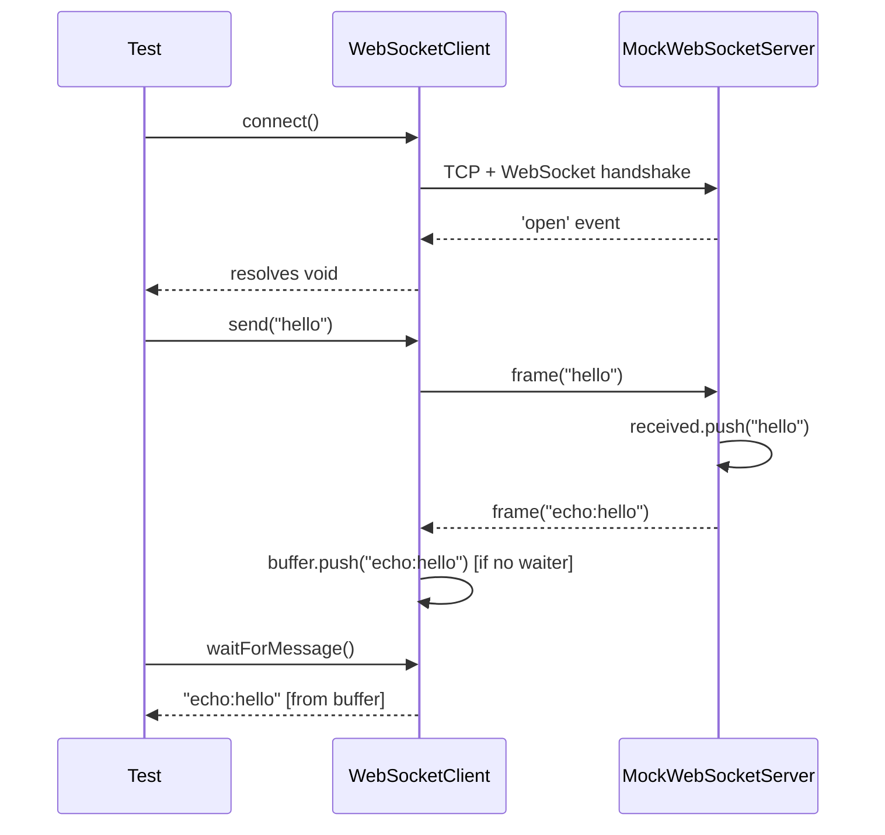
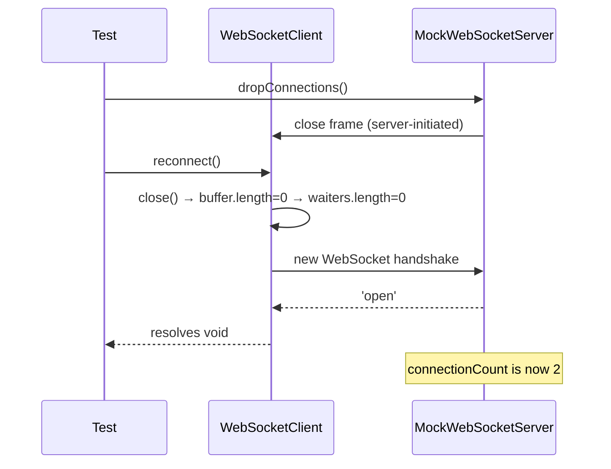

# WebSocket Testing — OminAPI Framework

## Overview

OminAPI provides deterministic, offline WebSocket testing through two classes:

| Class                 | File                          | Role                                                   |
| --------------------- | ----------------------------- | ------------------------------------------------------ |
| `WebSocketClient`     | `src/api-client/ws-client.ts` | Async-friendly client; converts events to Promises     |
| `MockWebSocketServer` | `src/utils/ws-server.ts`      | In-process echo server; spy + drop-connections support |

Both are wired together by the `ws` fixture in `src/fixtures/api.fixtures.ts`
and are exercised in `tests/websocket/`.

---

## Purpose

Raw WebSocket events (`on('message')`, `on('open')`) are callback-based and
race-prone in sequential tests. `WebSocketClient` solves this with a
**buffer + waiter queue**: messages that arrive before `waitForMessage()` is
called are buffered; messages that arrive after are handed directly to the
waiting Promise. The result is a linear, async/await API that never misses
a message.

`MockWebSocketServer` provides a controllable server that echoes messages,
records what it received, counts connections, and can forcibly drop clients —
covering connection-lifecycle and resilience scenarios without any external
service.

---

## Architecture

### `WebSocketClient` internals

```
Private state
  socket      : WebSocket | undefined   ← the ws connection
  buffer      : string[]                ← messages arrived before waitForMessage()
  waiters     : Array<(msg: string)=>void>  ← Promises waiting for the next message

Message arrival path (ws 'message' event):
  if waiters.length > 0  → shift() the first waiter and resolve it immediately
  else                   → push the text into buffer

waitForMessage() call:
  if buffer.length > 0   → shift() and resolve immediately (no async needed)
  else                   → push a new waiter Promise; timer rejects it on timeout
```

This design eliminates the classic WebSocket test race: send a message, then
call `waitForMessage()` — the message is already in the buffer when the call
arrives.

### `MockWebSocketServer` internals

```
Private state
  wss         : WebSocketServer | undefined
  port        : number (OS-assigned ephemeral)
  sockets     : Set<WsSocket>   ← all currently open client sockets

Public spy state
  received    : string[]        ← every text message the server received
  connectionCount : number      ← total connections accepted (for reconnect tests)

Behavior on connection:
  connectionCount++
  sockets.add(socket)
  on('message') → push to received[], then socket.send(`echo:${text}`)
  on('close')   → sockets.delete(socket)
```

---

## Flow Diagram

### Connection + messaging



### Reconnect after server-side drop



---

## API Reference

### `WebSocketClient` — `src/api-client/ws-client.ts`

| Method                       | Signature                     | Description                                                                                          |
| ---------------------------- | ----------------------------- | ---------------------------------------------------------------------------------------------------- |
| `connect(timeoutMs?)`        | `(number) => Promise<void>`   | Open the socket; resolves on `'open'`, rejects on error or timeout (default 5 s)                     |
| `isOpen()`                   | `() => boolean`               | `true` when `socket.readyState === OPEN`                                                             |
| `send(data)`                 | `(string \| object) => void`  | Send text or a JSON-serialized object; throws if socket is not open                                  |
| `waitForMessage(timeoutMs?)` | `(number) => Promise<string>` | Returns buffered message immediately, or the next arriving message; rejects on timeout (default 5 s) |
| `waitForJson<T>(timeoutMs?)` | `(number) => Promise<T>`      | `waitForMessage()` + `JSON.parse`                                                                    |
| `close(code?)`               | `(number) => Promise<void>`   | Clean close (default code `1000`); resolves once the socket emits `'close'`                          |
| `reconnect(timeoutMs?)`      | `(number) => Promise<void>`   | `close()` → clear buffer/waiters → `connect()`                                                       |

### `MockWebSocketServer` — `src/utils/ws-server.ts`

| Member              | Type / Signature      | Description                                                         |
| ------------------- | --------------------- | ------------------------------------------------------------------- |
| `received`          | `string[]`            | All text messages the server received (spy)                         |
| `connectionCount`   | `number`              | Total connections ever accepted                                     |
| `url`               | `string` (getter)     | `ws://127.0.0.1:<port>` once started                                |
| `start()`           | `() => Promise<void>` | Listen on an ephemeral port; default behavior is echo               |
| `dropConnections()` | `() => void`          | Forcibly close all open client sockets                              |
| `stop()`            | `() => Promise<void>` | Shut the server down; idempotent — second call resolves immediately |

---

## Code Examples

### Connection lifecycle

```ts
// tests/websocket/connection.spec.ts
import { test, expect } from '../../src/fixtures/api.fixtures.js';

test('client connects and the server registers the connection', async ({
  ws,
}) => {
  const { server, client } = ws;

  expect(client.isOpen()).toBe(false);
  await client.connect();

  expect(client.isOpen()).toBe(true);
  expect(server.connectionCount).toBe(1);
});

test('connecting to a dead port rejects', async ({ ws }) => {
  await ws.server.stop();
  await expect(ws.client.connect(1500)).rejects.toThrow();
});
```

### Text and JSON message round-trips

```ts
// tests/websocket/messaging.spec.ts
test('text message round-trips (echo)', async ({ ws }) => {
  const { client } = ws;
  await client.connect();

  client.send('hello');
  const reply = await client.waitForMessage();
  expect(reply).toBe('echo:hello');
});

test('JSON message round-trips', async ({ ws }) => {
  const { client } = ws;
  await client.connect();

  client.send({ type: 'ping', seq: 1 });
  const reply = await client.waitForMessage();
  // Server echoes "echo:" + the serialized JSON
  expect(reply).toBe('echo:{"type":"ping","seq":1}');
});
```

### Ordered multi-message exchange

```ts
// tests/websocket/messaging.spec.ts
test('multiple messages are received in order', async ({ ws }) => {
  const { client } = ws;
  await client.connect();

  client.send('a');
  client.send('b');
  client.send('c');

  expect(await client.waitForMessage()).toBe('echo:a');
  expect(await client.waitForMessage()).toBe('echo:b');
  expect(await client.waitForMessage()).toBe('echo:c');
});
```

### Server spy — verifying what was received

```ts
// tests/websocket/messaging.spec.ts
test('server records what it received', async ({ ws }) => {
  const { server, client } = ws;
  await client.connect();

  client.send('spy-me');
  await client.waitForMessage();
  expect(server.received).toContain('spy-me');
});
```

### Clean disconnect

```ts
// tests/websocket/reconnect-disconnect.spec.ts
test('clean disconnect closes the socket', async ({ ws }) => {
  const { client } = ws;
  await client.connect();
  expect(client.isOpen()).toBe(true);

  await client.close();
  expect(client.isOpen()).toBe(false);
});

test('sending after close throws a clear error', async ({ ws }) => {
  const { client } = ws;
  await client.connect();
  await client.close();
  expect(() => client.send('too late')).toThrow(/not open/);
});
```

### Reconnect after server-side drop

```ts
// tests/websocket/reconnect-disconnect.spec.ts
test('reconnect restores messaging after a server-side drop', async ({
  ws,
}) => {
  const { server, client } = ws;
  await client.connect();
  client.send('first');
  expect(await client.waitForMessage()).toBe('echo:first');

  // Server forcibly drops the connection.
  server.dropConnections();

  // Client reconnects and messaging works again.
  await client.reconnect();
  expect(client.isOpen()).toBe(true);
  client.send('second');
  expect(await client.waitForMessage()).toBe('echo:second');

  // Two distinct connections were accepted.
  expect(server.connectionCount).toBe(2);
});
```

### Schema validation of received messages

```ts
// tests/websocket/validation.spec.ts
import { SchemaValidator } from '../../src/validators/index.js';
import type { SchemaObject } from 'ajv';

const messageSchema: SchemaObject = {
  type: 'object',
  required: ['type', 'seq'],
  additionalProperties: true,
  properties: {
    type: { type: 'string' },
    seq: { type: 'integer' },
  },
};

test('a received JSON message conforms to its schema', async ({ ws }) => {
  const { client } = ws;
  await client.connect();

  client.send({ type: 'event', seq: 7 });
  const reply = await client.waitForMessage();

  // Strip the server's "echo:" prefix to recover the JSON payload.
  const json = reply.replace(/^echo:/, '');
  const parsed = JSON.parse(json) as unknown;

  const result = SchemaValidator.getInstance().validate(messageSchema, parsed);
  expect(result.valid, result.errors.join('; ')).toBe(true);
});

test('an invalid message shape is detected', async ({ ws }) => {
  const { client } = ws;
  await client.connect();

  client.send({ type: 'event' }); // missing required `seq`
  const reply = await client.waitForMessage();
  const parsed = JSON.parse(reply.replace(/^echo:/, '')) as unknown;

  const result = SchemaValidator.getInstance().validate(messageSchema, parsed);
  expect(result.valid).toBe(false);
});
```

---

## Best Practices

| Practice                                                              | Rationale                                                                                           |
| --------------------------------------------------------------------- | --------------------------------------------------------------------------------------------------- |
| Always `await client.connect()` before `send()` or `waitForMessage()` | The buffer design only works while the `'message'` listener is registered (i.e., after `connect()`) |
| Use `waitForJson<T>()` for JSON payloads                              | Eliminates manual `JSON.parse`; type parameter documents the expected shape                         |
| Assert `server.connectionCount` to verify reconnect                   | Connection count is the only authoritative proof that a new handshake occurred                      |
| Use `server.received[]` as the spy, not inferred message content      | The spy records what the server actually received, independent of echo behavior                     |
| Validate message shapes with `SchemaValidator`                        | Catches contract drift in streamed messages the same way REST body assertions do                    |
| Let the `ws` fixture manage lifecycle (start/stop/close)              | Fixture teardown always runs (`finally`), preventing leaked sockets even on test failure            |

---

## Common Mistakes

### 1. Sending before connecting

```ts
// WRONG — socket is undefined; throws "[ws] Cannot send: socket is not open"
client.send('hello');
await client.connect();

// CORRECT
await client.connect();
client.send('hello');
```

### 2. Not awaiting `waitForMessage()` — missing the timing

```ts
// WRONG — test ends before the Promise resolves; assertion never runs.
const replyPromise = client.waitForMessage();
expect(replyPromise).toBe('echo:hello'); // comparing Promise to string

// CORRECT
const reply = await client.waitForMessage();
expect(reply).toBe('echo:hello');
```

### 3. Forgetting to strip the echo prefix before JSON parsing

```ts
// WRONG — "echo:{...}" is not valid JSON; JSON.parse throws.
const parsed = JSON.parse(await client.waitForMessage());

// CORRECT — strip the server prefix first.
const raw = await client.waitForMessage();
const parsed = JSON.parse(raw.replace(/^echo:/, '')) as unknown;
```

### 4. Assuming `reconnect()` preserves buffer state

`reconnect()` calls `close()`, then clears `buffer` and `waiters` before
reconnecting. Any messages buffered before the reconnect are discarded.

### 5. Calling `server.stop()` manually when using the `ws` fixture

The `ws` fixture calls `client.close()` and `server.stop()` in its `finally`
block. Calling `stop()` again inside a test causes a double-stop, which the
idempotent implementation handles silently — but it is misleading and
unnecessary.

---

## Real Project Usage

The `ws` fixture (defined in `src/fixtures/api.fixtures.ts`) starts a fresh
`MockWebSocketServer` per test and creates a `WebSocketClient` pointed at it:

```ts
// src/fixtures/api.fixtures.ts
ws: async ({}, use) => {
  const server = new MockWebSocketServer();
  await server.start();
  const client = new WebSocketClient(server.url);
  try {
    await use({ server, client });
  } finally {
    await client.close();
    await server.stop();
  }
},
```

To test against a real external WebSocket server, construct `WebSocketClient`
directly with the target `ws://` or `wss://` URL — the `ws` fixture is for
in-process, offline tests only.

```ts
// Direct construction — no fixture needed for external targets
const client = new WebSocketClient('wss://echo.example.com/ws');
await client.connect();
client.send('probe');
const reply = await client.waitForMessage();
```

---

## Interview Questions

**Q: What is the buffer + waiter design and what race condition does it solve?**
A: Without buffering, a message arriving between `send()` and `waitForMessage()`
would be lost — `waitForMessage()` would block forever waiting for a message
that already passed. The buffer stores arriving messages; `waitForMessage()` drains
the buffer immediately if it is non-empty, or registers a waiter for the next
arrival. This eliminates the race in both directions.

**Q: Why does `waitForMessage()` have a timeout, and what happens when it fires?**
A: Without a timeout, a missing message causes the test to hang indefinitely.
When the timer fires, the waiter is removed from the `waiters` array (to prevent
a stale resolve later) and the Promise rejects with `[ws] No message within Nms`.

**Q: How does `MockWebSocketServer.stop()` achieve idempotency?**
A: It nulls out `this.wss` _before_ closing the underlying `WebSocketServer`.
A concurrent or subsequent call finds `this.wss` already `undefined` and
resolves immediately — no double-close error.

**Q: What does `reconnect()` clear and why?**
A: It clears `buffer` and `waiters` (`length = 0` mutates in place without
reallocating). Messages buffered from the old connection are irrelevant on the
new connection, and outstanding waiters would never resolve (the old socket is
gone), so both must be discarded before the fresh `connect()`.

**Q: How would you validate JSON schema on WebSocket messages in this framework?**
A: Use `SchemaValidator.getInstance().validate(schema, parsed)` after parsing
the raw message text. `SchemaValidator` is a singleton AJV wrapper
(from `src/validators/schema.validator.ts`) with a compiled-schema cache —
the same validator used for REST response body assertions.

**Q: Why does `MockWebSocketServer` prefix echo responses with `echo:`?**
A: The prefix lets tests distinguish the server's outbound response from the
client's original message without parsing JSON or comparing raw bytes. Tests
strip the prefix (`reply.replace(/^echo:/, '')`) when they need the raw payload.

---

## References

- Source — client: [`../src/api-client/ws-client.ts`](../src/api-client/ws-client.ts)
- Source — server: [`../src/utils/ws-server.ts`](../src/utils/ws-server.ts)
- Fixtures: [`../src/fixtures/api.fixtures.ts`](../src/fixtures/api.fixtures.ts)
- Test — connection: [`../tests/websocket/connection.spec.ts`](../tests/websocket/connection.spec.ts)
- Test — messaging: [`../tests/websocket/messaging.spec.ts`](../tests/websocket/messaging.spec.ts)
- Test — reconnect: [`../tests/websocket/reconnect-disconnect.spec.ts`](../tests/websocket/reconnect-disconnect.spec.ts)
- Test — validation: [`../tests/websocket/validation.spec.ts`](../tests/websocket/validation.spec.ts)

---

## Related Modules

- [GraphQL.md](GraphQL.md) — using `WebSocketClient` for GraphQL subscriptions
- [Mocking.md](Mocking.md) — `MockServer` for HTTP mocking (analogous in-process pattern)
- [`../src/validators/schema.validator.ts`](../src/validators/schema.validator.ts) — AJV `SchemaValidator` used for message validation
- [`../src/api-client/api-client.ts`](../src/api-client/api-client.ts) — HTTP facade (contrast to the WS client)
